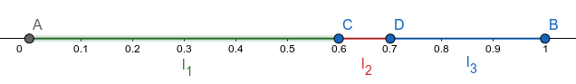

     
     
     
     
     
     
     
     
    <h1 style="font-size: 40px; margin: 10px 0;">AI - Inference in Bayesian Networks: Sampling</h1>
    <h1 style="font-size: 20px; font-weight: 400;">Sharif University of Technology - Computer Engineering Department</h1>
     
    <h4 style="font-size: 18px; font-weight: 400; color:#555">Alireza Honarvar, Navid Eslami, Ali Najibi</h4>
     
     
     
     
     

Table of Contents
==============

- [Table of Contents](#table-of-contents)
- [Introduction](#introduction)
- [Basic Idea](#basic-idea)
- [Sampling from Given Distribution](#sampling-from-given-distribution)
- [Prior Sampling](#prior-sampling)
- [Rejection Sampling](#rejection-sampling)
- [Likelihood Weighting](#likelihood-weighting)
- [Gibbs Sampling](#gibbs-sampling)

# Introduction

In the past lecture note, it was shown that Inference
in Bayesian Networks, in general, is an intractable
problem. The natural approach now would be to try
and approximate the posterior probability. There are
several approximation methods for this problem, of
which we will discuss the ones based on randomized
sampling. The rest of the note is layed out as follows:
- We give intuition about the basic idea behind sampling.
- We describe the building block of every sampling algorithm, namely, sampling from a given distribution.
- We explain four standard methods of sampling in Bayes' Nets.

# Basic Idea

To compute an approximate posterior probability, one approach is to simulate the Bayes' Net's joint distribution. This can be achieved by drawing many samples from the joint distribution. Using these samples, we can approximate the probability of certain events.

Sampling has two main advantages:

- Learning: By getting samples from an unknown distribution, we can learn the associated probabilities.
- Performance: Getting a sample is much faster than  computing the right answer.

The primitive element in any sampling algorithm is the generation of samples from a known probability distribution. So the step-by-step algorithm is described in the following section.

# Sampling from Given Distribution
Consider the example of picking random colored cubes from a large bag of them. The probrability distribution of the colors of these cubes is given in the table below. In this setting, sampling is analogous to picking a random cube from said bag so that the probabilities are taken into account.

|   C   	| P(C) 	|
|:-----:	|:----:	|
|  green  	|  0.6 	|
|   red 	|  0.1 	|
|  blue 	|  0.3 	|

In order to draw a sample from this distribution, we can use a uniform distribution to generate a seed 
and determine the sample based on that. As shown in the figure below, the unit length segment is 
partitioned into parts named $l_i$, each having length equal to $p_i$. These $p_i$s represent the 
probabilities of the distribution, and are equal to $Pr(C=c_i)$. In other words, we have indexed the 
values that the random variable $C$ can take and defined the probabilities based on them. Here, we have 
$c_1 = green$, $c_2 = red$ and $c_3 = blue$.

We say that the sample drawn has the value $c_i$, if the seed chosen lies in $l_i$. Since we chose the seed from a uniform distribution, it can be shown that the probability of the sample being equal to $c_i$ is $Pr(C=c_i)$.

Thus, using uniform distributions in this manner, we can generate samples from a given distribution having the same corresponding probabilities.

# Prior Sampling
Now we're ready to tackle the sampling problem! Suppose we want to sample from the joint distribution 
of the Bayes' Net, $Pr(x_1,...,x_n)$.

Consider the following process:

1.&nbsp; For i = 1 to n

2.&emsp;&emsp; Sample $x_i$ from $Pr(x_i | parents(x_i))$

3.&nbsp; Return $(x_1,...,x_n)$

This process generates a sample $X=(x_1,...,x_n)$ with the following probability:
$$
S_{PS}(x_1,...,x_n) = \prod_{i=1}^{n}Pr(x_i|parents(x_i)) = Pr(x_1,...,x_n),
$$
which is the Bayes' Net's joint probability.

Now we need to prove that the samples are realizations of I.I.D (Independent, Identically Distributed) random variables. 
1. Since we choose a new random number for every sample, thus samples are independent from each other. 
2. It has been also shown that they are identically distributed because of the formula above.

Suppose we have drawn $N$ samples from the joint distribution. Let the number of samples of an event be 
$N_{PS}(x_1,...,x_n)$.

So based on the law of large numbers, we have:
$$
lim_{N\to\infty}\hat{Pr}(x_1,...,x_n) = lim_{N\to\infty} \frac{N_{PS}(x_1,...,x_n)}{N}
$$
$$
= S_{PS}(x_1,...,x_n) = Pr(x_1,...,x_n),
$$

hence, the sampling procedure is consistent with the joint distribution.

It is apparent that this algorithm is faster than its exact counter-parts. Since we have the joint distribution, we can calculate the probability of any event. However, in the case of conditional probabilities, it's more efficient not to consider samples inconsistent with the evidence. This brings us to the idea of rejection sampling.

# Rejection Sampling

# Likelihood Weighting

# Gibbs Sampling
The main problem with Likelihood Weighting was the sample inefficiency that could occur. To rectify this issue, one could use the approach of Gibbs Sampling, which is special case of the Metropolis-Hastings algorithm.

Suppose we want to draw a sample $X = (x_1, ..., x_n)$ from the distribution $Pr(X_{Query} | X_{Evidence} = Observations)$, where $X_{Query}$ and $X_{Evidence}$ are the query and evidence variables, respectively. The algorithm operates as follows:

- Start from an arbitrary sample $X^{(1)} = (x_1^{(1)}, ..., x_n^{(1)})$, satisfying the $X_{Evidence} = Observations$ equality.
- Assume the last sample generated was $X^{(t)}$. We want to calculate the next sample, namely, $X^{(t+1)}$. Sample one **non-evidence variable** $x_i^{(t+1)}$ at a time, conditioned on all the others being $x_j^{(t+1)} = x_j^{(t)}$. In other words, we sample $x_i^{(t+1)}$ from $Pr(x_i | x_1^{(t)}, ..., x_{i-1}^{(t)}, x_{i+1}^{(t)}, ..., x_n^{(t)})$.

It can be shown that as $t$ becomes larger, $X^{(t)}$ approximates the distribution of $Pr(X_{Query} | X_{Evidence} = Observations)$. 