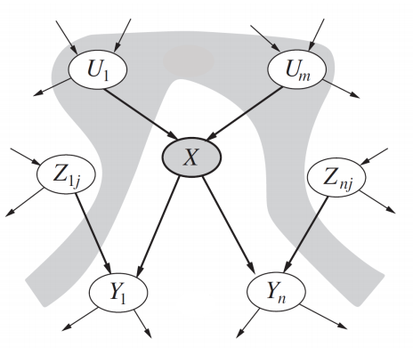
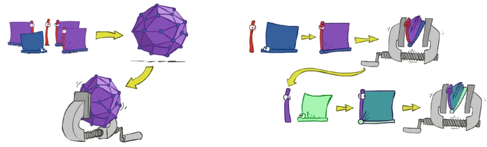
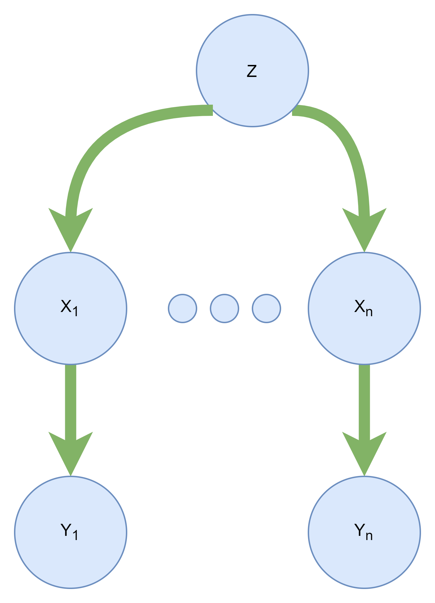
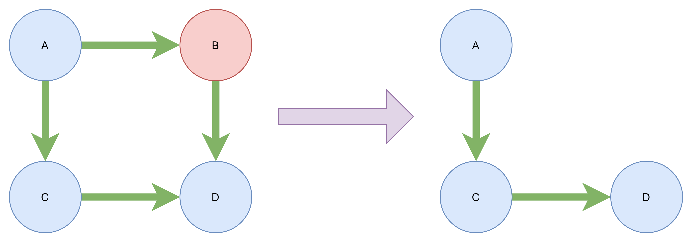

<div align="justify">
# Inference in Bayes Nets 1

## Table of Contents

- [Introduction](#introduction)
- [Inference by Enumeration](#inference-by-enumeration)
    - [Algorithm Explanation](#algorithm-explanation)
    - [Algorithm Steps](#algorithm-steps)
    - [Algorithm Pseudocode](#algorithm-pseudocode)
    - [Algorithm Time Complexity](#algorithm-time-complexity)
    - [Algorithm Example](#algorithm-example)
- [Inference by Variable Elimination (Marginalizing Early)](#inference-by-variable-elimination-marginalizing-early)
    - [Algorithm Explanation](#algorithm-explanation-1)
    - [Algorithm Steps](#algorithm-steps-1)
    - [Algorithm Pseudocode](#algorithm-pseudocode-1)
    - [Algorithm Time Complexity](#algorithm-time-complexity-1)
    - [Ordering Polytree Variables for VE](#ordering-polytree-variables-for-ve)
    - [Cut-set Conditioning](#cut-set-conditioning)
    - [Algorithm Example](#algorithm-example-1)
- [Conclusions](#conclusions)
- [References](#references)

<p align="center"></p>

## Introduction

The basic task of a Bayesian network is to compute the posterior probability distributions for a set of query variables, given an observation of a set of evidence variables. This process is known as inference, but is also called Bayesian updating, belief updating or reasoning. There are two ways to approach this, either exact or approximate. Both approaches are worst-case NP-hard. An exact method obviously gives an exact result, while an approximate method tries to approach the correct outcome as close as possible. In this lecture, we discuss the exact inference method. Approximate (Sampling) method will be discussed in the next lecture. 

## Inference by Enumeration

The enumeration algorithm is a simple, brute-force algorithm for computing the distribution of a variable in a Bayes net. In this algorithm, we partition all Bayes net variables into three groups:

1. evidence variables
2. hidden variables
3. query variables

This algorithm takes query variables and evidence variables as input, and outputs the distribution of query variables. The evidence $e$ is whatever values you already know about the variables in the Bayes net. Evidence simplifies your work because instead of having to consider those variables’ whole distributions, you can assign them particular values, so they are no longer variables, they are constants. In the most general case, there is no evidence.

### Algorithm Explanation

This algorithm has to compute a distribution over $X$, which, because $X$ is a discrete variable, means computing the probability that $X$ takes on each of its possible values (the values in its domain). The algorithm does this simply by looping through all the possible values, and computing the probability for each one. Note that if there is no evidence, then it is literally just computing the probabilities $P(X=x_i)$ for each $x_i$ in $X$’s domain. If there is evidence, then it is computing $P(e, X=x_i)$ for each $x_i$ in $X$’s domain – that is, it is computing the probability that $X$ has the given value $x_i$ and the evidence is true – so in that case, we use the law of conditional probability, which says that $$P(X=x_i | e) = \frac{P(e, X=x_i)}{P(e)}$$. Once we have computed $P(e, X=x_i)$ for all $x_i$, we can just normalize those values to get the correct distribution $P(X | e)$.

### Algorithm Steps

We can summarize the explained algorithm in the following steps:

1. Select the entries consistent with the evidence.
2. Sum out the hidden variables to get joint distribution of query and evidence variables.
3. Normalize the distribution to get the distribution of query variables.

### Algorithm Pseudocode

```python
def enumeration_ask(X, e, bn):
    """
    Input:
        X: query variable
        e: observed values for all variables
        bn: given Bayes net 
    Output:
        P(X | e)
    """
    q = ProbDist(X) # a ditribution over X, where q(x) = P(X=x)
    for xi in X.domain:
        q[xi] = enumerate_all(e + [(X, xi)], bn.vars)
    return q.normalize()

def enumerate_all(e, vars):
    """
    Input:
        e: observed values for all variables plus a new variable X assignment
        vars: list of all variables
    Output:
        P(e[-1] | e[:-1])
    """
    if not vars.any():
        return 1.0
    Y = vars[0]
    if e.contains(Y):
        return probability_condition_parents(Y, e, vars[1:]) * enumerate_all(e, vars[1:])
    else:
        sum = 0.0
        for yi in Y.domain:
            sum += probability_condition_parents(Y, e + [(Y, yi)], vars[1:]) * enumerate_all(e + [(Y, yi)], vars[1:])
        return sum
```

### Algorithm Time Complexity

In the worst case, we have no evidence, so we have to for loop through all possible values of all variables. Hence, this algorithm has a complexity of $O(d^n)$ where $d$ is the size of the domain of the variables and $n$ is the number of variables.

### Algorithm Example

[Here](https://youtu.be/BrK7X_XlGB8) is a video of the algorithm running on a simple example.

## Inference by Enumeration is Slow

In enumeration, first we find the whole joint distribution, and then we marginalize out the hidden variables. Hence, it is too slow because of the big joint distribution we need to compute.

If we marginalize out the hidden variables in the partial joint distribution, we can get a much faster algorithm. This method is called Inference by Variable Elimination.

<p align="center"></p>

## Inference by Variable Elimination (Marginalizing Early)

The point of the variable-elimination algorithm is that it is more bottom-up than top-down. Instead of figuring out the probabilities we need to compute and then computing all the other probabilities that each one depends on, we try to compute probabilities and then compute the other terms that depend on them, and repeatedly simplify the expression until we have something that is in terms of only the variable we’re looking for.

The variable-elimination algorithm uses things called factors. A factor is basically a CPT, except that the entries are not necessarily probabilities (but they would be if you normalized them). You can think of a factor as a matrix with a dimension for each variable, where $Factor[VAL1][VAL2][…]$ is (proportional to) a probability such as 
$$P(VAR1=VAL1, VAR2=VAL2, …)$$ 
or you can think of it as a table with one row for each possible combination of assignments of values to the variables.

We also define two operations on factors:
1. Join
2. Eliminate 

Join is used to combine two factors. For example, if we have two factors $F_1$ and $F_2$, we can compute the joint distribution of $F_1$ and $F_2$ by multiplying their probabilities together, corresponding to the variable's value in factors.

Eliminate is used to eliminate a variable from a factor. For example, if we have a factor $F$, and we want to eliminate $X$ from $F$, we can group rows by non-$X$ values and sum probabilities. This is exactly marginalization.

> - Join is exactly like SQL join.
> - Eliminate is like a group by and SUM aggregation function in SQL.

### Algorithm Explanation

This algorithm, like the previous one, takes a variable X and returns a distribution over X, given some evidence e. First, it initializes the list of factors; prior to any simplification, this is just the conditional probability tables for each variable given the evidence e. Then, it joins each factors with it. The summing-out process takes all the factors that depend on a given variable and replaces them with a single new factor that does not depend on that variable (by summing over all possible values of the variable). By the end of the loop, all the variables have been summed out except the query variable X, so then we can just multiply the factors together and normalize to get the distribution.

### Algorithm Steps

1. Initialize the list of factors which are local CPTs instantiated by the evidence.
2. While there are any hidden variables:
    - Join all the factors containing the hidden variable.
    - Eliminate the hidden variable.
3. Join all remaining factors.
4. Normalize the resulting factor.

### Algorithm Pseudocode

```python
def elimination_ask(X, e, bn):
    """
    Input:
        X: query variable
        e: observed values for all variables
        bn: given Bayes net 
    Output:
        P(X | e)
    """
    factors = [t.marginalize(X) for t in bn.cpt]
    for var in bn.vars:
        if var not in e and var != X:
            relevant_factors = [f for f in factors if var in f.vars]
            for f in relevant_factors:
                factors.remove(f)
            factors.append(f.eliminate(var, join(relevant_factors)))
    return join(factors).normalize()
```

### Algorithm Time Complexity

The computational and space complexity of variable elimination is determined by the largest factor. In the worst case, this algorithm has exponential complexity, like the enumeration algorithm. But variable elimination ordering can greatly affect the largest factor. For example, in the following Bayes net, assuming the query is $P(X_n | Y_1, …, Y_n)$, the largest factor for following orders are different:

- $Z, X_1, …, X_n \rightarrow 2^{n+1}$
- $X_1, …, X_n, Z \rightarrow 2^{2}$ 

<p align="center"></p>

There is no general ordering that provides only small factors.

### Ordering Polytree Variables for VE

Polytree is a directed graph which has no undirected cycles. In this special kind of graph we can introduce an algorithm for ordering nodes in order to achieve small factors, and efficiently compute the joint distribution of the variables. 

1. Drop edge directions
2. Pick an arbitrary node as the root
3. Do depth first search from the root
4. Sort the resulting nodes in topological order
5. Reverse the order

Now, if we eliminate variables with this order, we would never get a factor larger than the original factors. This makes the VE algorithm linear time complexity.

### Cut-set Conditioning

We can cut the bayes net at an instantiated variable, and this can transform a multi connected graph into a polytree, for which we can find the order of elimination. If these variables are not actually known, we can set them to each of their possible values and then solve the problem with the polytree. You can see an example of this below.

<p align="center"></p>

### Algorithm Example

[Here](https://youtu.be/w4sJ8SazmFo) is a video of elimination of a variable from a set of factors.

## Conclusions

We reviewed two major exact inference algorithms, the enumeration algorithm and the variable elimination algorithm. The enumeration algorithm is a simple algorithm that is easy to understand and implement, but it is not very efficient. On the other hand, the variable elimination algorithm is a more complex algorithm that is more efficient, but it is also harder to understand and implement. For both introduced algorithms, the worst-case time complexity is exponential. So in practice, using sampling is usually a better choice, which you will learn more about in the next lecture.

## References

- [Class Presentation](http://ce.sharif.edu/courses/99-00/1/ce417-2/resources/root/Slides/PDF/Session%2013_14.pdf)
- [Visualizing Inference in Bayesian Networks](http://www.kbs.twi.tudelft.nl/Publications/MSc/2006-JRKoiter-Msc.html)
- [Exact Inference in Bayes Nets](http://courses.csail.mit.edu/6.034s/handouts/spring12/bayesnets-pseudocode.pdf)
- [Variable Elimination](https://ermongroup.github.io/cs228-notes/inference/ve/)
- [Bayesian Networks - Inference (Part II)](https://ccc.inaoep.mx/~esucar/Clases-mgp/Notes/c7-bninf-p2.pdf)
</div>
