# Table of contents
1. [Introduction](#introduction)
    1. [History](#history)
    2. [ML Applications](#ml-applications)
2. [Types of Machine Learning](#types-of-machine-learning)
    1. [Supervised Learning](#supervised-learning)
        1. [Classification](#classification)
        2. [Naïve Bayes Classifier Algorithm](#naïve-bayes-Classifier-algorithm)
    2. [Unsupervised Learning](#unsupervised-learning)
3. [Bias and Variance](#bias-and-variance)
    1. [What is Bias?](#what-is-Bbas?)
    2. [What is variance?](#what-is-variance?)
    3. [Bias and Variance Trade-Off](#bias-and-variance-trade-off)
4. [OverFitting and Underfitting](#overFitting-and-underfitting)
    1. [So what is overfitting?](#so-what-is-overfitting?)
    2. [What is underfiting?](#what-is-underfiting?)
    3. [and how to prevent overfitting?](#and-how-to-prevent-overfitting?)
5. [Parameter Estiamtion](#parameter-estiamtion)
    1. [What is MLE?](#what-is-mle?)
    2. [Waht is MAP?](#waht-is-map?)
6. [Handle unseen events](#handle-unseen-events)
    1. [Laplace Smoothing](#laplace-smoothing)
    2. [Linear interpolation](#linear-interpolation)
7. [More about dataset](#more-about-dataset)
    1. [Training Dataset](#training-dataset)
    2. [Validation Dataset](#validation-dataset)
    3. [Test Dataset](#test-Dataset)
    4. [About the dataset split ratio](#about-the-dataset-split-ratio)
8. [Conclusion](#conclusion)
9. [References](#references)

# Introduction
Humans are capable of learning by experiencing, but how about computers? Can they learn from past data and make correct decisions for future situations?

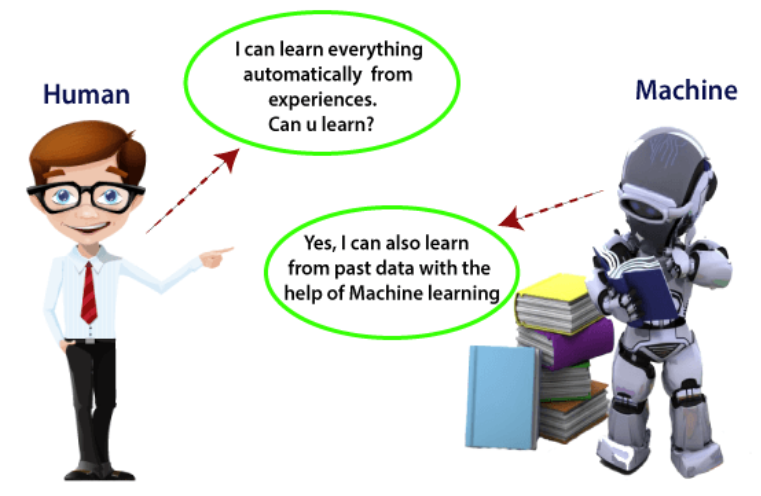

Machine learning techniques allow computers to automatically learn from a dataset and improve its performance from experiences and enables them to predict things in a new situation without being explicitly programmed. Machine learning algorithms bring computer science and statistics together to build mathematical models from our dataset that is known as training data and use these models for future decision. The diagram below shows the ML algorithm:

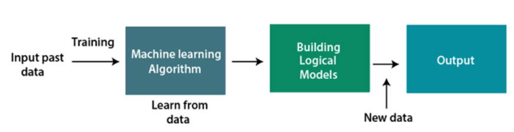

## History
The base idea behind machine learning has a long history, But the term of machine learning was first used by Arthur Samuel in 1959. Below we can see a timeline of ML in brief:

*   **1834:** Charles Babbage made the first computer that could be programmed by punched cards and all modern computers followed its logical structure.
*   **1936:** Alan Turing gave a theory about how machines can execute a set of instructions.
*   **1940:** First manually operated computer named "ENIAC" was invented.
*   **1943:** The first model of human neural network was modeled with electronic circuits.
*   **1950:** "Computer Machinery and Intelligence," was published by Alan Turing on the topic of AI with this question, "Can machines think?".
*   **1952:** Arthur Samuel created a program to play checkers for an IBM computer that could play better by playing more.
*   **1959:** Arthur Samuel first used the term of “Machine Learning” and popularized it. In this year, the first neural network was used to solve a real-world problem to remove echoes over phone lines using an adaptive filter.
*   **1974 to 1980:** These years are known as AI winter that lots of people lost their interest from AI and governmental funding reduced.
*   **1985:** A neural network was developed named NETtalk that was able to correctly pronounce 20000 words in a week.
*   **1997:** The IBM’s computer named Deep Blue won a chess game against human chess expert Garry Kasparov.
*   **2006:** Geoffrey Hinton has first used name of "deep learning" instead of neural net research.
*   **2012:** Google developed a deep neural network system to distinguish cat and human images in a YouTube video.
*   **2016:** AlphaGo won a Go game against number one and number second player of Go.

## ML Applications

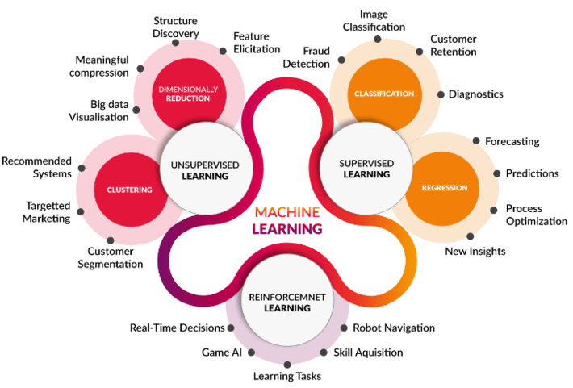

The machine learning concepts are growing every day and we can see its usages everywhere. Some of the real-world applications of ML are:

*   **Image recognition:**
    
    One example can be Facebook friends tagging suggestion that when we upload a photo with our Facebook friends, then we can see some labels suggestions with their names. This project is called Deep Face which uses face detection and recognition algorithms.
    
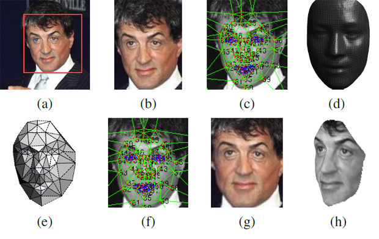
*   **Speech Recognition:**
    
    This project converts your voice to text and is also known as "Computer speech recognition." Some examples of this technology are Google assistant, Siri, Cortana, and Alexa.
    

*   **Traffic prediction:**
    
    Google Maps gathers data from all its users and sends them to its database and uses ML algorithms and technics to provide the shortest routes with the least traffic to its users.
    
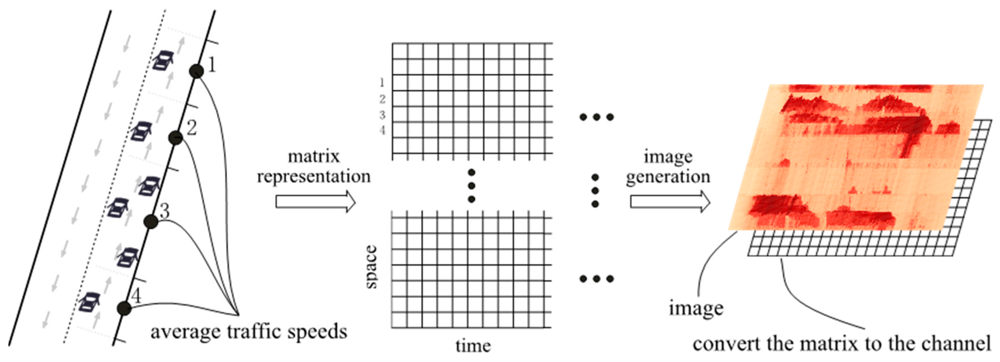
*   **Product recommendations:**
    
    Amazon and Netflix use ML for their product recommendation systems. Every time a user opens an amazon page is able to see most relevant suggestion according to its previous searches or other features that are used in dataset.
    
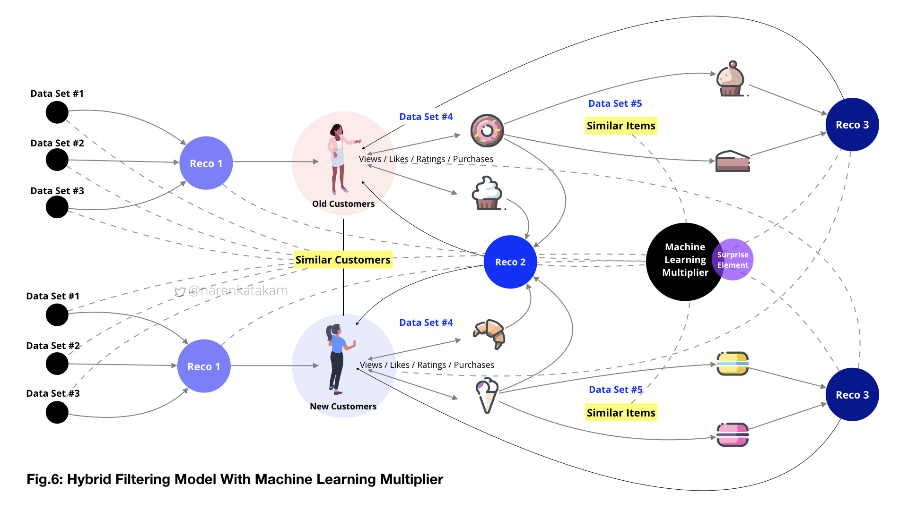

# Types of Machine Learning

There are three major recognized categories for ML:

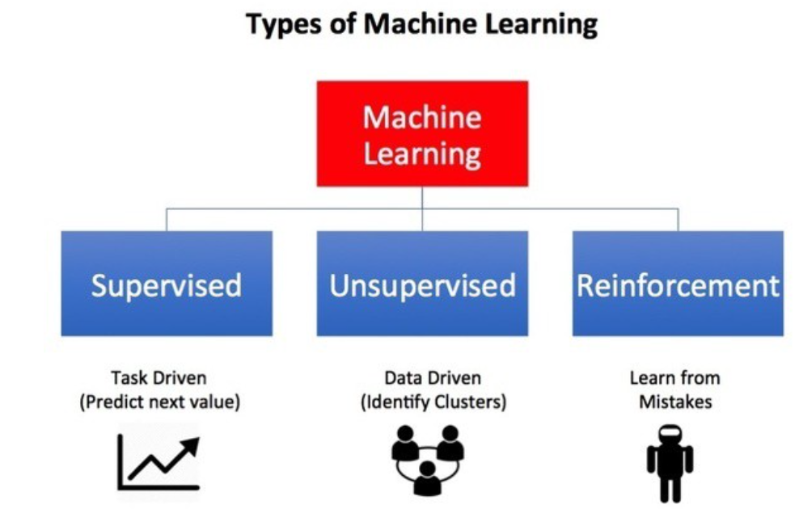

## Supervised Learning

In this method computer is provided by a set of labeled (tagged) data which is called training data and tries to create a mathematical model according to it and learn to approximate the exact nature of the relationship between examples and their labels. By the time this process of training finished, the supervised learning algorithm will be able to observe a new, never-before-seen example and predict a good label for it. Then we provide another set of data called sample data to test if the predictions are exact or not. One example of supervised learning is Face Recognition that we have a system that takes a photo, finds faces, and guesses who that is in the photo (suggesting a tag) is a supervised process. It has multiple layers to it, finding faces and then identifying them, but is still supervised nonetheless. The supervised algorithms are grouped in two main categories:

*   **Classification**
*   **Regression**

### Classification

In this algorithm machine learns from given training data and identifies the category of input data and classifies it into number of groups or classes. The main difference of this method and regression is that classification is a process of finding a function which helps in dividing the dataset into classes based on different parameters, but regression is a process of finding the correlations between dependent and independent variables. The classifiers can be binary that means we have only two possible outcomes, or multi-class that means we can have more than two labels or classes. In another hand we have two types of learners in a classification problem:

*   **Lazy Learners:**
    
    Lazy learning methods simply store the data and generalizing beyond these data is postponed until an explicit request is made. In this case we just store dataset without learning from it and start classifying data when test data is received. These learners find the most related data that is stored in our training dataset. First they store the training data and start the next phase when the test dataset arrives. In this method we reduce the training time but prediction time increases. Some algorithms of this method are:
    
    *   K-Nearest Neighbours algorithm
    *   Case-based reasoning
*   **Eager Learners:**
    
    Eager learning methods construct general (one-fits-all), explicit (input independent) description of the target function based on the provided training examples. In this method the learner creates a model according to the training dataset, so the training time is more than lazy learners but prediction is faster. Some algorithms of this method are:
    
    *   Decision Trees
    *   Naïve Bayes
    *   ANN

### Naïve Bayes Classifier Algorithm

Naïve Bayes algorithm is a probabilistic classifier based on Bayes theorem and is used to solve classification problems. It is called naïve because it assumes that occurrence of a certain feature is independent of the occurrence of other features. It is also called Bayes because it depends on the principle of Bayes' Theorem.

A general naïve bayes model has the form below that Y is our label variable and F is our feature set:

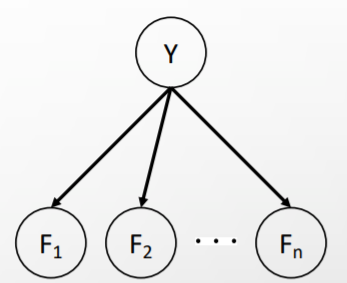

As a result of bayes net above and bayes theorem we can say that:

$P\\left(Y, F\_1, F\_2, ..., F\_n\\right) = P\\left(Y\\right)\\prod\_{i}P(F\_i|Y)$

As we can use this equation for computing posterior distribution over label variable Y first by calculating joint probibility of evidence and label for each label using equation above second sum to get probability of evidence and then divide the first by second to calculate $P\\left(Y| F\_1, F\_2, ..., F\_n\\right)$ .
The process can be seen in figure below:

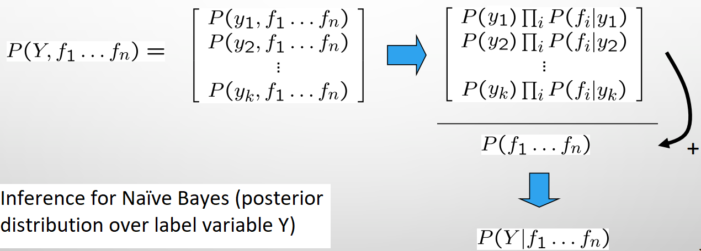

#### Advantages of Naïve Bayes Classifier

*   It is fast and not that much complicated.
*   It can be used for Binary as well as Multi-class Classifications.
*   It is the most popular choice for text classification problems.

#### Disadvantages of Naïve Bayes Classifier

*   Naive Bayes assumes that all features are independent or unrelated, so it cannot learn the relationship between features. It can be helpful in some cases to consider features independent, but sometimes the results are not exact.

## Unsupervised Learning
In this method our training dataset doesn’t contain labels and they have not been categorized. Instead, our algorithm would be fed a lot of data and given the tools to understand the properties of the data. In this case machine learns to group, cluster the data such that a human (or other intelligent algorithm) can come in and make sense of the newly organized data. In another word the goal of unsupervised learning is to find the underlying structure of dataset, group that data according to similarities, and represent that dataset in a compressed format. The unsupervised algorithms are grouped in two main categories:

*   **Clustering**
*   **Association**

<h1>Bias and Variance</h1>

if the model in machine learning  is not accurate, it will make errors and these errors are known as Bias and Variance. these two errors causes small difference between predicted and actual value! In machine learning we want to reduce these errors to get more accurate predictions

 On the basis of these errors, the machine learning model is selected that can perform best on the particular dataset.

<h2>What is Bias?</h2>

In general, a machine learning model analyzes the data, find patterns in it and make predictions. While training, the model learns these patterns in the dataset and applies them to test data for prediction.
<b>While the model is making prediction about data, a difference occurs between prediction values made by the machine learning model and actual values is known as bias errors</b>
It can be defined as an inability of ML algorithms such as polynomial Regression to capture the true relationship between the data points. Each algorithm in ML  has some amount of bias because bias occurs from assumptions in the model, which makes the target function simple to learn. A model has either:
<ul>
<li><b>High Bias:</b> A model with a high bias has more assumptions, and the model can not capture the important features of our dataset. the model with high biased has good performance on training data but not test data.</li>
<li><b>Low Bias:</b> A low bias model will make fewer assumptions about the form of the target function.</li>
</ul>
linear algorithms have a high bias, as they learn fast. The simpler the algorithm, the higher the bias it has! but a nonlinear algorithm often has low bias.

<h4>Machine learning algorithm with low bias:</h4>
<ul> 
<li>Decision Trees</li>
<li>k-Nearest Neighbours</li>
</ul>

<h4>Machine learning algorithm with high bias:</h4>
<ul> 
<li>Linear Regression</li>
<li>Logistic Regression</li>
</ul>

<h2>What is variance?</h2>

The variance of model tells us the amount of variation in the prediction if the different data is used. a model should not vary too much from one training dataset to another, which means the algorithm should be good in understanding the mapping between inputs and outputs. some models has <b>low variance</b> but some of them has <b>high variance. </b>

 <b>low varince </b> means that we have small variation in the changes of training data with prediction in target function!
<b>high variance means there is a high variation in the prediction of the target function with changes in the training dataset</b> 

a model that has high variance performs well on training data but can not generalize unseen dataset as well.
high variance leads to overfitting and increases model complexities!

<h4>machine learning algorithms with low variance:</h4>
<ul>
<li>Linear Regression</li>
<li>Logistic Regression</li>
</ul>

<h4>machine learning algorithms with high variance:</h4>
<ul>
<li>decision tree</li>
<li>K-nearest neighbours</li>
</ul>

in general variance shows us how much our model is dependent to our dataset!

in the following image you can see the impact of bias and variance in machine learning model:

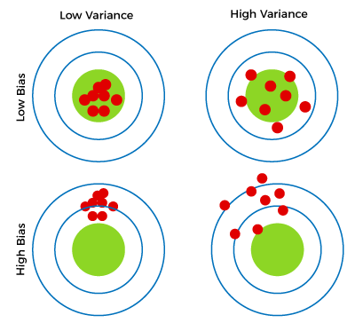</img>

<h3>Bias and Variance Trade-Off</h3>

the best and ideal model has low bias and low variance but it can not be acheived and is not possible practically!
low-bias and high-variance leads to overfitting, high-bias and low-variance leads to underfitting! so it is required to make a balance between bias and variance errors, and this balance between the bias error and variance error is known as the Bias-Variance trade-off.
in simple words bias and variance are related to each other and we can not reduce both of them simultanously!

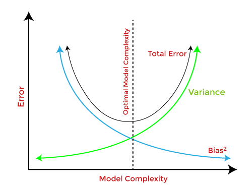</img>

<h1>OverFitting and Underfitting</h1>

Supervised machine learning is best understood as approximating a target function (f) that maps input variables (X) to an output variable (Y). f(X) = Y

An important consideration in learning the target function from the training data is how well the model generalizes to new data. Generalization is important because the data we collect is only a sample, it is incomplete and noisy

<ul>
<li><b>Generalization:</b> It shows how well a model is trained to predict unseen data.
</li>
<li><b>Noise: </b> Noise is meaningless or irrelevant data present in the dataset. It affects the performance of the model if it is not removed.</li>
</ul>

The goal of a good machine learning model is to generalize well from the training data to any data from the problem domain. This allows us to make predictions in the future on data the model has never seen.

There is a terminology used in machine learning when we talk about how well a machine learning model learns and generalizes to new data, namely overfitting and underfitting.

Overfitting and underfitting are the two biggest causes for poor performance of machine learning algorithms.

<h2>So what is overfitting?</h2>

when the ml model predicts training data very well but it can not predict unseen data as well as training data we face overfitting in our ml algorithm!  
This means that the noise or random fluctuations in the training data is picked up and learned as concepts by the model. The problem is that these concepts do not apply to new data and negatively impact the models ability to generalize.
<b><i>An overfitted model is said to have low bias and high variance.</i></b>

To detect overfitting we must split our dataset.about 80% of our data set is goinig to be trained and 20% of dataset is going to be tested!Now, if the model performs well with the training dataset but not with the test dataset, then it is likely to have an overfitting issue. for example if the error is 2.5% in training data and 20% in test data we have overfitting

<h2>What is underfiting?</h2>

Underfitting refers to a model that can neither model the training data nor generalize to new data.
An underfit machine learning model is not a suitable model and will be obvious as it will have poor performance on the training data.

<h3>and how to prevent overfitting?</h3>
<ul>
<li><b>cross validation: </b>In the general k-fold cross-validation technique, we divided the dataset into k-equal-sized subsets of data; these subsets are known as folds.</li>
<li><b>regularization: </b>in this technique we reduce our model features and simplify it with our tools! it may increase bias but reduce the variance of the model. in many cases we add penalizing term to our objective function. as an example in linear regression we use l2 regularization and add sum penalizing term to the MSE function</li>
<li>...</li>
</ul>

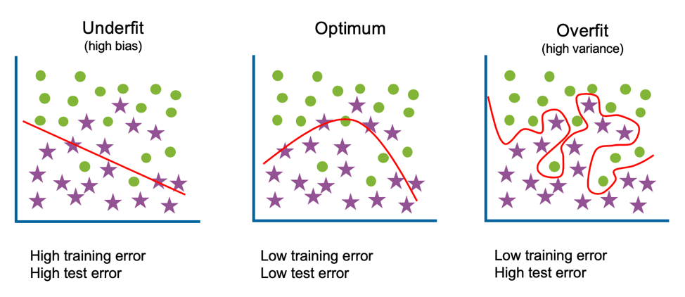</img>

<h1>Parameter Estiamtion</h1>

<h2>What is MLE?</h2>

The following is a general setup for a statistical inference problem: There is an unknown quantity that we would like to estimate. We get some data From the data, we estimate the desired quantity this is frequentist approach to this problem. In this approach, the unknown quantity θ is assumed to be a fixed (non-random) quantity that is to be estimated by the observed data.

We now would like to talk about a systematic way of parameter estimation. Specifically, we would like to introduce an estimation method, called maximum likelihood estimation (MLE)

Let X1, X2, X3, ..., Xn be a random sample from a distribution with a parameter θ (In general, θ might be a vector, θ=(θ1,θ2,⋯,θk).) Suppose that x1, x2, x3, ..., xn are the observed values of X1, X2, X3, ..., Xn. If Xi's are discrete random variables, we define the likelihood function as the probability of the observed sample as a function of θ: 
L(x1,x2,⋯,xn;θ) = P(X1=x1,X2=x2,⋯,Xn=xn;θ)

<ol>
<li>If Xi's are discrete, then the likelihood function is defined as
<b>L(x1,x2,⋯,xn;θ) = PX1X2⋯Xn(x1,x2,⋯,xn;θ)</b>. </li>

<li>If Xi's are jointly continuous, then the likelihood function is defined as
<b>L(x1,x2,⋯,xn;θ)=fX1X2⋯Xn(x1,x2,⋯,xn;θ)</b>.</li>
</ol>

In some problems, it is easier to work with the log likelihood function given by
ln L(x1,x2,⋯,xn;θ).

Now that we have defined the likelihood function, we are ready to define maximum likelihood estimation. Let X1, X2, X3, ..., Xn be a random sample from a distribution with a parameter θ. Suppose that we have observed X1=x1, X2=x2, ⋯, Xn=xn. The maximum likelihood estimate of θ, shown by θ^ML is the value that maximizes the likelihood function
L(x1,x2,⋯,xn;θ).

Note that the value of the maximum likelihood estimate is a function of the observed data. Thus, as any other estimator, the maximum likelihood estimator (MLE) is indeed a random variable

<h2>Waht is MAP?</h2>

 we would like to discuss a different approach for inference, namely the Bayesian approach. In the Bayesian framework, we treat the unknown quantity, Θ, as a random variable. we assume that we have some initial guess about the distribution of Θ. This distribution is called the prior distribution. We observe some data. We then use Bayes' rule to make inference about the unobserved random variable. This is generally how we approach inference problems in Bayesian statistics.That is why this approach is called the Bayesian approach.

in this approach our goal is to draw inferences about an unknown variable X by observing a related random variable Y. The unknown variable is modeled as a random variable X, with prior distribution. 
After observing the value of the random variable Y, we find the posterior distribution of X. This is the conditional PDF (or PMF) of X given Y=y,
we use bayes formula for calculating posterior distribution.

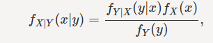

in the above image we have Fx|y(x|y) as postrior distribution and fx(X) as priror distribution. in many problems Fy|x(y|x) is MLE function that we will explain it later!

The posterior distribution, fX|Y(x|y), contains all the knowledge about the unknown quantity X. Therefore, we can use the posterior distribution to find point estimation of X. One way to obtain a point estimate is to choose the value of x that maximizes the posterior PDF (or PMF). This is called the maximum a posteriori (MAP) estimation

Note that fY(y) does not depend on the value of x. Therefore, we can equivalently find the value of x that maximizes:
     fY|X(y|x)fX(x) 

 in many cases we choose alpha-beta distribution for prior distribution 

# Handle unseen events

One of the most important concepts in machine learning is to handle unseen events. To clarify, consider the following example.  

Consider the vector $X=[x_1,x_2,x_3,x_4,x_5]$ and the following data as training dataset.  

|    data     |    label    |
| :-----------: | :-----------: |
|[1, 1, 1, 0, 1]|    a    |
|[1, 0, 1, 0, 0]|    a    |
|[0, 0, 1, 0, 1]|    a    |
|[0, 1, 1, 0, 0]|    a    |
|[0, 0, 1, 0, 0]|    a    |
|[0, 0, 0, 0, 1]|    b    |
|[0, 1, 1, 0, 1]|    b    |
|[0, 1, 0, 1, 1]|    b    |
|[0, 1, 1, 1, 1]|    b    |
|[0, 0, 0, 1, 1]|    b    |

We want to predict the label of $[1, 1, 0, 0, 1]$ using a simple naïve Bayes model. First, we create a naïve Bayes model based on the training dataset.  
    

Now, we calculate the probability of each label based on the created naïve Bayes model.  

$P(label=a)\propto\frac{2}{5}\times\frac{2}{5}    \times0\times1\times\frac{2}{5}=0$  

$P(label=b)\propto0\times\frac{3}{5}\times\frac{3}{5}\times\frac{2}{5}\times1=0$

If you look at the naïve bayes model again, you will find out that there is no data with $x_3=0$ or $x_4=1$ for label a, and there is no data with $x_1=1$ or $x_5=0$ for label b.  

**So, what would we do to handle this situation?**

## Laplace Smoothing

One of the most common methods to solve the above problem is using Laplace smoothing. Consider a bag of green and yellow balls. Suppose there are three green balls and no yellow balls in the bag. So, the probability of each color is:  

$P(color=green)=1$  

$P(color=yellow)=0$  

Using Laplace smoothing, we pretend that we saw every outcome extra time. For the above example, by using Laplace smoothing with, the probabilities for each color are as follows:  

$P(color=green)=\frac{4}{5}$  

$P(color=yellow)=\frac{1}{5}$  

In general:  

$P_{LAP,k}(x)=\frac{c(x)+k}{N+k|X|}$  

And for conditional probabilities:  

$P_{LAP,k}(x|y)=\frac{c(x,y)+k}{c(y)+k|X|}$  

**Using Laplace smoothing with large k is not appropriate as it ignores the prior belief.**  

Now, back to the label prediction example. We use Laplace smoothing with $k=1$ and calculate label probabilities again. We consider the following extra data:  

|    data     |    label    |
| :-----------: | :-----------: |
|[1, 1, 1, 1, 1]|    a    |
|[1, 1, 1, 1, 1]|    b    |
|[0, 0, 0, 0, 0]|    a    |
|[0, 0, 0, 0, 0]|    b    |

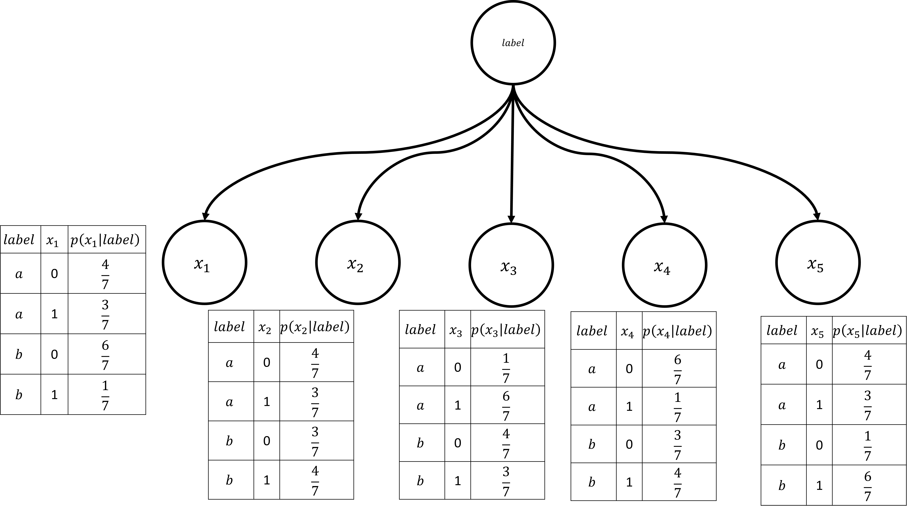

$P(label=a)\propto\frac{3}{7}\times\frac{3}{7}\times\frac{1}{7}\times\frac{6}{7}\times\frac{3}{7}=\frac{162}{16807}$  

$P(label=b)\propto\frac{1}{7}\times\frac{4}{7}\times\frac{4}{7}\times\frac{3}{7}\times\frac{6}{7}=\frac{288}{16807}$  

## Linear interpolation

In practice, Laplace smoothing often performs poorly for $P(X|Y)$ When $X$ or $Y$ is very large.  

Another useful method is **linear interpolation**. Linear interpolation (also known as **Lerp**) is a method to find unknown values between two known points. The unknown values are approximated through Linear interpolation by connecting these two known points with a straight line.  

In this method, we consider both $p(x|y)$ and $p(x)$ to calculate the $p(x|y)$  

In general:  

$P_{LIN}(x|y)=\alpha P(x|y)+(1-\alpha)P(x), 0<\alpha<1$  

By choosing an appropriate value for $\alpha$, we can handle unseen events.  

# More about dataset

In the last section, we learned about Laplace smoothing and linear interpolation. But how can we calculate appropriate values for $\alpha$ and k?  

We introduce three datasets:  

## Training Dataset

**The sample of data used to fit the model.**
The actual dataset that we use to train the model (weights and biases in the case of a Neural Network). The model sees and learns from this data.  

## Validation Dataset
**The sample of data used to provide an unbiased evaluation of a model fit on the training dataset while tuning model hyperparameters. The evaluation becomes more biased as skill on the validation dataset is incorporated into the model configuration.**  
The validation set is used to evaluate a given model, but this is for frequent evaluation. We, as machine learning engineers, use this data to fine-tune the model hyperparameters. Hence the model occasionally sees this data but never does it “Learn” from this. We use the validation set results and update higher-level hyperparameters. So, the validation set affects a model, but only indirectly. The validation set is also known as the Dev set or the Development set. This makes sense since this dataset helps during the “development” stage of the model. We use this dataset to calculate $\alpha$ and $k$.  

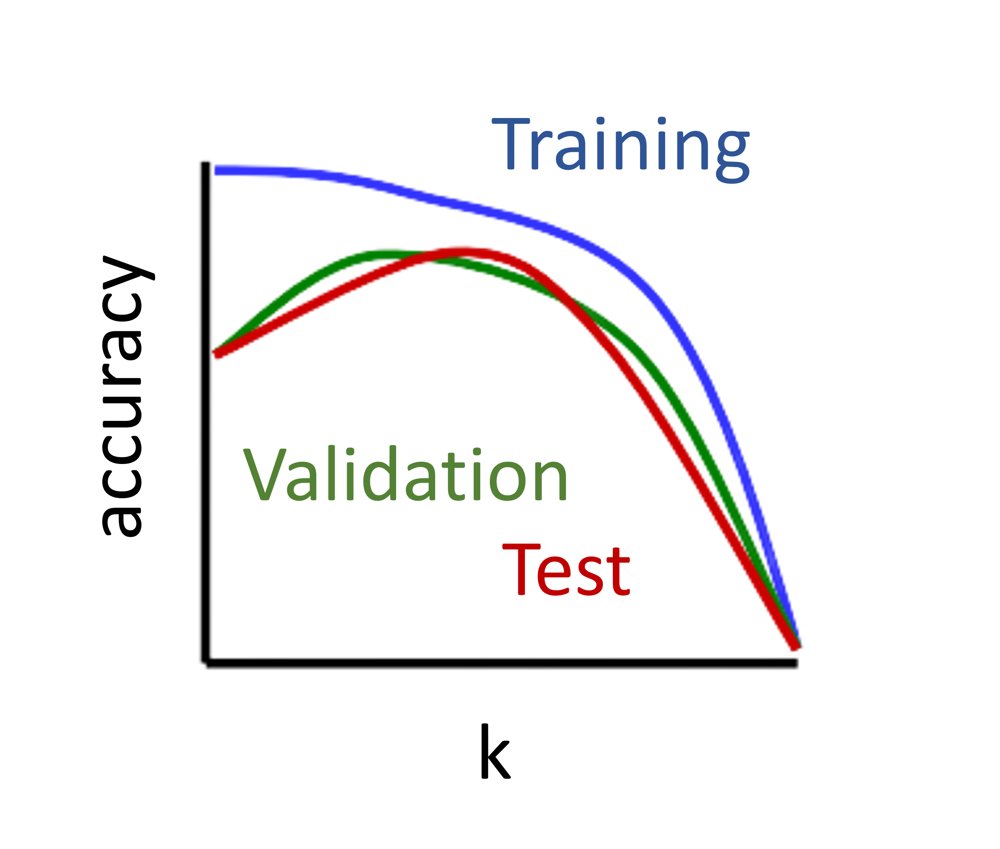  

## Test Dataset

**The sample of data used to provide an unbiased evaluation of a final model fit on the training dataset.**  

The Test dataset provides the gold standard used to evaluate the model. It is only used once a model is completely trained(using the train and validation sets). The test set is generally what is used to evaluate competing models (For example on many Kaggle competitions, the validation set is released initially along with the training set, and the actual test set is only released when the competition is about to close, and it is the result of the model on the Test set that decides the winner). Many times the validation set is used as the test set, but it is not good practice. The test set is generally well-curated. It contains carefully sampled data that spans the various classes that the model would face when used in the real world.  

## About the dataset split ratio
Now that you know what these datasets do, you might be looking for recommendations on how to split your dataset into Train, Validation and Test sets.  
This mainly depends on 2 things. First, the total number of samples in your data and second, on the actual model you are training.  
Some models need substantial data to train upon, so in this case, you would optimize for the larger training sets. Models with very few hyperparameters will be easy to validate and tune, so you can probably reduce the size of your validation set, but if your model has many hyperparameters, you would want to have a large validation set as well(although you should also consider cross-validation). Also, if you happen to have a model with no hyperparameters or ones that cannot be easily tuned, you probably don’t need a validation set too!  

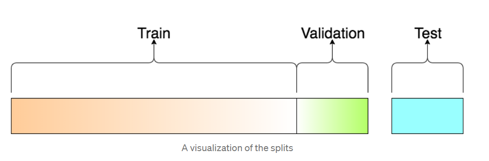

# Conclusion
so in this chapter, we introduced key concepts of machine learning.
we learned about the applications of ML, supervised and unsupervised in ML, and some algorithms like naive Bayes.
after these primary concepts, we learned about some problems like bias and variance and their relations to overfitting and underfitting.
for parameter estimation, we learned two statistical approaches like Bayesian and frequentist approach and after that, we used these two frameworks and some formulas like Laplace and linear interpolation which are based on MLE and MAP.
we also learned about how to work with datasets in machine learning.  

# References

[Gentle Introduction to the Bias-Variance Trade-Off in Machine Learning](https://machinelearningmastery.com/gentle-introduction-to-the-bias-variance-trade-off-in-machine-learning/).  

[Understanding the Bias-Variance Tradeoff](https://towardsdatascience.com/understanding-the-bias-variance-tradeoff-165e6942b229).  

[Underfitting and Overfitting](https://www.geeksforgeeks.org/underfitting-and-overfitting-in-machine-learning/).  

[Probability concepts explained: Maximum likelihood estimation](https://towardsdatascience.com/probability-concepts-explained-maximum-likelihood-estimation-c7b4342fdbb1).  

[A Gentle Introduction to Maximum Likelihood Estimation and Maximum A Posteriori Estimation](https://towardsdatascience.com/a-gentle-introduction-to-maximum-likelihood-estimation-and-maximum-a-posteriori-estimation-d7c318f9d22d#:~:text=estimated%20with%20MLE.-,Maximum%20A%20Posteriori%20Estimation,when%20you%20have%20enough%20data.&text=For%20example%2C%20if%20Liverpool%20only,is%202%2F2%20%3D%201).  