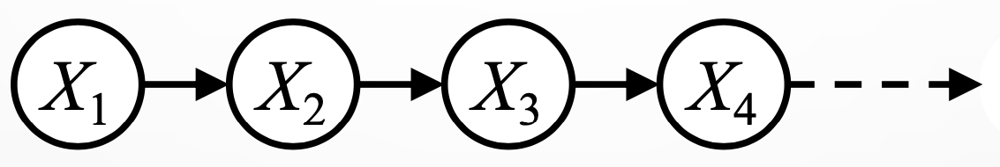
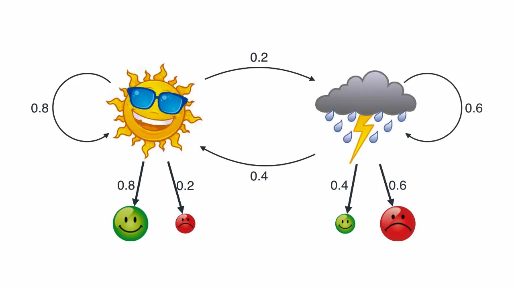

# Temporal Probability Models
## Group Info:
Group Number: 12
Members: Arshan Dalili, Soroush Jahanzad, Mohammad Hejri

## Table of Contents
[Introduction](#Introduction)

[Reasoning over time or space](#Reasoning-over-time-or-space)
* [What is a Temporal Probability Model?](#What-is-a-Temporal-Probability-Model)
* [Markov Models](#Markov-Models)
* [Joint Distributions of Markov Models](#Joint-Distributions-of-Markov-Models)
* [Chain Rule](#Chain-Rule)

[Mini-Forward Algorithm](#Mini-Forward-Algorithm)

[Stationary Distribution](#Stationary-Distribution)

[Hidden Markov Model](#Hidden-Markov-Model)
* [Chain Rule and Joint Distribution of Hidden Markov Model](#Chain-Rule-and-Joint-Distribution-of-Hidden-Markov-Model)
* [Hidden Markov Models Applications](#Hidden-Markov-Model-Applications)

[Conclusion](#Conclusion)

[References](#References)

## Introduction
In this lecture note, we are going to talk about **_Temporal Probability Models_**. We will discuss what they are and how they can help us model problems that are subject to change over time.

## Reasoning over time or space
So far, we have learned how to deal with probabilistic reasoning in static worlds. That means each random variable has a fixed value and doesn't change over time. However, most of our problems don't have this static behavior, and the state varies over time (or space).

Let' start with an example of a static problem:
>Imagine that your car has broken down. You may guess that the problem is related to the engine, batteries, or other car parts. You may take the vehicle to a car repair shop to diagnose the problem and fix it. You know that during the diagnosis process, the broken part remains broken, so the state of the car doesn't change.

<<<<<<< HEAD

=======

>>>>>>> 62945d3c53841b83ca4a968833319d274fcbb349

But our problems aren't always static. Consider the below example:
>Take diabetes management of a patient as our problem. We know that, for instance, the patient's blood sugar isn't constant and will vary over time, so there is a dynamic in the variables used to describe the patient's state (such as the blood sugar and insulin).

<<<<<<< HEAD

=======

>>>>>>> 62945d3c53841b83ca4a968833319d274fcbb349

As you can see, the patient's status varies over time, and our approaches in static probabilistic reasoning won't work for these problems. So we should look for other approaches to solve them.

Temporal Probability Models can make it easier for us to model and solve these types of problems.

### What is a Temporal Probability Model?

As the diabetes example above shows, we need to introduce **time** (or space) for our models.
Retake variables of the diabetes example. We know that these variables can change over time, so to manage the diabetes of the patient, we slice time at specific points and keep track of this evidence to evaluate the current state and predict the future diabetic condition of the patient.

>_**Hence we can model the diabetes status of a patient using a Temporal Probability Model.**_

There are some variables like measured blood sugar and pulse rate that are measurable, and we denote them as  at time $t$.

On the other hand, we have some unmeasurable variables like stomach content and blood sugar. (Notice that measured blood sugar and blood sugar are considered different variables since measured blood sugar has some errors.) and at time $t$, we use ${X}_t$ to denote them.
In a nutshell, we have:

\begin{equation}
{E}_t = Observable\;Variable\;at\;time\;t\\
{X}_t = NonObservable\;Variable\;at\;time\;t
\end{equation}

### Markov Models
Let's define a random variable $X$ and call its value at a given time $t$ the state of $X$ and denote it as $X_t$. If in our model the future state of $X$ depends only on the current state of $X$ and not on states that had occurred before, we call it a **_First-order Markov Model_**, or simply a **_Markov Model_**. Bayesian network of this model looks like the below network and is referred to as a **_Markov Chain_**:

In a Markov chain, we can write the Morkov assumption as:

\begin{equation}
P(X_n=x_n|X_{1:n-1}=x_{1:n-1}) = P(X_n = x_n|X_{n - 1}=x_{n - 1})
\end{equation}

*Note:* We also define $X_{a:b}$ to denote a set of variables from $X_a$ to $X_b$.

\begin{equation}
X_{a:b} = X_a, X_{a+1}, \cdots, X_{b-1}, X_b
\end{equation}

In a similar way, we can use **_$i$th-order Markov Models_** to model situations in which the future state of $X$ depends only on $i$ recent states and not on states that had occrred before. In this case we have:

\begin{equation}
P(X_n=x_n|X_{1:n-1}=x_{1:n-1}) = P(X_n = x|X_{n - i:n - 1}=x_{n - i : n - 1})
\end{equation}

### Joint Distributions of Markov Models

Take $X$ as a Markov Model and consider its Bayesian network (depicted below).

We can quickly notice that for every $1\lt i\le n$ , if we are given $X_{i-1}$, then **$X_i$ is independent of $X_1, X_2, \cdots, X_{i-2}$** since there is only one inactive path between each of them and $X_i$. (Regarding the fact that $X_{i-1}$ is given)
So we have:

\begin{equation}
    X_i \perp \!\!\! \perp X_1, X_2, \cdots, X_{i-2} \vert X_{i-1}
\end{equation}

We define two parameters here:
* **Transition Probabilities**:
    
    \begin{equation}
    P(X_t \vert X_{t-1})
    \end{equation}
    
    It shows how each state is related to its previous state and how states develop.
    The **_Stationary assumption_** in Markov models ensures that transition probabilities don't change over time.
* **Initial State Probability**:
    
    \begin{equation}
    P(X_1)
    \end{equation}
    
    It is the probability of the initial state ($X_1$), and we usually know its value.
    
    We can find the joint distribution of X regarding the Bayesian network and the parameters we defined. If we consider $X_1$ to $X_n$, then we have:
    
    \begin{equation}
    P(X_1, X_2, \cdots, X_{n-1}, X_n) = P(X_1)P(X_2\vert X_1)P(X_3\vert X_2)\cdots P(X_{n-1}\vert X_{n-2})P(X_{n}\vert X_{n-1})\\ \Rightarrow P(X_1, X_2, \cdots, X_{n-1}, X_n) =P(X_1)\prod_{t=2}^{n}P(X_t \vert X_{t-1})
    \end{equation}
    
In the next section, we will prove this joint distribution using Chain Rule and independence.

### Chain Rule
Take $X$ as a Markov Model and consider its Bayesian network (depicted below).

We know that from Chain Rule, every joint distribution of $X_1$ to $X_n$ can be written as:

    \begin{equation}
    P(X_1, X_2, \cdots, X_{n-1}, X_n) = P(X_1)P(X_2\vert X_1)P(X_3\vert X_1, X_2)\cdots P(X_{n}\vert X_1,X_2,\cdots X_{n-1})
    \end{equation}
    
Now, due to the independence we saw earlier, we can assume:

\begin{equation}
    X_3 \perp \!\!\! \perp X_1\vert X_2, X_4\perp \!\!\! \perp X_1,X_2\vert X_3, \cdots, X_{n}\perp \!\!\! \perp X_1,X_2\cdots X_{n-2}\vert X_{n-1}
\end{equation}

So, after applying independence to Chain Rule, we have:

    \begin{equation}
    P(X_1, X_2, \cdots, X_{n-1}, X_n)= P(X_1)P(X_2\vert X_1)P(X_3\vert X_1, X_2)\cdots P(X_{n}\vert X_1,X_2,\cdots X_{n-1})\\=P(X_1)P(X_2\vert X_1)P(X_3\vert X_2)\cdots P(X_{n}\vert X_{n-1})\\=P(X_1)\prod_{t=2}^{n}P(X_t \vert X_{t-1})
    \end{equation}
    
which is the same result we get from the previous section.

## Mini-Forward Algorithm

Imagine you want to go on a trip with your friends. Your friends think that trips in sunny days are more fun, so they ask you to schedule the trip for a sunny day. You know that you cannot be completely certain whether the $n$th day after today is going to be sunny or rainy, so what will you do?

We can solve this problem easily if we assume a Markov model. Suppose that we have measured the transition probabilities for this model and know that if some day is sunny, the next day will be sunny with probability $P(X_{n + 1} = sunny | X_{n} = sunny) = 0.9$ and will be rainy otherwise. Similarly, if some day is rainy, the next day will be rainy with probability $P(X_{n + 1} = rainy | X_{n} = rainy) = 0.7$ and will be sunny otherwise. We also know the initial probability because we know today's weather.

Now that we have a good model, we need an efficient approach to find the probability of each outcome in the $n$th day after today. A naive approach would be to enumerate all possible sequences of length $n$ which end in each outcome and then add up their probabilities. This will do the work, but it will require a lot of time and effort and is too slow. A better approach is to store our incremental *belief* about the weather and to update it as we consider proceed twords the $n$th day in our calculations. This approach is called the **Mini-Forward Algorithm**.

In the Mini-Forward algorithm, we use the probabilities for the initial state and forward simulation to calculate the probabilities in the future states. The probability of outcome $x_i$ in the state $X_n$ using this algorithm is:

\begin{equation}
    P(X_n = x_i) = \sum_{x_j} P(X_n = x_i | X_{n - 1} = x_j) P(X_{n - 1} = x_j)
\end{equation}

This can be easily computed for each state because we know the initial probability $P(X_1 = x_k)$ for every $k$ and the transition probabilities for each state can also be calculated using this algorothm.

Now that we have this solution, we can say that the probability that the $n$th day after today will be sunny in our example is:

\begin{equation}
    P(X_{n + 1} = sunny) = \sum_{x_j \in \{sunny, rainy\}} P(X_n = sunny | X_{n - 1} = x_j) P(X_{n - 1} = x_j)
\end{equation}

\begin{equation}
    \Rightarrow P(X_{n + 1} = sunny) = 0.9 \times P(X_n = sunny | X_{n - 1} = sunny) + 0.3 \times P(X_n = sunny | X_{n - 1} = rainy)
\end{equation}

Now, let's take a look at the state of weather with initial observation of sun:

 

Finally, let's take a look at the state of weather with initial observation of rain:

## Stationary Distribution

An interesting question to ask in problems modeled using Markov chains is about the state as we continue simulating for a long time. As we simulate further into the future, the Moarkov chain becomes longer and uncertainty is accumulated. 

In the general case, we cannot say what the state will be in the far future. However, for most Markov chains, we will eventually end up in the same distribution no matter what the initial distribution is. In other words, the distribution we end up in is independent of the initial distribution. In such cases, the distribution we end up with is called the **stationary distribution** of the chain. This distribution is denoted by $P_\infty$ and satisfies the condition below.

\begin{equation}
    P_{\infty}(X) = P_{\infty + 1}(X) = \sum_{x} P(X|x) P_{\infty}(x)
\end{equation}

In the weather example we mentioned earlier, the stationary distribution denotes the probability that each day will be sunny or rainy in general.

## Most Likely Explanation: Mini-Viterbi Algorithm

Sometimes we would like to find out what happened in the past using the knowledge that we have in present. Consider the trip we discussed earlier as an example. Imagine that you and your friends want to go outside, but some of your friends warn you that everything might be wet if it had rained in the past $n$ days. Since your destination is too far, you do not know about its past, so we need to reason about the most likely sequence of your destination's weather in the past $n$ days. The course of this problem can be shown using the following figure.

 

Again, a slow answer would be to enumerate all possible combinations and calculate the probabilities. However, we can calculate the most likely sequence inductively, remember the incremental probabilities, and update the most likely sequence as we proceed. This approach is called the **Mini-Viterbi Algorithm**.

In the Mini-Viterbi algorithm, we define $m_t[x]$ and $a_t[x]$ as:

\begin{equation}
    m_t[x] = \max_{x_{1:t - 1}} P(x_{1:t - 1}, x)
\end{equation}
\begin{equation}
    a_t[x] = arg\!\max_{x_{1:t - 1}} P(x_{1:t - 1}, x)
\end{equation}

The equation above can be rewritten to:
\begin{equation}
    m_1[x] = P(X_1 = x1)
\end{equation}
\begin{equation}
    m_t[x] = \max_{x_{1:t - 1}} P(x_t | x_{t - 1}) m_{t - 1}[x]
\end{equation}

Using this method, the most likely sequence in the past $t - 1$ states, also known as the most likely explanation, will be available in $a_t[x]$.

In our example, we can use the Mini-Viterbi algorithm starting from $x_1 = The\ weather\ n\ days\ ago$, and the most likely sequence would be available in $a_{n + 1}[x_{today}]$.

## Hidden Markov Model
Let's start with the following scenario:

We have two friends Alice and Bob. They live very far apart. So, they talk on the phone. Bob has a mood that changes based on the weather. Whenever they talk on the phone, Bob tells Alice his mood.

Suppose that if the weather is sunny, then Bob is happy with a probability of 80% and grumpy with a probability of 20%. Likewise, if the weather is rainy, Bob is grumpy with a probability of 60% and happy with a probability of 40%.

Whenever Bob tells Alice that he is happy, she may guess that the weather is sunny regarding the probabilities discussed above. Similarly, if Bob tells Alice that he is grumpy, she may suppose rainy weather. Notice that there may be some exceptions that despite the rainy weather, Bob is happy, or despite the sunny weather, he is grumpy.

Now, we get the time involved in our problem. Suppose that if today is sunny, tomorrow will be sunny with the probability of 80%, and rainy with the probability of 20%. Likewise, if today is rainy, tomorrow will be rainy with the probability of 60%, and sunny with the probability of 40%.

Consider the figure below to get a better understanding of the problem discussed above:

<<<<<<< HEAD

=======

>>>>>>> 62945d3c53841b83ca4a968833319d274fcbb349

Now, we formulate the problem formally:

\begin{equation}
{E}_t: Bob's\;mood\;at\;time\;t\;(Observation) \in \{happy, grumpy\}\\
{X}_t: Weather's\;condition\;at\;time\;t\;(State) \in \{sunny, rainy\}
\end{equation} 
So, the question is, how can Alice infer the weather’s condition (state) regarding Bob’s mood (observation)?

The problem discussed above is an example of the Hidden Markov Model (HMM). It is not possible to model the problem as a Markov Chain in many problems. So, how can we model these problems?

Most of the time, it is possible to use HMM! If the problem has a superior state that is a Markov Process, we can make an assumption about this superior state (i.e. our belief), and update it as we observe the problem’s inputs.

In the problem discussed before, our belief is weather’s condition that can be updated regarding the observation, Bob’s mood.

Let’s get into HMM’s structure. We start with a simple Markov chain. At each state, we add new nodes for the inputs of the problem. These nodes are called observation nodes and act like agent sensors. Note that each observation node solely relies on its corresponding state.

Take a closer look at the figure below to find out HMM's structure:

 
 

Regarding the structure above, an HMM is defined by:
- $P(X_1)$ as initial distribution
- $P(X_t \mid X_{t-1})$ as transitions distribution
- $P(E_t \mid X_t)$ as emissions distribution

We will dive into more mathematics in the next part.

### Chain Rule and Joint Distribution of Hidden Markov Model
Let's denote $X_t,X_{t-1},\cdots,X_2,X_1$ by $X_{t:1}$. Similarly, denote $E_t,E_{t-1},\cdots,E_2,E_1$ by $E_{t:1}$.

We are going to calculate joint distribution of HMM.

From the Chain Rule, every joint distribution over $X_{t:1}, E_{t:1}$ can be written as:

\begin{equation}
P(X_{t:1}, E_{t:1})=P(X_1)P(E_1 \mid X_1)P(X_2\mid X_1,E_1)P(E_2\mid X_{2:1},E_1)\cdots P(X_t\mid X_{t-1:1},E_{t-1:1})P(E_t\mid X_{t:1},E_{t-1:1})
\end{equation}  
Regarding the HMM's structure, we can assume that:

\begin{equation}
\forall t>1:\;\;\;X_t \perp \!\!\! \perp X_{t-2:1},E_{t-1:1} \mid X_{t-1}\;\;\;and\;\;\;E_t \perp \!\!\! \perp X_{t-1:1},E_{t-1:1} \mid X_{t}
\end{equation}  
Recall that every node given its parents is independent of its non-descendants.

Using the properties above, we get: 
\begin{equation}
P(X_{t:1}, E_{t:1})=P(X_1)P(E_1 \mid X_1)\prod_{i = 2}^{t} P(X_i \mid X_{i-1})P(E_i \mid X_i)
\end{equation}  

### Hidden Markov Model Applications
Hidden Markov models are known for their applications in various fields, such as:
- Signal processing
- Information theory
- Pattern recognition
- Statistical mechanics
- Physics
- Chemistry 
- Economics
- Finance
- Thermodynamics

Below, some of its popular applications are described in more details:

#### Speech recognition HMMs
The main core of HMM-based speech recognition systems is the Viterbi algorithm which will be discussed in the following section. The Viterbi algorithm uses dynamic programming to find out the best alignment between the input speech and a given speech model. Nowadays, most Large Vocabulary Continuous Speech Recognition (LVCSR) systems are based on HMMs.

In speech recognition HMMs, the continuous-valued acoustic signals are our observations. States are particular positions in specific words.

 

#### Machine translation HMMs
A simple approach would be the mechanical substitution of words in one language for words in another. However, this won't result in coherent translations most of the time.

Better results can be achieved using attention-based neural machine translation (NMT) models. These models focus on specific source positions to produce a translation with considerable improvements over pure encoder-decoder models. To achieve this, We use a Hidden Markov Model (HMM) consisting of neural network-based alignment and lexicon models, which are trained jointly using the forward-backward algorithm. 

In machine translation HMMs, observations are millions of words and corresponding states are translation options.

 

#### Robot tracking HMMs
Hidden Markov Models (HMM) are applied to interoceptive data acquired by a moving robot when contouring an environment. To track the robot accurately, the robot needs a sufficient set of sensors.

In Robot tracking HMMs, observations are sensors' continuous perceptions and corresponding states are positions in the map.

 

## Conclusion
In this note, we first introduced Temporal Probability Model and discussed why we need them to model problems that vary over time. We then introduce Markov Models, explain their properties, and calculate their joint distribution with Chain Rule.

Then, we talked about the Mini-Forward algorithm and how it can help us predict the state of the system in the future. After that, we talked about stationary distributions help us to know will eventually end up in the same distribution no matter what the initial distribution is.

Then, we discussed a popular family of temporal models, called Hidden Markov Models for probabilistic sequence classification. In these models, we link a sequence of observations to a sequence of hidden states that explains those observations. Inference, as our goal, was the process of discovering the sequence of hidden states, given the sequence
of observations. Finally, we introduced some of the HMM's well-known applications.

## References
* [Artificial Intelligence: A Modern Approach, 4th Edition](http://aima.cs.berkeley.edu/)
* [CE417 Lecture Slides, Prof. Rohabn, Sharif University of Technology](http://ce.sharif.edu/courses/00-01/1/ce417-1/resources/root/Slides/PDF/Session%2015_16.pdf)
* [CSC545 Lecture Slides, University of Miami](https://www.cs.miami.edu/home/visser/csc545-files/ProbabilisticReasoningOverTime.pdf)
* [Speech and Language Processing. Daniel Jurafsky & James H. Martin, Stanford University](https://web.stanford.edu/~jurafsky/slp3/A.pdf)
* [University of Tennesee Lecture Slides](https://nanopdf.com/download/chapter-15-probabilistic-reasoning-over-time_pdf)
* [Paulo E. Santos (FEI - Sao Paulo) Slides](https://fei.edu.br/~psantos/slidesIA/CAP15-DBN.pdf)
* [CS 188: Artificial Intelligence Lecture Slides, Dan Klein, Spring 2006](https://inst.eecs.berkeley.edu/~cs188/sp06/slides/cs188%20lecture%2018%20--%20HMMs%20(2pp).pdf)

<<<<<<< HEAD
_\*Some conceptual pictures used in this note are under courtesy of [VectorStock Media](https://vectorstock.com)_
=======
_\*Some conceptual pictures used in this note are under courtesy of [VectorStock Media](https://vectorstock.com)_
>>>>>>> 62945d3c53841b83ca4a968833319d274fcbb349
