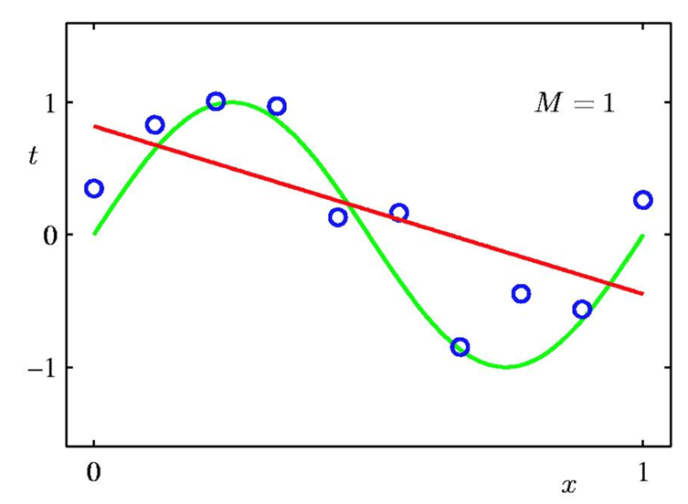
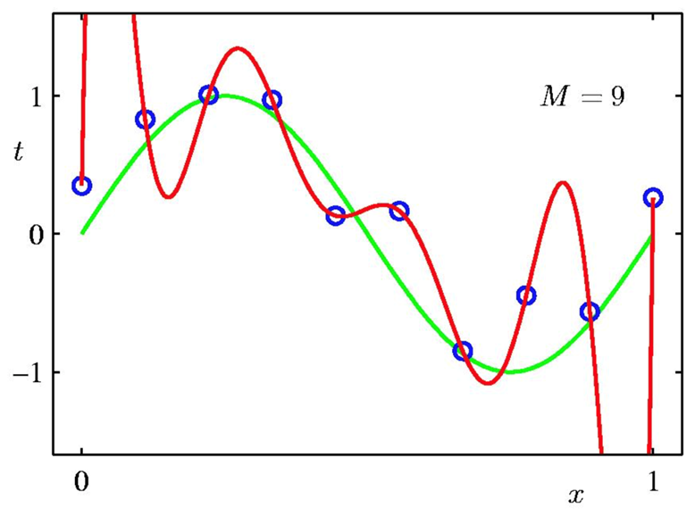
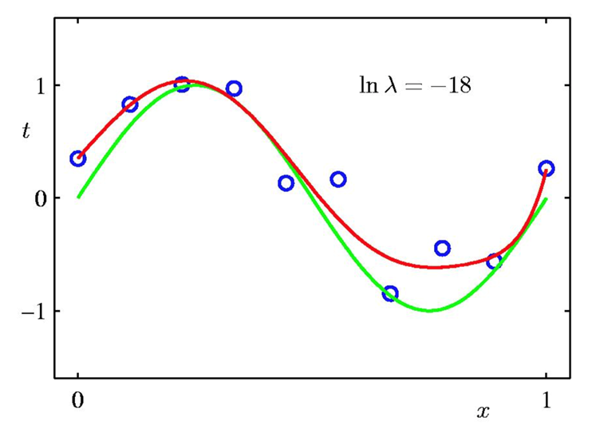
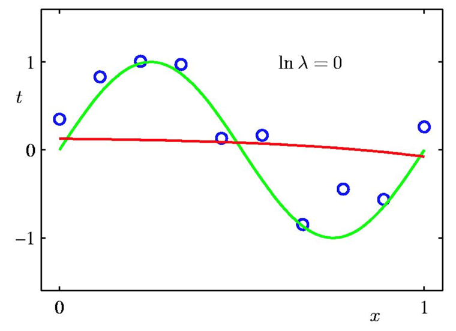

# Regression

# Table of Contents

- [Regression](#regression)
- [Table of Contents](#table-of-contents)
- [Introduction](#introduction)
- [1 - Linear Regression](#2---linear-regression)
  - [Loss Function](#loss-function)
    - [Mean Squared Error (MSE)](#mean-squared-error-mse)
  - [Finding $\hat{w}$](#finding-hatw)
    - [Gradient Descent](#gradient-descent)
    - [Normal Equation](#normal-equation)
- [2 - Learning Curves Using Polynomials](#3---learning-curves-using-polynomials)
  - [Reduction to Linear Regression](#reduction-to-linear-regression)
  - [Overfitting](#overfitting)
    - [Using Validation Set (Held-Out Data)](#using-validation-set-held-out-data)
    - [Regularization](#regularization)
- [3 - Logistic Regression](#5---logistic-regression)
  - [How to calculate probabilities](#how-to-calculate-probabilities)
  - [defining line _l_ and cost function $J(\theta)$](#defining-line-l-and-cost-function-jtheta)
  - [Training](#training)
- [Conclusion](#conclusion)
- [Refrences](#refrences)

# Introduction
We have some data points and a number or a label is assigned to each data point. Our goal is to predict the number or label of an unseen data point after learning from the data we already have. We assume each data point is a vector $x$ and we want to predict $f(x)$. The first idea is to use interpolation. By using interpolation, we will have a high degree polynomial which fits our training data perfectly. But the problem is that, interpolation leads to overfitting. So the error for unseen data will be too large. In regression, we aim to find the best curve with lower degree. Although there will be some training error here, our test error will decrease since we are avoiding overfitting.

# 1 - Linear Regression

Here, we want to assign $f(x)$ to each data point $x$. In linear regression, we assume $f$ is a linear function. We can define $f$ as

$$
    f_w(x) = w^T x = \begin{bmatrix}
        w_0 & w_1 & \cdots & w_n
    \end{bmatrix} . \begin{bmatrix}
        1 \\ x_1 \\ \vdots \\ x_n
    \end{bmatrix}.
$$
We assumed $x_0 = 1$ in $x$ to have bias in our function. So the data points are in an n-dimentional space.

We also define $y$ as

$$
    y_w = \begin{bmatrix}
        f_w(x^{(1)}) \\ f_w(x^{(2)}) \\ \vdots \\ f_w(x^{(m)})
    \end{bmatrix}
$$
where $x^{(i)}$ is the i'th data point. 

## Loss Function
After defining $f$, we need to find the best function. By defining a loss function, we can try to minimize loss by changing $w$ in the main function. Assuming $L$ as our loss function, best $f$ will be

$$
    \hat{w} = argmin_w L(y_w, \hat{y}) \rightarrow f_{best}(x) = f_{\hat{w}}(x) 
$$

where $\hat{y}$ is the given number for each data point.

### Mean Squared Error (MSE)
The main loss function we use is mean squared error. It's defined as 

$$
    MSE(y_w, \hat{y}) = \frac{1}{2} \Sigma_{i=1}^m \left[ y_w^{(i)} - \hat{y}^{(i)} \right]^2 .
$$
The main reason for using this function is that we can calculate gradient easily. So we can use gradient descent to find $\hat{w}$.

## Finding $\hat{w}$

### Gradient Descent
We want to use gradient descent to find $\hat{w}$. First, we need to calculate $\nabla_w L(y_w, \hat{y})$ because it's used in the gradient descent method. The partial derivitives for MSE are:

$$
    \frac{\partial MSE}{\partial w_j} = - \Sigma_{i = 1}^m x_j^{(i)} \left[ y_w^{(i)} - \hat{y}^{(i)} \right]
$$

So for gradinet, we have:

$$
    \nabla_w MSE = \begin{bmatrix}
        \frac{\partial MSE}{\partial w_0} \\ \vdots \\ \frac{\partial MSE}{\partial w_n}
    \end{bmatrix}
$$

Now, we can find $\hat{w}$ by the gradient descent algorithm as

$$
    w^{(i+1)} = w^{(i)} - \eta \nabla_{w^{(i)}} L
$$

where $\eta$ is the learning rate.

### Normal Equation
If we define

$$
    X = \begin{bmatrix}
        x^{(1)} \\ \vdots \\ x^{(m)}
    \end{bmatrix}
$$

and solve the equation $\nabla_w MSE = 0$, we get the normal equation. It's defined as
$$
    \hat{w} = (X^TX)^{-1} X^T \hat{y}.
$$
However, for using this equation, our features must be linearly independent. Otherwise, $(X^TX)^{-1}$ is not defined. In that case we can use pseudo inverse of $X^TX$ instead of the $(X^TX)^{-1}$. Since the calculation of inverse is computationaly inefficient, we usually prefer using gradient descent. 

# 2 - Learning Curves Using Polynomials

In this section, we want to find the best $P(x)$ where x is a real number and $P$ is an n'th degree polynomial.

## Reduction to Linear Regression

We can define 
$$
    z = \begin{bmatrix}
        x^0 \\ x^1 \\ \vdots \\ x^n
    \end{bmatrix},
$$
then use linear regression to find $f_w(z) = w^T z$. From definition, we know that $P(x) = f_w(z)$. However, if $n$ is too large, overfitting might happen since we are getting closer and closer to interpolation.

## Overfitting
To prevent overfitting, we must try to define $n$ optimaly. Since $n$ is a hyperparameter here, we can use validation set.

The example below demonstrates how $n$ can change curve we find and when overfitting happens. The green curve is our goal. The red curve is the M'th degree polynomial we using this method.

### Using Validation Set (Held-Out Data)
We split a part of the training data, and don't use it for training. Then, by calculating loss function over this data, we can optimize $n$. Since the model hasn't seen these data points, we can be sure that overfitting will decrease.

We can see in the above examples that $M = 3$ gives us the best curve. If we compare the validation loss for $M=3$ and $M=9$, the loss will be less for $M=3$ since it's closer to the green curve.

### Regularization
Although using validation set is a good way to prevent overfitting, We still might be trying to find the curve which best fits the data, not the curve which best matches it. Regularization tries to make $w$ smaller. The intuition is that large coefficients in $w$ happen because it tries to fit the points. It means that the curve will only get closer to each point. However, decreasing coeffiecients will make a better curve which might be further from each point, but does a better job at predicting the unseen data.

We only define $l_2-\text{regularization}$ since it's easier to derive and understand. The loss function is 

$$
    \tilde{E}(y_w, \hat{y}) = \frac{1}{2} \Sigma_{i=1}^m \left[ y_w^{(i)} - \hat{y}^{(i)} \right]^2 + \frac{\lambda}{2}||w||^2
$$
where $\lambda$ is hyperparameter which controls how small the $w$ should be.

In the following examples, we use regularization with 9'th degree polynomials. We can compare these with the overfitted example above. Also, we can see how imoprtant the choice of $\lambda$ is. So, using validation set might be still usefull to optimize $\lambda$.

# 3 - Logistic Regression

There are some regression algorithms that can be used for classification (And vise versa). _Logistic Regression_ is one of these algorithms. It can calculate the probability that an instance belongs to a particular class. we can use this probability for classification: if the probability is higher than 0.5 then that instance belongs to the particular class.

## How to calculate probabilities

Let's start with a simple example. We want to classify flowers that are _Iris Virginica_ from those that are _not Iris Virginica_. This classification is based on Petal Width and Petal Height. Also, consider that there is some line _l_ (black line in the image below) that separates these 2 types of flowers.

Now, to calculate the probabilities, we use the intuition that, the further we are from _l_, the higher is the probability of belonging to that particular class.
To be more exact, consider we want to find the probability of a given flower being _Iris Virginica_. Let's call the signed distance between the flower and the line, _t_. Signed-distance means if we are in the _Iris Virginica_ region, the distance is positive, otherwise, if we are in the _not Iris Virginica_ region, the distance is negative. The probability of this flower being _Iris Virginica_ is related to the value of _t_, the higher the value of _t_, the higher the probability. So we need a function $\sigma(.)$ that when given the singed distance _t_, returns the probability _p_. 
The logistic function is a common choice for this purpose. It is a sigmoid function (i.e., S-shaped) that outputs a number between 0 and 1.

Logistic function: 
$$
\sigma(t) = \frac{1}{1 + \exp(-t)}
$$

In the image above, you can see the probability of colored lines. For example, all the points on the green line have a probability of 0.9. These probabilities are calculated using the Logistic function.
Also in the image below, you can see the value of the Logistic function for different inputs:

## defining line _l_ and cost function $J(\theta)$

Now we know how to calculate the probabilities, the problem is reduced to finding the best line _l_ that separates 2 classes. For this First, we need to define the line and Second, we need to define a coss function $J(\theta)$ and then we should find the line _l_ such that it minimizes $J(\theta)$.

We define line _l_ with parameters $\theta$ like before. With this definition, the signed distance between x and the _l_ can be calculated as follows:
$$
    t_{\theta}(x) = x^{T}\theta
$$
Now we can define the probability of a given x with respect to line _l_ with parameters $\theta$:

$$
    \hat{P} = \sigma(t_{\theta}(x)) = \sigma(x^{T}\theta)
$$

We consider that our dataset has _N_ data points $X_i$ with the label $y_i \in \{0 , 1\}$.
The cost function for just a single data point can be defined as:

$$
    J(\theta) = -log(\hat{P})y -log(1 - \hat{P})(1 - y)
$$
where $\hat{P}$ is the probability predicted for this data point given the line _l_ with parameters $\theta$.

And for _N_ data points, we can define cost function as:

$$
    J(\theta) = -\frac{1}{N}\sum_{i = 1}^{N}log(\hat{P}^{i})y^{i} -log(1 - \hat{P}^{i})(1 - y^{i})
$$
where $\hat{P}^{i}$ is the probability predicted and $y^{i}$ is the label for the $i^{th}$ data point given the line _l_ with parameters $\theta$.

## Training

Unfortunately, there is no known closed-form equation to compute the value of $\theta$ that minimizes this cost function. But the good news is that this cost function is convex! So we can use Gradient Descent to find the minimum. Because of convexity, Gradient Descent is guaranteed to find the global minimum (with the right learning rate).
We can compute the partial derivatives for the $j^{th}$ parameter of $\theta$ as follows:

$$
    \displaystyle \frac{\partial}{\partial\theta_{j}}J(\theta) = -\frac{1}{N}\sum_{i = 1}^{N}(\sigma(\theta^{T}x^{i}) - y^{i})x^{i}_{j}
$$

# Conclusion

# Refrences
- Artificial Inteligence Course at Sharif University of Technology (Fall, 2021)
- Hands-on Machine Learning with Scikit-Learn, Keras, and TensorFlow: Concepts, Tools, and Techniques to Build Intelligent Systems - 2th Edition
- https://en.wikipedia.org/wiki/Linear_regression
- https://math.stackexchange.com/questions/1962877/compute-the-gradient-of-mean-square-error
- https://towardsdatascience.com/normal-equation-in-python-the-closed-form-solution-for-linear-regression-13df33f9ad71