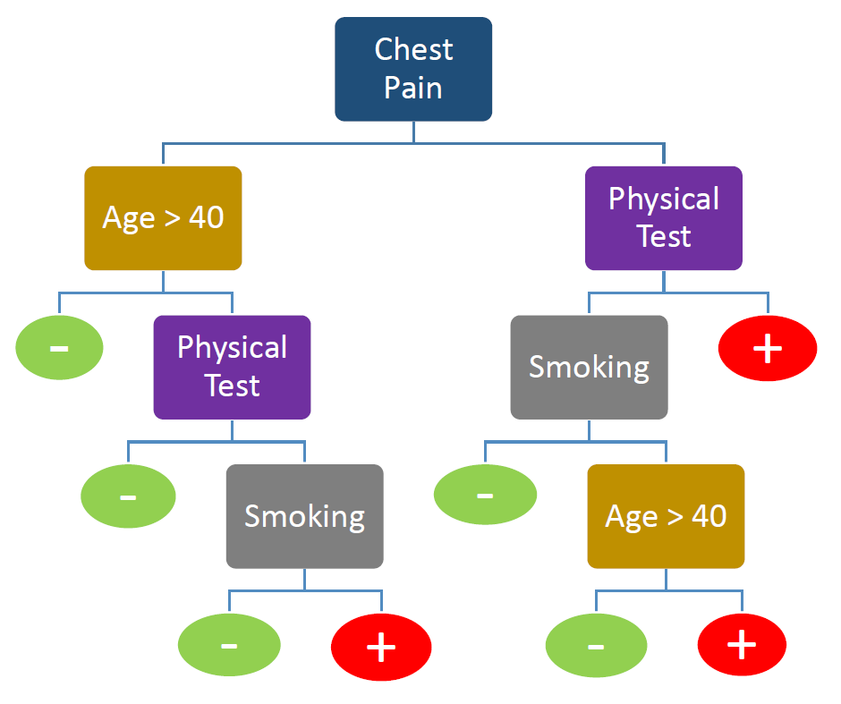
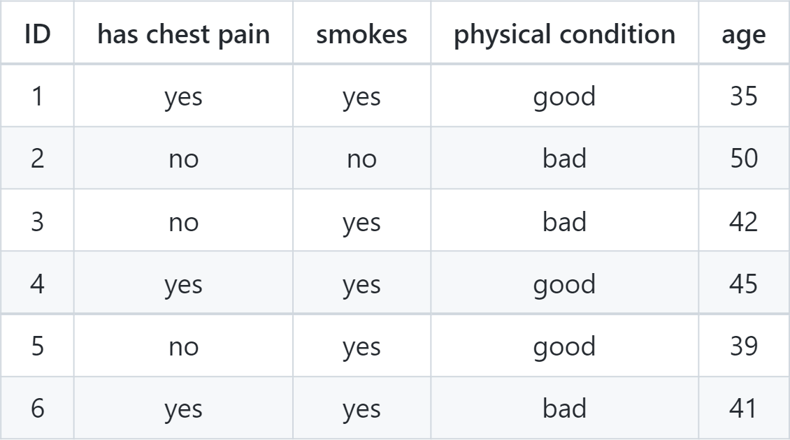
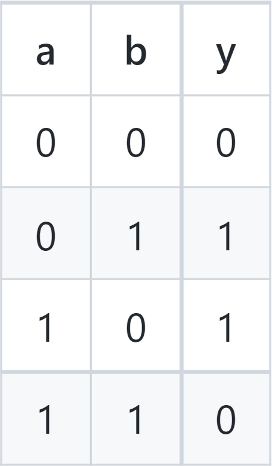
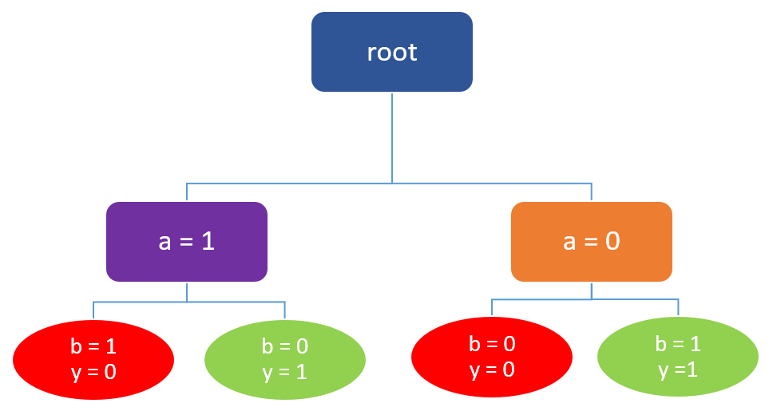
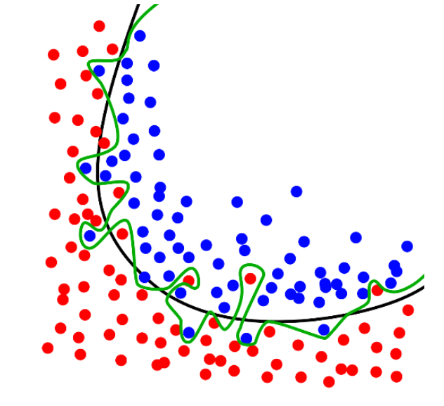
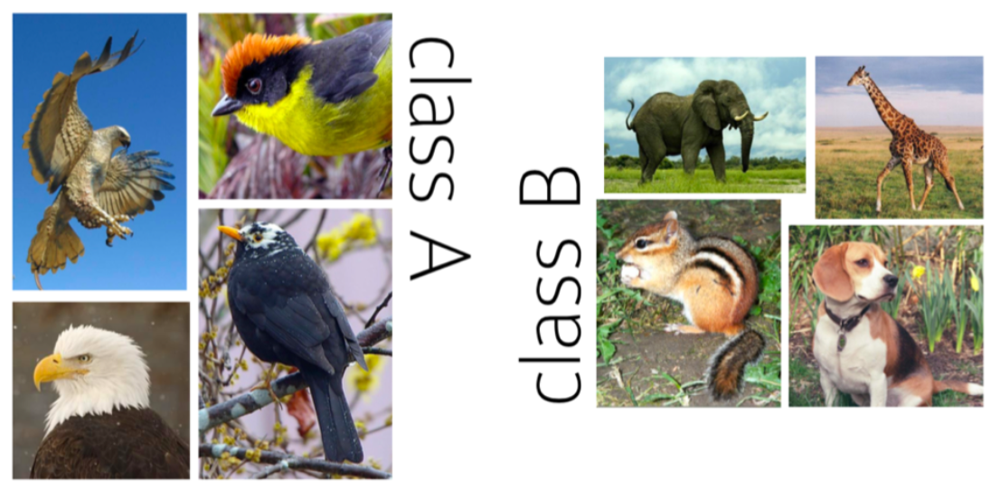
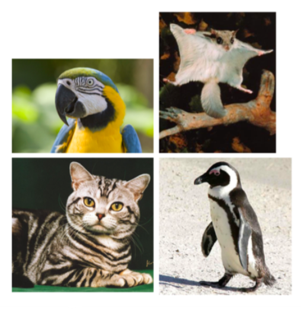
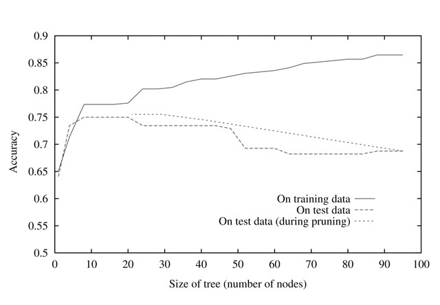

<div align="justify">

# Learning a Decision Tree (Classification)

## Table of Content

- [Introduction](#introduction)
- [Decision Tree](#decision-tree)
- [Information Gain](#information-gain)
  - [Entropy](#entropy)
  - [Conditional entropy](#conditional-entropy)
  - [Mutual Information And Information Gain](#mutual-information-and-information-gain)
- [Learning Decision Trees](#learning-decision-trees)
  - [ID3 Algorithm](#id3-algorithm)
- [Hypothesis Space](#hypothesis-space)
- [Overfitting](#overfitting)
  - [Inductive Bias & Variance Balance](#inductive-bias-variance-balance)
  - [Occam's Razor](#occams-razor)
  - [Pruning](#pruning)
    - [Reduced Error Pruning](#reduced-error-pruning)
    - [Chi-squared Pruning](#chi-squared-pruning)
- [Conclusion](#conclusion)
- [References](#references)

## Introduction

Let's start with a story. Imagine you own a small business and you need to acquire some new clients, and because your business is not big enough you have a limited budget. You want to make sure that, in advertising, you focus on clients that are most likely to purchase a product from you. How do you figure out who these people are? You need a classification algorithm that can recognize these types of clients and one of the possible classification algorithms is the __decision tree__ algorithm.

The idea behind the decision tree is to divide the dataset into smaller datasets based on characteristic features until you reach a small enough set that contains data points that fall under one single label. Each feature of the dataset becomes a root node, and the leaf nodes represent the outcomes.

Decision tree learning is a method for approximating discrete-valued target functions, in which the learned function is represented by a decision tree. Learned trees can also be re-represented as sets of if-then rules to improve human readability. These learning methods are among the most popular inductive inference algorithms and have been successfully applied to a broad range of tasks from learning to diagnose medical cases to learning to assess the credit risk of loan applicants.

## Decision Tree

Decision trees are a type of machine learning algorithm used for making decisions on the value of a target variable based on the other attributes of our data. As an analogy of a tree, decision trees consist of a root, some branches(edges), and leaves. Every internal node in the tree presents us with a condition, and the branch is split in correspondence to the different answers to the condition.

There are two kinds of decision trees:

1. __Classification trees__, where the target variable has a classifiable value
2. __Regression trees__, where the target variable has a continuous value

We will focus on classification trees in this lecture.

__Example:__

<p align='center'>

</p>

The above figure is an example of a decision tree. on every node, we move to the right edge in case of a true condition. suppose we want to perform a cardiac checkup for some patients with the data presented to us in the table below:

<p align="center">

</p>

Starting from the root of the tree, the value of attribute "has chest pain" should be checked for every sample. We then move to the next node based on the answer. If a patient has chest pain, we check his physical test. If his physical condition is not good, we conclude that this patient probably has a heart disease. The same process goes on for every branch. The decision tree leads us to below classification of the sample:

<p align="center">

</p>

Some questions might arise here on how was this decision tree constructed. How should we choose the beginning node correctly? What features and conditions should be used for splitting to get an optimal decision tree? When should we stop the process?

Constructing a decision tree with the lowest error rate is a greedy search problem. Our tree should split the data into homogeneous subsets by each split as we go down. This purpose can be achieved using a concept called __Entropy__.

## Information Gain

### Entropy

Entropy is the measurement of disorder, or impurity, in a group of observations. Consider having a random variable with a class of answers. the Entropy  of this random variable will be calculated by the formula below:

<p align="center">

</p>

where  is the probability of the class .

Let's consider a boolean variable. If all of our data is in one class, the Entropy would be 0.

<p align="center">

</p>

this case wouldn't be useful for learning. on the other hand, if the data is evenly distributed on the two classes, the Entropy would be:

<p align="center">

</p>

the best kind we could use.

### Conditional Entropy

) is the conditional Entropy of a radnom variable, defining the expected entropy of target label  if data is splitted on attribute .

<p align="center">

</p>

) is called the *specific conditional entropy*, the exact entropy of  knowing the value of attribute . Basically, for calculating the conditional entropy, you take the entropy of label  for each value  of attribute  and sum them up together.

### Mutual Information And Information Gain

Previously, we learned how to calculate the entropy of a target label  as ), and also, its entropy conditional to the value of an attribute  as ). Using both definitions, we can calculate the reduction in entropy of target attribute  after learning .

This is called the __*mutual information*__ between  and , calculated as:

<p align="center">

</p>

It can be perceived from the equation that mutual information is symmetric.

<p align="center">

</p>

if , then:

<p align="center">

</p>

and if  and  are independent:

<p align="center">

</p>

which means that there will be no reduction in label 's entropy by choosing the attribute .

When mutual learning is applied to a decision tree, it is also called __*information gain*__, since the amount of reduction in the label's entropy shows how much new information has been gained by the attribute. .g., if an attribute is independent from the label, it won't reduce the entropy, meaning it doesn't give the label any new information.

## Learning Decision Trees

Now that we know how to choose the best attribute to split the branch on, we can move on to the details on how to construct a decision tree from a training sample.

Creating an optimal decision tree with the least number of nodes is an NP-Complete problem, but by using a greedy search approach, we can come up with a good conclusion, although not necessarily the global-optimal.

One of the most commonly used algorithms for learning a decision tree is the __ID3__ algorithm.

### ID3 Algorithm

A greedy top-down notch is one of the most common ways for decision tree learning. In this approach, the sample is split into subsets based on the values of the best attribute recursively. Using heuristics such as information gain helps us to construct trees with fewer nodes.

The pseudocode for this algorithm can be seen below.

```pseudo
function ID3(samples, attribute_set, parent_samples) returns a tree

  if samples.isEmpty return most_common_label(parent_samples)
  else if all(samples.label) == True return True
  else if all(samples.label) == False return False
  else if atribute_set.isEmpty return most_common-label(samples)
  else
      A = best_attribute(samples, attribute_set)
      tree = new tree with root A 

      for value v_k of A do
        examples = e in samples e.A == v_k
        branch = ID3(examples, {attribute_set - A}, samples)
        add branch to tree with label {A = v_k}
      return tree
```

`best_attribute` function returns the attribute with the best information gain.

> best_attribute = )

The recursion is broken in two cases:

1. All samples in the subset have the same label value.
2. All samples in the subset have the same set of attributes. In this case, all attributes can only create a single child and the label is assigned even if the sample subset contains multiple label values. Such a case might happen due to noise or error in dataset.

There's also a third case that's sometimes proposed for terminating the algorithm:

3. When all attributes have zero information gain.

This case argues that since zero information gain from attributes indicates their independence from the target label, there's no need to go through them anymore.

This case can cause some problems. Our learning algorithm is of the greedy type in the way that it examines each attribute, one by one. But there are situations where it's the combination of those attributes that leads us to a result.

Take this example:

<p align="center">

</p>

's value can be indicated as `a XOR b`. If we calculate the information gain of the two attributes, we see that the value is zero for both of them.

If we knowledge the third case in our algorithm, It would stop right at the first level without a decent output, while without considering it, we could achieve the tree below:

<p align='center'>

</p>

## Hypothesis Space

As with other inductive learning methods, ID3 can be characterized as searching a space of hypothesis for one that fits the training examples. The hypothesis space searched by ID3 is the set of possible decision trees. ID3 performs a simple-to-complex, hill-climbing search through this hypothesis space, beginning with the empty tree, then considering progressively more elaborate hypotheses in search of a decision tree that correctly classifies the training data. The evaluation function that guides this hill-climbing search is the information gain measure.

By viewing ID3 in terms of its search space and search strategy, we can get some insight into its capabilities and limitations.

- ID3's hypothesis space of all decision trees is a complete space of finite
discrete-valued functions relative to the available attributes. Because every finite discrete-valued function can be represented by some decision tree, ID3 avoids one of the major risks of methods that search incomplete hypothesis spaces: that the hypothesis space might not contain the target function.

- ID3 maintains only a single current hypothesis as it searches through the
space of decision trees. By determining only a single hypothesis, ID3 loses the capabilities that follow from explicitly representing all consistent hypotheses. For example, it can't determine how many alternative decision trees are consistent with the available training data, or to pose new instance queries that optimally resolve among these competing hypotheses.

- ID3, in its pure form, performs no backtracking in its search. Once it selects an attribute to test at a particular level in the tree, it never backtracks to reconsider this choice. Therefore, it is susceptible to the usual risks of
hill-climbing search without backtracking: converging to locally optimal solutions that are not globally optimal.

  In the case of ID3, a locally optimal solution corresponds to the decision tree it selects along the single search path it explores. However, this locally optimal solution may be less desirable than trees that would have been encountered along a different branch of the search.

- ID3 uses all training examples at each step in the search to make statistically based decisions regarding how to refine its current hypothesis. This contrasts with methods that make decisions incrementally, based on individual training examples.

  One advantage of using statistical properties of all the examples (e.g., information gain) is that the resulting search is much less sensitive to errors in individual training examples. ID3 can be easily extended to handle noisy training data by modifying its termination criterion to accept hypotheses that imperfectly fit the training data.

## Overfitting

Overfitting is a phenomenon in which our learning system, the decision tree in this case, strongly fits our training sample. This might sound like a good thing at first, but the stronger the system fits the training set, the less it is generalizable, and in conclusion, it will not have a desirable result on other sets.
The below picture is an example of overfitting. The black line shows a suitable classification with a small amount of error, and the green line is the production of overfitting, with zero amount of error.

<p align='center'>

</p>

The greedy algorithm doesn't necessarily output the samples tree. and a complex decision tree with too many nodes is likely to face overfitting.

<p align='center'>

</p>

### Inductive Bias & Variance Balance

Inductive bias (or learning bias) is the set of all the assumptions a learning algorithm takes to put restrictions on its output and hypothesis space.

Take the example below. Suppose that you're given this training dataset of some classified animals.

<p align='center'>

</p>

Now, how would you classify the animals given in the test data below?

<p align='center'>

</p>

You might make your decision based on question like "do they fly or not?" or "are they feathered or not?".

As you might've noticed, each person takes some kind of meta-data into their minds to induct the input samples. without this factor in mind, any solution can equally be an answer to our problem. That's why having a suitable bias is crucial to a learnable problem. This concept is also known as __"no free launch"__ theorem.

Decision trees don't have any biases by themselves, and they're able to create all kinds of complex functions, leading the error of the training set to zero. But if there's any noise among the training set, the tree will learn them too. This increases the variance in our function and as a result, our tree will overfit. That's why we need to put some kind of bias in our tree to make it more simple.

### Occam's Razor

> Entities should not be multiplied beyond necessity

This saying is known as __Occam's razor__. It can also be rephrased as "the simplest solution is usually the best one".

The theory makes sense. When a few hypotheses can explain a principle, we gain nothing by putting in more assumptions and making our proof more complicated. Leaving the hypotheses short and simple and putting aside the insignificant data helps us to have a more accurate view on the true nature of the problem, and thus, makes it more probably the correct theory.

Extending this to learning algorithms, shorter hypotheses in a problem are usually preferred over longer ones. The longer a hypothesis is, the higher the possibility it would be overfitted. Currently, Occam's Razor has been one of the most common inductive biases for learning algorithms and decision trees.

### Pruning

There are two main approaches in making a tree smaller and simpler:

- Stop growing the tree before overfitting (pre-pruning)
  
  For example, we could bound the depth or the number of leaves in our tree, or maybe the minimum number of samples produced from a leaf. this heuristic is also known as *early stopping*. Although a fast approach, pre-pruning can lead to underfittnes of data if the growth is stopped too early. This might happen in cases that a split seems to be of little benefit to the tree, while subsequent splits could've optimized it significantly. An example would be base case 3, which as previously stated, isn't practically optimal.

- Prune after growing the full tree (post-pruning)

  Another alternative approach to pruning a decision tree, also known as backward pruning. In this method, certain nodes and branches will be removed from the tree, decreasing the size of the tree and increasing its accuracy on the data set.

  Two of the most common strategies which are discussed here are __reduced error pruning__ and __chi-squared pruning__.

#### Reduced Error Pruning

How exactly might we use a validation set to prevent overfitting? One approach,
called reduced-error pruning, is to consider each of the decision
nodes in the tree to be candidates for pruning. Pruning a decision node consists of removing the subtree rooted at that node, making it a leaf node, and assigning it the most common classification of the training examples affiliated with that node.

Nodes are removed only if the resulting pruned tree performs no worse than the
original over the validation set. This has the effect that any leaf node added due to coincidental regularities in the training set is likely to be pruned because these same coincidences are unlikely to occur in the validation set.

Nodes are pruned iteratively, always choosing the node whose removal most increases the decision
tree accuracy over the validation set. Pruning of nodes continues until further
pruning is harmful.

<p align='center'>

</p>

The impact of reduced-error pruning on the accuracy of the decision tree
is illustrated in the figure above, the accuracy of the tree is shown
measured over both training examples and test examples. The additional line in
this figure shows accuracy over the test examples as the tree is pruned.

When
pruning begins, the tree is at its maximum size and lowest accuracy over the test set. As pruning proceeds, the number of nodes is reduced and accuracy over the test set increases. Here, the available data has been split into three subsets: *the training examples*, *the validation examples* used for pruning the tree, and a *set of test examples used to provide an unbiased estimate of accuracy over future unseen examples*. The plot shows accuracy over the training and lest sets. Accuracy over the validation set used for pruning is not shown.

Using a separate set of data to guide pruning is an effective approach provided a large amount of data is available. The major drawback of this approach
is that when data is limited, withholding a part of it for the validation set reduces even further the number of examples available for training.

#### Chi-Squared Pruning

The most popular tests for independence are based on the fact that some test statistics have approximately a chi-squared distribution with (J-1)) degrees of freedom if the null hypothesis is correct. The classic test statistic with this property is the chi-squared statistic.

<p align='center'>

</p>

where  are the expected cell counts under the null hypothesis, calculated according to

<p align='center'>

</p>

where  is the estimated probability that a particular observation will fall into row , and  is the corresponding probability for column . Because these two probabilities are independent under the null hypothesis, their product constitutes the probability that an observation will fall into ).

A disadvantage of tests based on the chi-squared distribution is that they are statistically invalid when the sample size is small. The chi-squared distribution is an approximation to the test statistics’ true sampling distribution under the null hypothesis, and this approximation is only accurate when the sample is large. Unfortunately, there is no single rule that can be used to determine when the approximation is valid.

## Conclusion

Decision trees are the single most popular data mining tool out there. These are the most important reason that makes it so.

- Easy to understand
- Easy to implement
- Easy to use
- Asymptotically Fast

The main points about decision trees include:

- Decision tree learning provides a practical method for concept learning and
for learning other discrete-valued functions. The ID3 family of algorithms
infer decision trees by growing them from the root downward, greedily
selecting the next best attribute for each new decision branch added to the
tree.

- ID3 searches a complete hypothesis space (i.e., the space of decision trees
can represent any discrete-valued function defined over discrete-valued instances). It thereby avoids the major difficulty associated with approaches
that consider only restricted sets of hypotheses: that the target function might
not be present in the hypothesis space.

- Overfitting the training data is an important issue in decision tree learning,
Because the training examples are only a sample of all possible instances.
it is possible to add branches to the tree that improve performance on the
training examples while decreasing performance on other instances outside
this set. Methods for post-pruning the decision tree are, therefore, important
to avoid overfitting in decision tree learning (and other inductive inference
methods that employ a preference bias).

## References

- Soleymani, M. (2021) *Decision tree* [PDF]. Sharif University of Technology

- Rohban, M. (2020) *Classification (decision tree)* [PDF]. Sharif University of Technology

- (2017, September 7), *[Decision Trees for Classification: A Machine Learning Algorithm](https://www.xoriant.com/blog/product-engineering/decision-trees-machine-learning-algorithm.html#:~:text=Introduction%20Decision%20Trees%20are%20a,namely%20decision%20nodes%20and%20leaves).* Xiorant.

- Gupta, P. (2017, May 17), *[Decision Trees in Machine Learning](https://towardsdatascience.com/decision-trees-in-machine-learning-641b9c4e8052).* Towards data science.

- T, S. (2019, January 11), *[Entropy: How Decision Trees Make Decisions](https://towardsdatascience.com/entropy-how-decision-trees-make-decisions-2946b9c18c8).* Towards data science.

- Duignan, B. (1998, July 1998), *[Occam's razor](https://www.britannica.com/topic/Occams-razor).* Britannica.

</div>
