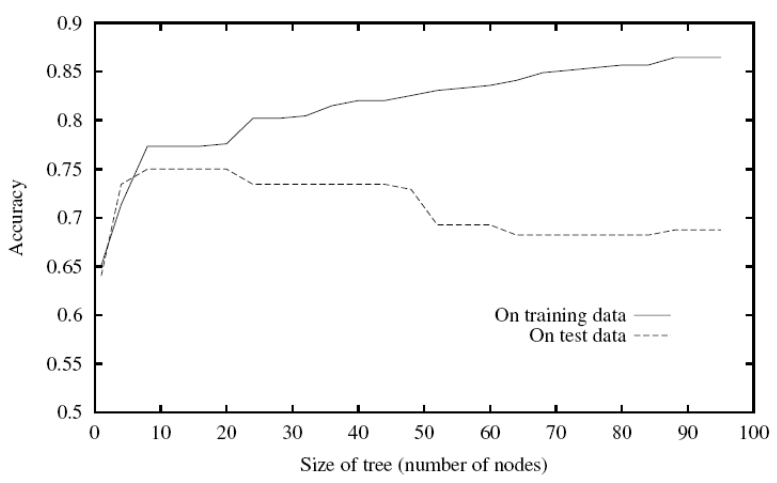

# Learning a decision trees (classification)

## Table of contents

- Preface
- [Decision Tree](#decision-tree)
- [Information Gain](#information-gain)
  - [Entropy](#entropy)
  - [Conditional entropy](#conditional-entropy)
  - [Mutual Information And Information Gain](#mutual-information-and-information-gain)
- [Learning Decision Tree](#learning-decision-tree)
  - [ID3 Algorithm](#id3-algorithm)
- Hypothesis Space
- [Overfitting](#overfitting)
  - [Inductive Bias & Variance Balance](#inductive-bias-variance-balance)
  - [Occam's Razor](#occams-razor)
  - [Pruning](#pruning)
    - [Error reduced pruning](#error-reduced-pruning)
    - [Chi-squared Testing](chi-squared-testing)
- C4.5 Algorithm
- Reference

## Decision Tree

Decision trees are a type of machine learning algorithm used for making decisions on the value of a target variable based on the other attributes of our data. As an analogy of a tree, decision trees are consisted of a root, some branches(edges) and leaves. Every internal node in the tree presents us with a condition, and the branch is splitted in correspond to the different answers to the condition.

There are two kinds of decision trees:

1. __Classification trees__, where the target variable has a classifiable value
2. __Regression trees__, where the target variable has a continuous value

We will focus on classification trees in this lecture.

__Example:__


The above figure is an example of a decision tree. on every node, we move to the right edge in case of a true condition. suppose we want to perform a cardial checkup for some patients with the data presented to us in the table below:

| ID | has chest pain | smokes | physical condition | age |
|:--:|:--------------:|:------:|:------------------:|:---:|
|1   |yes             |yes     |good                |35   |
|2   |no              |no      |bad                 |50   |
|3   |no              |yes     |bad                 |42   |
|4   |yes             |yes     |good                |45   |
|5   |no              |yes     |good                |39   |
|6   |yes             |yes     |bad                 |41   |

Starting from the root of the tree, the value of the attribute "has chest pain" should be checked for every sample. We then move to the next node based on the answer. If a patient has chest pain, we then check his physical test. If his physical condition is not good, we conclude that this patient might probably have a heart disease. The same process goes on for every branch. The decision tree leads us to the below classification of the sample:

| ID | has chest pain | smokes | physical condition | age |cardial disease|
|:--:|:--------------:|:------:|:------------------:|:---:|:-------------:|
|1   |yes             |yes     |good                |35   |-              |
|2   |no              |no      |bad                 |50   |-              |
|3   |no              |yes     |bad                 |42   |+              |
|4   |yes             |yes     |good                |45   |+              |
|5   |no              |yes     |good                |39   |-              |
|6   |yes             |yes     |bad                 |41   |+              |

Some questions might arrise here on how was this decision tree constructed. How should we correctly choose the beginning node? What features and conditions should be used for splitting to get an optimal decision tree? when should we stop the process? Before going through the answer to these questions, there is a definition, Entropy, which we should understand first.

## Information Gain

### Entropy

Entropy is a measurement for the disorder, or impurity, in a group of observations. Consider having a random variable with $N$ class of answers. the Entropy  of this random variable will be calculated by the formula below:

=-\sum_{i=1}^{N}p_i\log_{2}p_i)

where $p_i$ is the probability of the class $i$.

Let's consider a boolean variable. If all of our data is in one class, the Entropy would be $0$.

=-(1\log_{2}1)=0)

this case would not be useful for learning. on the other hand, if the data is evenly distributed in the two classes, the Entropy would be:

=-(0.5\log_{2}0.5+0.5\log_{2}0.5)=1)

the best kind we could use.

### Conditional Entropy

) is the conditional Entropy, defining the expected entropy of target label  if data is splitted by attribute .


$H(Y|X=x)$ is called the *specific conditional entropy*, the exact entropy of $Y$ knowing the value of attribute $X$. Basically, for calculating the conditional entropy, you take the entropy of label $Y$ for each value $x$ of attribute $X$ and sum them up together.

### Mutual Information And Information Gain

Previously, we learned how to calculate the entropy of our target label $Y$ as $H(Y)$, an.... using both definitions, we can calculate the reduction in entropy of target attribute $Y$ after learning $X$.

$
\begin{aligned}
I(Y;X) & = H(Y) - H(Y|X) = -\sum_{x, y}P(x, y)\log_{2}\frac{P_{X,Y}(x, y)}{P_X(x)P_Y(y)}
\end{aligned}
$

This is called the __*mutual information*__ between $Y$ and $X$. It can be percieved from the equation that mutual information is symmetric.

> $ I(Y;X)=I(X;Y)$

if $Y=X$, then:

> $I(X;X) = H(X)-H(X|X)=H(X)$

and if $Y$ and $X$ are independent:

> $P_{X, Y}(x, y) = P_X(x)P_Y(y) \\ I(Y;X)=-\sum_{x, y}P(x, y)\log_{2}1=0$

which means that there's no reduction in label $Y$ entropy by choosing the attribute $X$.

When mutual learning is applied to a decision tree, it is also called __*information gain*__, since the amount of reduction in the label's entropy shows how much new information has been gained by the attribute. e.g., we previously saw that an attribute indepentant from the label won't reduce the entropy, meaning it doesn't give the label any new information.

__Example:__ Consider the problem of cardial disease patients.

## Learning Decision Tree

Now that we know how to choose the best attribute too split the branch on, we can move on to the details on how to construct a decision tree from a training sample. Creating an optimal decision tree with the least number of nodes is an NP-Complete problem, but by using a greedy search approach, we can come up with a good conclusion, although not necessarily the global-potimal.

One of the most common used algorithms for learning decision tree is the __ID3__ algorithm.

### ID3 Algorithm

A greedy top-down notch is one of the most common ways for decision tree learning. In this approach, the sample is splitted into subsets based on the values of the best attribute recursively. Using heuristics such as information gain helps us to construct trees with fewer nodes. The psudocode for this algorithm can be seen below.

```pseudo
function ID3(samples, attribute_set, parent_samples) returns a tree

  if samples.isEmpty return most_common_label(parent_samples)
  else if all(samples.label) == True return True
  else if all(samples.label) == False return False
  else if atribute_set.isEmpty return most_common-label(samples)
  else
      A = best_attribute(samples, attribute_set)
      tree = new tree with root A 

      for value v_k of A do
        examples = e in samples e.A == v_k
        branch = ID3(examples, {attribute_set - A}, samples)
        add branch to tree with label {A = v_k}
      return tree
```

`best_attribute` function returns the attribute with the best information gain.

> best_attribute = $argmax_{i} \space IG(Y, X_i)$

The recursion is broken in two cases:

1. All samples in the subset have the same label value.
2. All samples in the subset have the same set of attribtues. In this case, all attributes can only create a single child and the label is assigned even if the sample subset contains multiple label values. Such case might happen due to noise or error.

there's also another case that's sometimes proposed for terminating the algorithm:

3. When all attributes have zero information gain.

This case argues that since zero information gain from attributes indicates their independency from the target label, then there's no need to go through them anymore. But in fact, this case causes some problems. Our learning algorithm is of the greedy type in the way that it examines each attribute, one by one. But there are cases where the combination of those attributes will lead us to a result. Take this example:

|  a  |  b  |  y  |
|:---:|:---:|:---:|
|  0  |  0  |  0  |
|  0  |  1  |  1  |
|  1  |  0  |  1  |
|  1  |  1  |  0  |

$y$'s value can be indicated as `a XOR b`. If we calculate the information gain of the two attributes, we see that the value is zero for both of them. If we consider the third case in our algorithm, It would stop right at the first level without a decent output, while we could achieve the tree below:


## Overfitting

Overfitting is a phenomenon in which our learning system, the decision tree in this case, strongly fits our training sample. This might sound like a good think at first, but the stronger the system fits the training set, the less it is generalizable and in conclusion, it will not have a desirable result on other sets.
The below picture is an example of overfitting. The black line shows a suitable classification with a small amount of error, and the green line is the production of overfitting, with zero amount of error.


Greedy algorithm doesn't necessarily output the simples tree. and a complex decision tree with too many nodes is likely to face overfitting.



### Inductive Bias & Variance Balance

Inductive bias (or learning bias) is the set of all the assumptions a learning algorithm takes in order to put restrictions in its output and hypothesis space.

Take the example below suppose that you're given this training dataset of some classified animals.


Now, how would you classify the animals given in the test data below?


You might make your decision on the question that "do they fly or not?" or "are they feathered or not?".

As you might've noticed, each person takes some kind of meta-data into their minds in order to induct the input samples. without this factor in mind, any solution can equally be an answer to our problem. That's why having a suitable bias is crucial to a learnable problem. This concept is also known as __"no free launch"__ theorem.

Decision trees don't have any biases by themselves, and they're able to create all kinds of comples functions, leading the error of the training set to zero. But if there's any noise among the training set, the tree will learn them too. This increases the variance in our function and as a result, our tree will overfit. That's why we need to put some kind of bias in our tree to make it more simple.

### Occam's Razor

"entities should not be multiplied beyond necessity", such says __Occam's razor__. It can also be rephrased as "the simples solution is usually the best one". The theory makes sense. when a few hypothesis can explain a principle, we gain nothing by putting in more assumptions and making our proof more complicated. As a matter of fact, leaving the hypotheses short and simple and putting aside the unsignificant data helps us to have a more accurate view on the true nature of the problem, and thus, makes it more probably the correct theory.

Extending this to learning algorithms, shorter hypothses in a problem are usually preferred over longer ones. The longer the hypothesis is, the higher the possibility it would be overfitted. Currently, Occam's Razor has been one of most common inductive biases for learning algorithms and decision trees.

### Pruning

There are two main approaches in making a tree smaller and simpler:

- Stop growing the tree before overfitting
  
  for example we could bound the depth or the number of leaves in our tree. The problem that arrises in this case is to how to label a leaf when it contains impure data.

  another example would be the base case 3, which as previously stated, isn't practicaly optimal

- Prune after growing the full tree

#### Error Reduced Pruning

#### Chi-square testing
