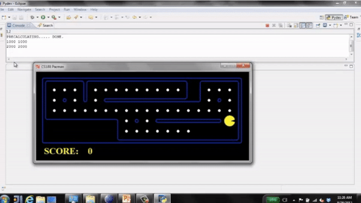

     
     
     
     
     
     
     
     
    <h1 style="font-size: 40px; margin: 10px 0;">AI - Intelligent Agents</h1>
    <h1 style="font-size: 20px; font-weight: 400;">Sharif University of Technology - Computer Engineering Department</h1>
     
    <h4 style="font-size: 18px; font-weight: 400; color:#555">Amirreza Mirzaei, Bardia Mohammadi, Sina Elahimanesh</h4>
     
     
     
     
     

Table of contents
==============
- [Introduction](#Introduction)
- [Intelligent agents](#Intelligent-agents)
    - [Vacuum world agent example](#Vacuum-world-agent-example)
- [Rational agents and performance measure](#Rational-agents-and-performance-measure)
    - [Rationality vs perfection](#Rationality-vs-perfection)
    - [Autonomy](#Autonomy)
- [Task environment (PEAS)](#Task-environment-(PEAS))
    - [Types of environment](#Types-of-environment)
    - [PEAS example](#PEAS-example)
- [Type of agents](#Type-of-agents)
    - [Reflex agents](#Reflex-agents)
    - [Goal-based agents](#Goal-based-agents)
    - [Utility-based agents](#Utility-based-agents)
- [Conclusion](#Conclusion)
- [References](#References)

# Introduction
In this notebook we will discuss the nature of intelligent agents.

# Intelligent agents
An <b>intelligent agent</b> is anything that perceives its environment through sensors and acts upon that environment through its actuators.  
    We will use the term <b>percept</b> to refer to the agent's perceptual inputs at any given moment.
We can describe an agent's behavior by the agent function.  
<b>Agent function</b> maps any given percepts sequence to an action. But how does the agent know what sequence it must choose? we will try to answer this question using a simple example.

##### Vacuum world agent example

Imagine an environment that only has two rooms (room A & room B). Our agent is a vacuum cleaner. It can perceive whether the room it is currently in, is dirty or not. It can also move between the rooms and suck up dirt (the actuators of the agent).  
Imagine that we only care about both rooms being clean, a simple way we can implement an agent that guarantees this is for our agent to constantly move between the rooms and suck up dirt in each one. Now imagine we also want to minimize the amount of energy the vacuum cleaner uses. In order to do that we can stop the agent for a limited amount of time if both rooms are clean. As you can see we implemented two completely different agents for these two problems and that's because we used two different performance measures.

# Rational agents and performance measure
A <b>rational</b> agent chooses the set of action in order to maximize its performance. Agents use a performance measure to evaluate the desirability of any given sequence. In other words, an agent will choose the action (or a sequence of them) that maximize the expected value of its performance measure.

#### Rationality vs perfection
Keep in mind that rationality is distinct from omniscience. An omniscient agent knows the actual outcome of its actions but in reality, an agent only knows the expected outcome of its action.

#### Autonomy
A rational agent should be autonomous meaning it mustn't only rely on the prior knowledge of its designer and must learn to compensate for partial or incorrect prior knowledge. In other words, rational agents should learn from experience. For example, in the vacuum world our agent could start to learn when the rooms usually get dirty based on its experience.

# Task environment (PEAS)
We have already talked about performance measure, task environment, actuators and sensors. We group all these under the heading of the <b>Task environment </b> and we abbreviate it as <b>PEAS</b>(<b>P</b>erformance measure, <b>E</b>nviroment, <b>A</b>ctuators, <b>S</b>ensors). When designing an agent our first step should be specifying the task environment.

#### Types of environment
<ul>
  <li><b>Fully observable or partially observable</b> (Do the agent sensors give access to the complete state of the environment at each time?)</li>
  <li><b>Single agent or multiagent</b> (Are there more than one agent in the environment?)</li>
  <li><b>Deterministic or stochastic</b> (Is the next state completely determined by the current state and the executed action?)</li>
  <li><b>Episodic or sequential</b> (Is the agent's experience divided into atomic "episodes“ where the choice of action in each episode depends only on the episode itself?)</li>
  <li><b>Discrete or continuous</b> (Are there a limited number of distinct, clearly defined states, percepts and actions?)</li>  
</ul>

#### PEAS example
Here are a few examples of specifying PEAS for different agents.

| Agent       | Performance Measure | Environment |  Actuator | Sensor |
| ----------- | ----------- | ----------- | ----------- | ----------- |
| Hospital Management System       | Patient’s health, Admission process, Payment | Hospital, Doctors, Patients |  Prescription, Diagnosis, Scan report | Symptoms, Patient’s response |
| Automated Car Drive       | Comfortable trip, Safety, Maximum Distance | Roads, Traffic, Vehicles |  Steering wheel, Accelerator, Brake, Mirror | Camera, GPS, Odometer |
| Subject Tutoring       | Maximize scores, Improvement is students | Classroom, Desk, Chair, Board, Staff, Students |  Smart displays, Corrections | Eyes, Ears, Notebooks |

# Type of agents
In this section we will introduce three basic kinds of basic agent programs.(The agent program is simply a program which implements the agent function.)
<ul>
  <li>Simple reflex agents</li>
  <li>Goal-based agents</li>
  <li>Utility-based agents</li>
</ul>

## Reflex agents
This is the simplest kind of agent. They choose their next action only based on their current percept. In other words, they do not consider the future consequences of their actions and only consider <b>how the world IS.</b>  
As an example look at this Pacman agent below, at each turn the agent look at its surrounding and chooses the direction that has a point in it and stops when there are no points around it.

## Goal-based agents
This kind of agent has a specific goal and it tries to reach that goal efficiently. They have a model of how the world evolves in response to actions, and they make decisions based on (hypothesized) consequences of actions to reach their goal state. Search and Planning are two subfields that are closely tied with these kind of agents. In other words, these kinds of agents act on <b>how the world WOULD BE.</b>  
as an example look at this Pacman agent below. the goal is to collect every point.

## Utility-based agents
This kind of agent like goal-based agents has a goal. But they also have a Utility function they seek to reach their goal in a way that maximizes the utility function. For example, think about an automated car agent. They are many ways for this agent to get from point A to point B. But some of them are quicker, safer, cheaper. The utility function allows the agent to compare different states with each other and ask the question how happy am I in this state. 
In other words, this kind of agent act on <b>how the world will LIKELY be.</b>  

# Conclusion
You should know about these topics after reading this note.
<ul>
    <li>Intelligent agents</li>
    <li>Performance measure</li>
    <li>Task environment(PEAS)</li>
    <li>Types of agents</li>
</ul>

# References

+ Russell, S. J., Norvig, P., &amp; Davis, E. (2022). Artificial Intelligence: A modern approach. Pearson Educación. 
+ UC Berkeley's introductory artificial intelligence course, CS 188
+ https://www.geeksforgeeks.org/understanding-peas-in-artificial-intelligence/

