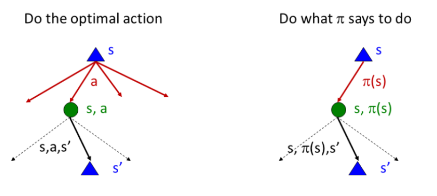
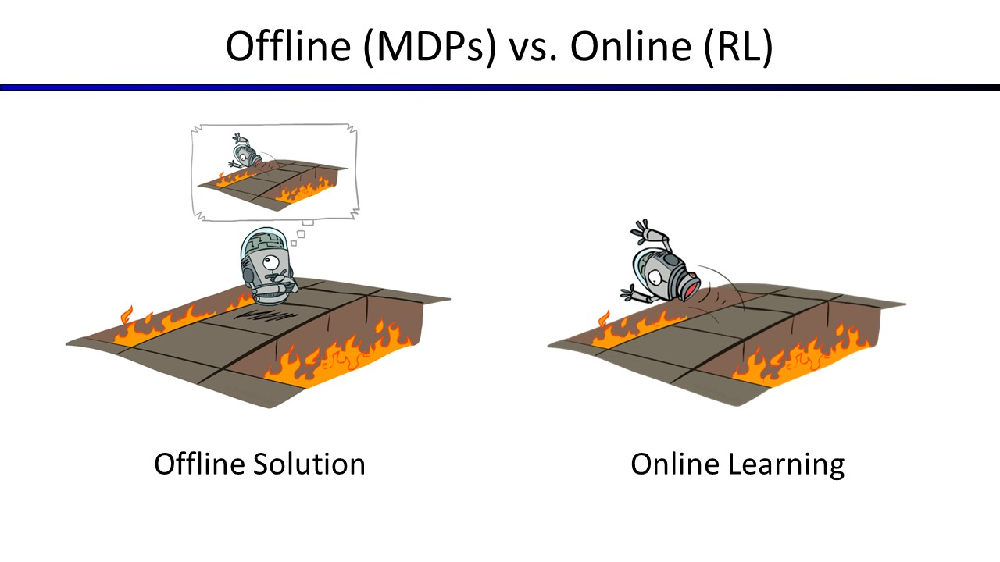

	
        Markov Decision (from value iteration)
    
    

<h1> Table of Contents </h1>

- [Introduction](#introduction)
- [Value Iteration](#value_iteration)
    - [Convergence of Value Iteration](#vi_convergence)
        - [Contraction](#vi_cont)
        - [Error Bound ](#vi_error)
    - [Value Iteration pseudocode](#vi_code)
- [Policy Iteration](#pi)
    - [The idea of policy iteration](#pi_id)
    - [Policy Evaluation](#pe)
        - [Fixed Policy](#fp)
    - [Policy Extraction (Improvement)](#pe)
        - [Computing Actions from Values](#pi_cafv)
        - [Computing Actions from Q-Values](#pi_cafq)
    - [Policy Iteration Summary](#pis)
    - [Policy Iteration pseudocode](#pi_code)
- [Conclusion](#conclusion)
- [References](#references)

<h1> Introduction </h1>

In the previous lecture, you became familiar with what MDP is. As you know, MDP can be remembered as a mathematical framework used for modeling decision-making problems. Usually, an agent can do some actions, but the outcomes are stochastic and not entirely controllable. The goal is to decide the best action to select based on his current state. It’s better to know MDP before Reinforcement Learning.

In this lecture, we are going to talk about two different methods for solving MDPs. These two methods are value iteration and policy iteration. Stay with us.

---

<h1> Value Iteration </h1>

The Bellman equation is the basis of the **value iteration** algorithm for solving MDPs. We would like to solve these simultaneous equations to find the utilities. One thing to try is an iterative approach. We start with arbitrary initial values for the utilities, calculate the right-hand side of the equation, and plug it into the left-hand side. Thereby updating the utility of each state from the utilities of its neighbors. We repeat this until we reach an equilibrium.

Let $U_{i}$ be a utility function that $U_{i}(s)$ gives the utility value for state s at the $i$th iteration. The iteration step, called a **Bellman update**, looks like this:
 
 
$$
U_{i+1}(s) = \max_{a \in A(s)} \sum_{s^\prime}^{} P(s^{\prime}|s,a)[R(s,a,s^{\prime})+\gamma U_{i}(s^{\prime})]
$$
 
where the update is assumed to be applied simultaneously to all the states at each iteration. If we apply the Bellman update infinitely often, we are guaranteed to reach an equilibrium, In fact, they are also the unique solutions, and the corresponding policy is optimal.

<h2> Convergence of Value Iteration </h2>

Suppose we view the Bellman update as an operator $B:\mathbb{R}^{\lvert S\lvert}\rightarrow \mathbb{R}^{\lvert S\lvert}$ that maps functions to functions. Then as a result of Bellman equation $U^{*} = B U^{*}$ that $U^{*}$ is the optimal utility function and the Bellman update equation can be written as $U_{i+1} = B U_{i}$.

> 
<h3>Contraction</h3>

The basic concept used in showing that value iteration converges is the notion of a **contraction**. An important fact about the Bellman operator is that it's contraction. An operator $f:\mathbb{R}^{n}\rightarrow \mathbb{R}^{n}$ is said to be a $\alpha$-contraction if $\alpha \in (0,1)$ and
 
 
$$
\forall x,y \in \mathbb{R}^{n}, \quad \Vert f(x)-f(y)\Vert \leq \alpha \Vert x-y \Vert
$$
 
The **Banach fixed-point** theorem guarantees that if $f$ is a contraction, then $f$ has a unique
fixed point($x$ is a fixed point of the $f$ if $f(x) = x$) $x^* \in \mathbb{R}^{n}$ satisfying
$$
x^* = f(x^*) = lim_{k \to \infty} f^{k}(x) \quad \forall x \in \mathbb{R}^{n}
$$
 
where $f^{k+1}(x) = f(f^{k}(x))$ for $k > 0$ and $f^{1}(x) = f(x)$.
 
 
Hence, two important properties of contractions are
<ul>
    <li>
        A contraction has only one fixed point; if there were two fixed points, they would not get closer together when the function was applied, so it would not be a contraction.
    </li>
    <li>
        When the operator is applied to any argument, the output must get closer to the fixed point (because the fixed point does not move), so repeated application of a contraction always reaches the fixed point in the limit.
    </li>
    
</ul>

We will use the **max norm** to measure distances between utility functions:
 
 
$$
\Vert U\Vert = \max_{s} \lvert U(s)\lvert
$$
 
Now, we want to prove that the Bellman operator is $\gamma -contraction$ in the max norm. To prove this, we use the
following Lemma:
 
 
$$
\lvert \max_{x} f(x) - \max_{x} g(x) \lvert \leq \max_{x} \lvert f(x) - g(x) \lvert
$$
 
To see this, suppose $\max_{x} f(x) > \max_{x} g(x)$ (the other case is symmetric) and let $b = \underset{x}{\operatorname{argmax}} f(x)$. Then
 
 
$$
\begin{aligned}
\lvert \max_{x} f(x) - \max_{x} g(x) \lvert & = f(b) - \max_{x} g(x) \\
& \leq f(b) - g(b) \\
& \leq \max_x (f(x) - g(x)) = \max_{x} \lvert f(x) - g(x) \lvert\\
\Rightarrow \lvert \max_{x} f(x) - \max_{x} g(x) \lvert & \leq \max_{x} \lvert f(x) - g(x) \lvert
\end{aligned}
$$

Let $U_i$ and $U^{\prime}_{i}$ be any two utility functions. Then we have
 
 
$$
\begin{aligned}
\Vert B U_i - B U^{\prime}_{i}\Vert & = \max_{s} \lvert B U_{i}(s) - B U^{\prime}_{i}(s) \lvert \\
& = \max_{s} \Big \lvert \max_{a \in A(s)} \sum_{s^\prime}^{} P(s^{\prime}|s,a)[R(s,a,s^{\prime})+\gamma U_{i}(s^{\prime})] - \max_{a \in A(s)} \sum_{s^\prime}^{} P(s^{\prime}|s,a)[R(s,a,s^{\prime})+\gamma U^{\prime}_{i}(s^{\prime})] \Big \lvert \\
& \leq \max_{s} \max_{a \in A(s)} \Big \lvert \sum_{s^\prime}^{} P(s^{\prime}|s,a)[R(s,a,s^{\prime})+\gamma U_{i}(s^{\prime})] - \sum_{s^\prime}^{} P(s^{\prime}|s,a)[R(s,a,s^{\prime})+\gamma U^{\prime}_{i}(s^{\prime})] \Big \lvert & (Lemma)\\
& = \max_{s} \max_{a \in A(s)} \Big \lvert \gamma \sum_{s^\prime}^{} P(s^{\prime}|s,a)[U_{i}(s^{\prime}) - U^{\prime}_{i}(s^{\prime})] \Big \lvert \\
& \leq \max_{s} \max_{a \in A(s)} \Big \lvert \gamma \Big (\sum_{s^\prime}^{} (P(s^{\prime}|s,a)\Big ) \max_{s^\prime} \Big ( U_{i}(s^{\prime}) - U^{\prime}_{i}(s^{\prime}) \Big )\Big \lvert \\
& = \Big \lvert \gamma \max_{s^\prime} \Big ( U_{i}(s^{\prime}) - U^{\prime}_{i}(s^{\prime}) \Big )\Big \lvert \\
& \leq \gamma \max_{s^\prime} \Big \lvert U_{i}(s^{\prime}) - U^{\prime}_{i}(s^{\prime}) \Big \lvert \\
\Rightarrow \Vert B U_i - B U^{\prime}_{i}\Vert & \leq \gamma \Big \Vert U_{i} - U^{\prime}_{i}\Big \Vert
\end{aligned}
$$

That is, the Bellman operator is $\gamma -contraction$ on the space of utility functions. The fixed point of the Bellman operator is $U^*$. Hence, from the properties of contractions in general, it follows that value iteration always converges to $U^*$ whenever $\gamma < 1$.

> 
<h3> Error Bound </h3>

We can't have $\infty$ iterations to converges to $U^*$. If we view $\Vert U_{i+1} - U^* \Vert$ as the error, we want to relate a bound for error to a bound for $\Vert U_{i+1} - U_{i} \Vert$. If $\Vert U_{i+1} - U_{i} \Vert < \delta$ we have
$$
\begin{aligned}
\Vert U_{i+1} - U^* \Vert & = \max_{s} \lvert U_{i+1}(s) - U^{*}(s) \lvert \\
& = \max_{s} \Big \lvert (U_{i+1}(s) - U_{i+2}(s)) + (U_{i+2}(s) - U_{i+3}(s)) + ...\Big \lvert \\
& \leq \max_{s} \Big ( \lvert U_{i+1}(s) - U_{i+2}(s)\lvert + \lvert U_{i+2}(s) - U_{i+3}(s)\lvert + ...  \Big ) \\
& \leq \max_{s} \lvert U_{i+1}(s) - U_{i+2}(s)\lvert + \max_{s} \lvert U_{i+2}(s) - U_{i+3}(s)\lvert + ... \\
& =  \Vert B U_{i} - B U_{i+1}\Vert + \Vert B U_{i+1} - B U_{i+2}\Vert + ... \\
& \leq \gamma \Vert U_{i} - U_{i+1}\Vert + \gamma^{2} \Vert U_{i} - U_{i+1}\Vert + ... \\
& = \frac{\gamma}{1 - \gamma} \Vert U_{i} - U_{i+1}\Vert & \text{for } \gamma < 1\\
& < \frac{\gamma}{1 - \gamma} \delta
\end{aligned}
$$
Thus, if $\delta < \frac{1 - \gamma}{\gamma} \epsilon$, then $\Vert U_{i+1} - U^* \Vert < \epsilon$.

<h2> Value Iteration pseudocode </h2>

**function** Value-Iteration(MDP,$\epsilon$) returns a utility function  
&emsp; **inputs**: MDP, an MDP with states $S$ , actions $A(s)$, transition model $P(s^{\prime}|s,a)$,  
&emsp; &emsp; &emsp; &emsp; &emsp; rewards $R(s,a,s^{\prime})$, discount $\gamma$  
&emsp; &emsp; &emsp; &emsp; $\epsilon$, the maximum error allowed in the utility of any state  
&emsp; **local variables**: $U$, $U^{\prime}$, utility functions for states in S, initially zero for all states  
&emsp; &emsp; &emsp; &emsp; &emsp; &emsp; &emsp; &emsp; $\delta$, the maximum relative change in the utility of any state  
&emsp; **repeat**  
&emsp; &emsp; &emsp; $U \leftarrow U^{\prime}$;$\delta \leftarrow 0$  
&emsp; &emsp; **for each** state s **in** S **do**  
&emsp; &emsp; &emsp; $U^{\prime}(s) \leftarrow \max_{a \in A(s)} \sum_{s^\prime}^{} P(s^{\prime}|s,a)[R(s,a,s^{\prime})+\gamma U(s^{\prime})]$  
&emsp; &emsp; &emsp; **if** &nbsp; $\lvert U^{\prime}(s) - U(s)\lvert > \delta$ &nbsp; **then** &nbsp;  $\delta \leftarrow \lvert U^{\prime}(s) - U(s)\lvert$  
&emsp; **until** $\delta < \frac{1 - \gamma}{\gamma} \epsilon$  
&emsp; **return** U

Now, we want to calculate the number of iterations N required to reach an error of at most $\epsilon$. Suppose that the rewards are bounded by $\pm R_{max}$. if $\gamma < 1$ we have
$$
\begin{aligned}
U(s0,a0,s1,...) & = \sum_{t=0}^{\infty} \gamma^{t} R(s_{t},a_{t},s_{t+1}) \\
& \leq \sum_{t=0}^{\infty} \gamma^{t} R_{max} \\
U(s) & \leq \frac{R_{max}}{1-\gamma} 
\end{aligned}
$$

---

<h1>Policy Iteration</h1>

In the previous section, we observed that it is possible to get an optimal policy even when the utility function estimate is inaccurate.
If one action is clearly better than all others, then the exact magnitude of the utilities on the states involved need not be precise. 
This insight suggests an alternative way to find optimal policies.
Policy iteration is a different approach to find the optimal policy for given states and actions.

<h3>The idea of policy iteration</h3>

Once a policy, $\pi_0$ (could be initialized random), has been improved using $V^{\pi_0}$ to yield a better policy, $\pi_1$, we can then compute $V^{\pi_1}$ and improve it again to yield an even better $\pi_2$. We can thus obtain a sequence of monotonically improving policies and value functions.

Each policy is guaranteed to be a strict improvement over the previous one (unless it is already optimal). Because a finite MDP has only a finite number of policies, this process must converge to an optimal policy and optimal value function in a finite number of iterations.

<h2>Policy Evaluation</h2>

> 
<h3>Fixed Policy</h3>

Back to expectimax tree, there was different actions for node s, so we had different choices; but if the policy is fixed ($\pi(s)$), there is only one fixed action for the node s. This cause an important change in Bellman equation: there will be no need to take maximum in the equation.

 

 
    $V^{\pi}(s) \leftarrow \Sigma_{s'} {T(s,\pi(s),s')} \Big [R(s,\pi(s),s') + {\gamma}V^{\pi}_{k}(s') \Big]$

**Idea:** Calculate values for the fixed policy:

$V_0^\pi=0$

$V_{K+1}^{\pi}(s) \leftarrow \Sigma_{s'} {T(s,\pi(s),s')} \Big [R(s,\pi(s),s') + {\gamma}V^{\pi}_{k}(s') \Big]$

**Efficiency:** for each state we compute all the calculation which is the above equation. so order is $O(s^2)$ per interation.

<h2>Policy Extraction (Improvement)</h2>

> 
<h3>Computing Actions from Values</h3>

Assume we have the optimal values $V^*(s)$.

We need to do a mini-expectimax.

$$\pi^*(s)=\arg\max {}_a \Sigma_{s'} {T(s,a,s')} \Big [R(s,a,s') + {\gamma}V^{*}(s') \Big]$$

This is called policy extraction, since it gets the policy implied by the values

> 
<h3>Computing Actions from Q-Values</h3>

Assume we have the optimal Q-values.

This is kind of one-step expectimax with assumption that terminal values $V^\pi_k(s)$ are less or equal than result value from bellman equation. so we can conclude that new policy is better than the previous one.

The action is completely trivial.

$$\pi^*(s)=\arg\max {}_a Q^*(s,a)$$

**Comparison:**
actions are easier to select from q-values than values.

**Efficiency:**
for each state we compute all the calcaulations and take max on different actions. so order is $O(S^2A)$ in one-step.

<h2>Policy Iteration Summary</h2>

The policy iteration algorithm alternates the following two steps, beginning from some initial policy $\pi_0$

- **Policy evaluation**

    Calculate utilities for some fixed policy (not optimal
    utilities!) until convergence.
    
    For fixed current policy $\pi$, find values with policy evaluation:
    
$$V_{K+1}^{\pi_{i}}(s) \leftarrow \Sigma_{s'} {T(s,\pi_{i}(s),s')} \Big [R(s,\pi_{i}(s),s') + {\gamma}V^{\pi_{i}}_{k}(s') \Big]$$

- **Policy improvement**

    Update policy using one-step look-ahead with resulting
    converged (but not optimal!) utilities as future values.
    It is an one-step algorithm.
    
    For fixed values, get a better policy using policy extraction:

$${\pi}_{i+1}(s)=max_{a}\Sigma_{s'} {T(s,a,s')} \Big [R(s,a,s') + {\gamma}V^{\pi_{i}}(s') \Big]$$

- **Repeat steps until policy converges**
    
    The algorithm terminates when the policy improvement step yields no change in the utilities.
    
    At this point, we know that the utility function ${U_i}$ is a fixed point of the Bellman update, so it is a solution to the Bellman equations, and ${\pi_i}$ must be an optimal policy.
    
    Because there are only finitely many policies for a finite state space, and each iteration can be shown to yield a better policy, policy iteration must terminate.

**Terminate condition:** 

When algorithm stops changing utility, because we know that the utility function ${U_i}$ is a fixed point of the Bellman update, we conclude that it is a solution to the Bellman equations, and ${\pi_i}$ must be an optimal policy.

<h2> Policy-Iteratoin pseudocode </h2>

**function** Policy-Iteratoin(MDP) returns a utility function  
&emsp; **inputs**: MDP, an MDP with states $S$ , actions $A(s)$, transition model $P(s^{\prime}|s,a)$,  
&emsp; **local variables**: $U$ , a vector of utilities for states in $S$, initially zero  
&emsp; &emsp; &emsp; &emsp; &emsp; &emsp; &emsp; &emsp; $\pi$, a policy vector indexed by state, initially random  
&emsp; **repeat**  
&emsp; &emsp; $U \leftarrow $ Policy-Evaluation($\pi$, $U$, MDP)  
&emsp; &emsp; $unchanged? \leftarrow$ true  
&emsp; &emsp; **for each** state s **in** S **do**  
&emsp; &emsp; &emsp; **if** &nbsp; $\max\limits_{a \in A(s)} \Sigma_{s^{\prime}} P(s^{\prime}|s,a) U[s^{\prime}] > \Sigma_{s^{\prime}} P(s^{\prime}|s,\pi[s]) U[s^{\prime}]$ &nbsp; **then** &nbsp;  **do**  
&emsp; &emsp; &emsp; &emsp; $\pi[s] \leftarrow \arg\max\limits_{a \in A(s)} \Sigma_{s^{\prime}} P(s^{\prime}|s,a) U[s^{\prime}]$  
&emsp; &emsp; &emsp; &emsp; $unchanged? \leftarrow$ false  
&emsp; **until** $unchanged?$  
&emsp; **return** $\pi$

**Optimality:**
Policy iteration is optimal

**Convergence:**
Can converge mush faster under some codition

**Efficiency:**
$O(S^2A)=O(S^2)+O(S^2A)$ which are orders of policy evaluation and policy improvement. 

---

<h1> Conclusion </h1>

These two methods are compared and summarized in this section. In general, both are kinds of dynamic programming algorithms and guarantee convergence. As you see, in both you must use Bellman equations.

In policy iteration, you start with a random policy, then in several steps, you update utilities with a fixed policy. We called this part policy evaluation. $O(|S|^ 2)$ time required per iteration. Next, you must go to the policy improvement phase. it takes $O(|S|^ 2|A|)$ time. You find a better policy using a one-step look-ahead. If the policy doesn’t change, it means you reach the optimal answer.

In value iteration, you start with a random value function. In each step, you improve the values and (implicitly) the policy together. We don't care much about policy apparently, but taking maximum action will improve it as well.

The value iteration algorithm is more straightforward to understand as you only have to do one thing in each step. On the other hand, in practical terms, often policy iteration algorithm converges within fewer iterations and is much faster. Maximum selection in the value iteration is not here and it has a great impact on this fact. In theory, however, policy iteration must takes the same number of iterations as value iteration in the worst case. They differ only in whether we plug in a fixed policy or max over action

Each of them has its cons and pros. Depending on the situation you can choose each of them, but policy iteration is more commonly used.

In the next part, you will face reinforcement learning. The biggest change in RL is that we are unaware of R(s, a, s') and T(s, a, s') and we have to do some actions to find or estimate them.

<h1> References </h1>

+ AI course teached by Dr. Rohban at Sharif University of Technology, Fall 2021
+ Russell, S. J., Norvig, P., &amp; Davis, E. (4rd. Ed). Artificial Intelligence: A modern approach. Pearson Educación. 
+ https://www.geeksforgeeks.org
+ http://ai.berkeley.edu
+ https://towardsdatascience.com
+ https://ai.stanford.edu/~gwthomas/notes/mdps.pdf
