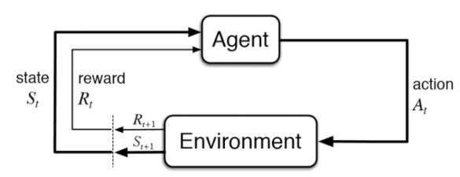
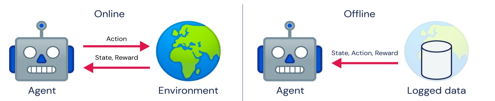
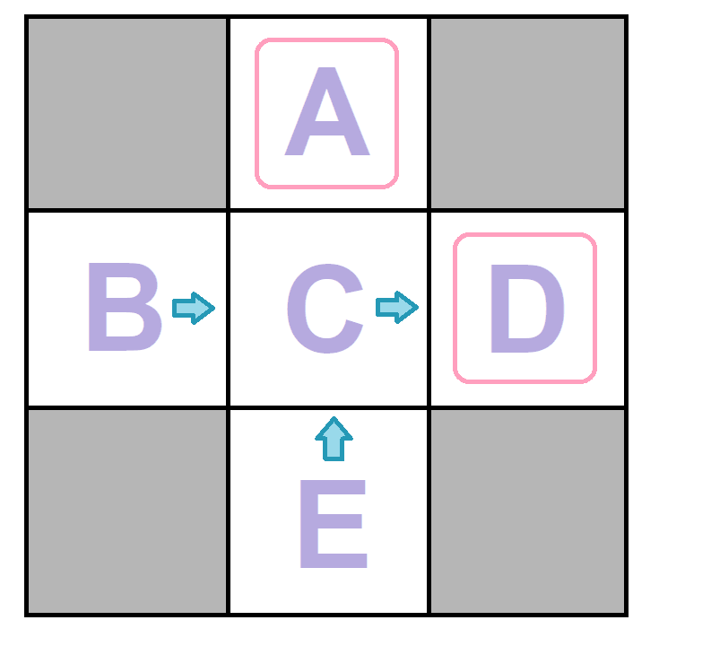
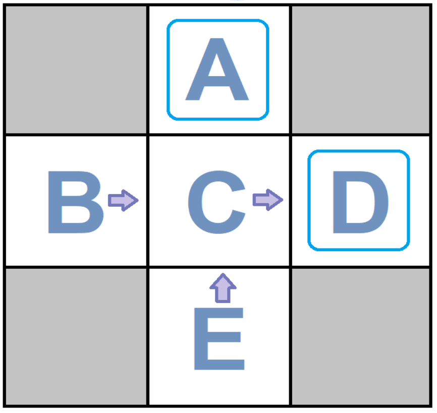
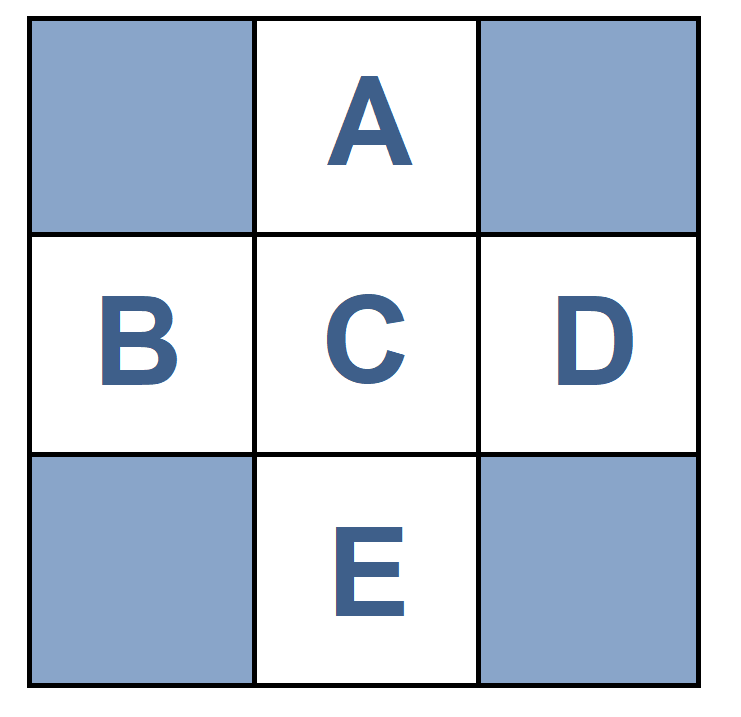
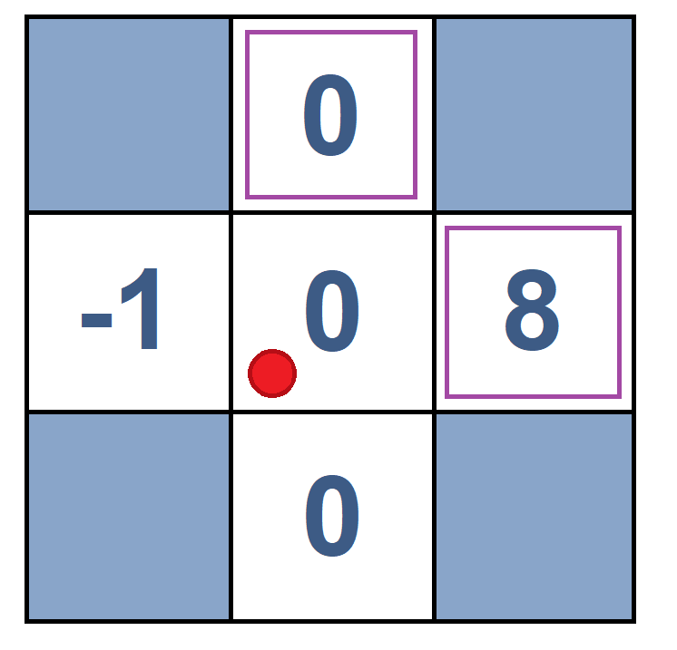
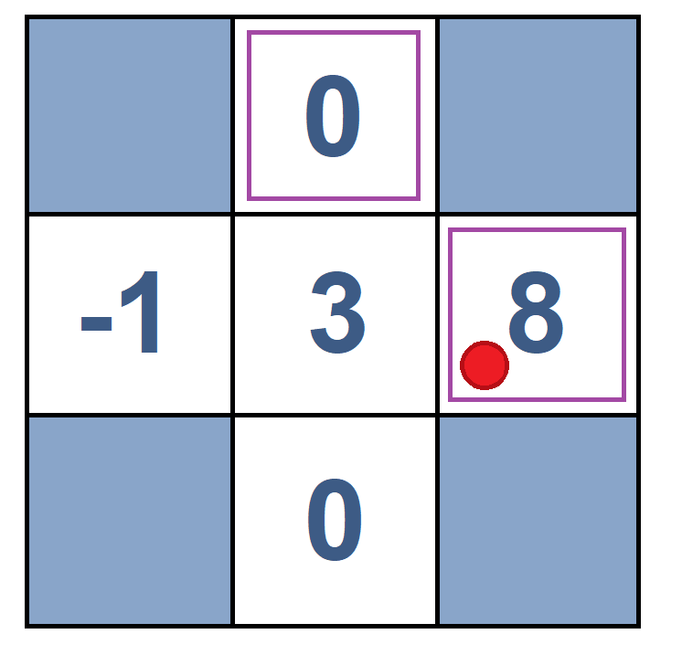

# Reinforcement Learning 
#  Table of content
- [Introduction](#introduction) 
- [Online vs Offline Learning](#OnlinevsOfflineLearning)
- [Main Elements of RL](#MainElementsofRL)
- [Different Methods of Learning According to Model](#DifferentMethodsofLearningAccordingtoModel)
    - [Model-based RL](#Model-basedRL)
    - [Model-free RL](#Model-freeRL)
        - [an example](#anexample1)
- [Types of Reinforcement Learning According to Learning Policy](#TypesofReinforcementLearningAccordingtoLearningPolicy)
    - [Passive Reinforcement Learning](#PassiveReinforcementLearning)
    - [Active Reinforcement Learning](#ActiveReinforcementLearning)
- [Policy Evaluation](#PolicyEvaluation)
- [Direct Utility Estimation](#DirectUtilityEstimation)
    - [Definition](#Definition)
        - [an example](#anexample2)
- [Advantages of Direct Utility Estimation](#AdvantagesofDirectUtilityEstimation)
- [Disadvantages of Direct Utility Estimation](#DisadvantagesofDirectUtilityEstimation)
- [Temporal Difference (TD) Learning](#TemporalDifference(TD)Learning)
    - [Definition](#DefinitionTD)
    - [pseudocode](#pseudocode)
    - [Some aspects of TD](#SomeaspectsofTD)
    - [an example](#anexample3)
- [Problem with TD](#ProblemwithTD)
- [Conclusion](#Conclusion)
- [References](#resources)


<div id='introduction'/>

# Inroduction

_**"... What we want is a machine that can learn from experience." -Alan Turing, 1947**_


Reinforcement learning is a subcategory of Machine Learning which solves problems that involve learning what to do—how to
map situations to actions— to maximize a numerical reward signal. In this learning system, the system's actions influence its later inputs. Moreover, the learner is not told which actions to take but instead must discover
which actions yield the most reward by trying them out.
<br>
<div style="text-align:center">

<br>
    <em>relation of agent and environment</em>

</div>
<br>

<div id='OnlinevsOfflineLearning'/>

## Online vs Offline Learning
Overall, there are two learning methods—online and offline. In the online approach, the agent has no information about the environment. It gathers information by rewards and decides which states are good and which are bad and should be avoided. However, in the offline method, the agent has prior information, helping it decide on its actions based on the information and receive a less negative reward.
Reinforcement learning (RL) is an MDP without $T$ and $R$, meaning it has no information on the environment. Thus, the learning method in RL is online.
<div style="text-align:center">

<br>
</div>
<br>

<div id='MainElementsofRL'/>

## Main Elements of RL
1. Policy $\pi : S \rightarrow A$
    * It is a map from state space to action space. 
    * It may be stochastic.
2. Reward Function R(s)
    * It maps each state to a real number, called **reward**.
    * Agent's utility is defined by the reward function. Agent must learn to maximize expected rewards. 
3. Value Function V(s)
    * The value of a state is the total expected reward starting from that state. 
  

<br>

<div id='DifferentMethodsofLearningAccordingtoModel'/>

## Different Methods of Learning According to Model
RL systems can be divided into two categories: **model-based** and **model-free**
<div id='Model-basedRL'/>

* **Model-based RL :**  This method tries to overcome the issue of a lack of prior knowledge to construct a functional representation of its environment. It solves the problem in two steps:
        
    1. **Learn imprical MDP model :** In this model, the agent explores the environment and performs some actions to estimate the parameters of the model. These parameters are  $\hat{T}(s, a, s')$ and $\hat{R}(s, a, s')$. First, it counts outcomes $s'$ for each $s,a$. Second, it normalizes the values to give an estimate of $\hat{T}(s,a,s')$. At last, it discovers each $\hat{R}(s,a,s')$ when it experiences $(s, a, s')$.
        
    2. **Solve the learned MDP:** After estimating the missing parameters of the MDP model, the agent can solve the MDP by using various algorithms (e.g. _Value Iteration_) that are mentioned before. 
<div id='Model-freeRL'/>

* **Model-free RL:** Unlike the previous category, in this type of Reinforcement Learning, the parameters of the traditional MDP are not estimated.  Consequently, the agent directly learns the policy and the evaluation function. This algorithm can be thought of as a _trial and error_ algorithm. 

<br>

<div id='anexample1'/>

**Example:** Assume that an agent wants to compute the expected age of students in one class. ($A$ is a random variable that represents the distribution of age) If the agent has the distribution of $A$, it can easily calculate the expectation according to $E[A] = \sum_{a} P(a).a$ . On the other hand, if the agent doesn't have the distribution over $A$, the problem must use Reinforcement Learning that can be solved with model-based or model-free RL. 
<br>
* **Model-based approach**: In this algorithm, first we have to estimate $\hat{P}(a)$. The estimation is simple in this special example, but it can be complicated in real-world problems. We start exploring and getting samples and then We set $\hat{P}(a) = \frac{num(a)}{N}$. $num(a)$ is the number of occurrences of the age $a$. Finally, after finding the probability function, we can find the expectation with $E[A] \approx \sum_{a} \hat{P}(a).a$.
<br>
* **Model-free approach**: In this algorithm, there is no need to find $\hat{P}(a)$. After exploring the envirnoment and gathering samples, we can directly calculate the value of $E[A] = \frac{1}{N}\sum_{i} a_i$. Samples appear with accurate frequencies. As a result, we can be sure that this algorithm works efficiently. 

**Example:** In this example, we are going to estimate $\hat{T}(s,a,s')$ and $\hat{R}(s,a,s')$ using model-based RL. In these kinds of questions, we need to fix the input policy $(\pi)$ and observe episodes to train the model and estimate the parameters. Each episode contains a series of movements with the same length (in this example the length of each episode is 3). After observing, we can estimate the possibility of each transition and the reward function for each movement. 



| | &ensp;&ensp;&ensp;&ensp;&ensp;Episode1  &ensp;&emsp;&emsp;&emsp;&emsp;&emsp;&emsp;&emsp;&emsp;&emsp;&emsp;Episode2  &emsp;&emsp;&emsp;|
|-| ----|
|| <table>   <tbody>    <td>B</td>  <td>east</td> <td>C</td> <td>-1</td>      <td>&emsp;&emsp;&emsp;&ensp;&ensp;B</td>     <td> east</td>    <td> C</td>  <td> -1</td>   </tr>  <tr>  <td>C</td>  <td>east</td> <td>D</td><td>-1</td> <td>&emsp;&emsp;&emsp;&ensp;&ensp;C</td>     <td> east</td>    <td> D</td>  <td> -1</td>     </tr>  <tr>  <td>D</td>  <td>exit</td> <td>X</td><td>+10</td>  <td>&emsp;&emsp;&emsp;&ensp;&ensp;D</td>     <td> exit</td>    <td> X</td>  <td> +10</td>  </tr>  <tr>    </tbody>  </table>            

| | &ensp;&ensp;&ensp;&ensp;&ensp;Episode3  &ensp;&emsp;&emsp;&emsp;&emsp;&emsp;&emsp;&emsp;&emsp;&emsp;&emsp;Episode4  &emsp;&emsp;&emsp;|
|-| ----|
|| <table>   <tbody>    <td>E</td>  <td>north</td> <td>C</td> <td>-1</td>      <td>&emsp;&emsp;&emsp;&ensp;&ensp;E</td>  <td>north</td> <td>C</td> <td>-1</td>   </tr>  <tr>  <td>C</td>  <td>east</td> <td>D</td><td>-1</td> <td>&emsp;&emsp;&emsp;&ensp;&ensp;C</td>     <td> east</td>    <td> A</td>  <td> -1</td>     </tr>  <tr>  <td>D</td>  <td>exit</td> <td>X</td><td>+10</td>  <td>&emsp;&emsp;&emsp;&ensp;&ensp;A</td>     <td> exit</td>    <td> X</td>  <td> +10</td>  </tr>  <tr>    </tbody>  </table>     

<br clear="left"/>
<br>

After sampling, in order to estimate $\hat{T}$ for each $(s,a,s')$, we have to count the number of all movements that start from $s$ and have the action $a$ and go to state $s'$. After that we have to divise this count to the number of movements that start from $s$ and have the action $a$. For example:
* $T(B, east, C) = \frac{2}{2} = 1$
* $T(C, east, D) = \frac{3}{4} = 0.75$
<br>
In addition, we can estimate $\hat{R}(s,a,s')$ for each movement in all episodes. We have to get the average of the reward for all tuples of $(s,a,s')$. For example:
* $R(B, east, C) = \frac{-1-1}{2} = -1$
* $R(D, exit, x) = \frac{10+10+10}{3} = 10$

**Question:** What is the problem of above model-based algorithm?<br> If the number of states are large, the number of required samples to train the model will be $O((|S|)^2.|A|)$. In other words, we need many episodes to be able to train the model properly. 

<div id='TypesofReinforcementLearningAccordingtoLearningPolicy'/>

## Types of Reinforcement Learning According to Learning Policy
Ther are two types of RL according to Learning policy: **Passive Reinforcement Learning**, **Active Reinforcement Learning**. In below, we explain both methods.

<div id='PassiveReinforcementLearning'/>

## Passive Reinforcement Learning
Passive reinforcement learning is when we want an agent to learn about the utilities of various states under a fixed policy. The learned policy will be different from the original fixed policy. _**Direct Utility Estimation**_ and _**Temporal Difference Learning**_ are two passive RL algorithms. 

<div id='ActiveReinforcementLearning'/>

## Active Reinforcement Learning
Active reinforcement learning is when the policy of the agent is not fixed and can change during the time of training. In this method exploration and exploition is done. Exploration refers to trying new actions that are rarely done and checking if they have a bigger reward. Exploitation refers to keep doing the optimal action at each state. _Q-learning_ is one of the active RL algorithms. 

<div id='PolicyEvaluation'/>

## Policy Evaluation
Policy evaluation computes the value functions for a policy $\pi$ using the Bellman equations.
$$V^{\pi}_0(s) = 0$$
$$V^{\pi}_{k+1} \leftarrow \sum_{s'}T(s, \pi(s), s')[R(s, \pi, s') + \gamma V^{\pi}_k(s')$$
In fact, simplified Bellman updates calculate V for a fixed policy:
* Each round, replace V with a one-step-look-ahead layer over V
* This approach fully exploited the connections between the states

<div id='DirectUtilityEstimation'/>

# Direct Utility Estimation

<div id='Definition'/>

**Definition:** In this method, the agent executes a sequence of trials or runs (sequences of state-action transitions that continue until the agent reaches the terminal state). Each trial gives a sample value and the agent estimates the utility based on the samples values. This can be calculated as running averages of sample values.


* **Direct utility estimation (model-free)**
    * Estimate **$V^{\pi}(s)$** as the average total reward of epochs containing $s$ (calculating from $s$ to end of epoch)

* **Reward-to-go of a state** **$s$**
    * The sum of the (discounted)rewards from that state until a  terminal state is reached

* **Key**: use observed reward-to-go of the state as the direct evidence of the actual expected utility of that state

Suppose we have a 4x3 grid as the environment in which the agent can move either Left, Right, Up or Down(set of available actions). An example of a run:

$(1,1) _{-0.04}  \rightarrow (1,2) _{-0.04}  \rightarrow (1,3) _{-0.04}  \rightarrow (1,2) _{-0.04}  \rightarrow (1,3) _{-0.04}  \rightarrow (2,3) _{-0.04}  \rightarrow (3,3) _{-0.04} \rightarrow (4,3) _{+1}$   

The total reward starting at (1,1) is 0.72. We call this a sample of the observed-reward-to-go for (1,1).

For (1,2) there are two samples for the observed-reward-to-go (assuming $\gamma$=1):

1. $(1,2) _{-0.04}  \rightarrow (1,3) _{-0.04}  \rightarrow (1,2) _{-0.04}  \rightarrow (1,3) _{-0.04}  \rightarrow (2,3) _{-0.04}  \rightarrow (3,3) _{-0.04}  \rightarrow (4,3) _{+1}     [Total:0.76]$ 

2. $(1,2) _{-0.04}  \rightarrow (1,3) _{-0.04}  \rightarrow (2,3) _{-0.04}  \rightarrow (3,3) _{-0.04}  \rightarrow (4,3) _{+1}    [Total:0.84]$

*  Direct Utility Estimation keeps a running average of this observed reward-to-go for each state

* Eg. for state (1,2), it stores $\frac{(0.76+0.84)}{2}=0.8$

Thus, at the end of each sequence, the algorithm calculates the observed reward-to-go for each state and updates the estimated utility for that state accordingly, just by keeping a running average for each state in a table. In the limit of infinitely many trials, the sample average will converge to the true expectation in the following Equation.

  &ensp;&nbsp;&nbsp; **$V^\pi (s) = E [\sum_{t = 0}^{\infty } \gamma^t R (S_{t})]$**

Direct utility estimation succeeds in reducing the reinforcement learning problem to an inductive learning problem, about which much is known. Unfortunately, it misses a very important source of information, namely, the fact that the utilities of states are not independent! The utility of each state equals its own reward plus the expected utility of its successor states. That is, the utility values obey the Bellman equations for a fixed policy (the following  Equation)

&ensp;&nbsp;&nbsp;**$V^\pi (s) =R(S)+\gamma \sum_{\acute{s}}   P(\acute{s}|s,\pi(s))   U^\pi(\acute{s})$**

<br />
<br />

And now it is good to see an example. The purpose of this question is to estimate the returns.

<div id='anexample2'/>

**Example:** Calculate the return of each state according to the figure below and the given episodes.($\gamma =1$)




| | &ensp;&ensp;&ensp;&ensp;&ensp;Episode1  &ensp;&emsp;&emsp;&emsp;&emsp;&emsp;&emsp;&emsp;&emsp;&emsp;&emsp;Episode2  &emsp;&emsp;&emsp;|
|-| ----|
|| <table>   <tbody>    <td>B</td>  <td>east</td> <td>C</td> <td>-1</td>      <td>&emsp;&emsp;&emsp;&ensp;&ensp;B</td>     <td> east</td>    <td> C</td>  <td> -1</td>   </tr>  <tr>  <td>C</td>  <td>east</td> <td>D</td><td>-1</td> <td>&emsp;&emsp;&emsp;&ensp;&ensp;C</td>     <td> east</td>    <td> D</td>  <td> -1</td>     </tr>  <tr>  <td>D</td>  <td>exit</td> <td>X</td><td>+10</td>  <td>&emsp;&emsp;&emsp;&ensp;&ensp;D</td>     <td> exit</td>    <td> X</td>  <td> +10</td>  </tr>  <tr>    </tbody>  </table>            

| | &ensp;&ensp;&ensp;&ensp;&ensp;Episode3  &ensp;&emsp;&emsp;&emsp;&emsp;&emsp;&emsp;&emsp;&emsp;&emsp;&emsp;Episode4  &emsp;&emsp;&emsp;|
|-| ----|
|| <table>   <tbody>    <td>E</td>  <td>north</td> <td>C</td> <td>-1</td>      <td>&emsp;&emsp;&emsp;&ensp;&ensp;E</td>  <td>north</td> <td>C</td> <td>-1</td>   </tr>  <tr>  <td>C</td>  <td>east</td> <td>D</td><td>-1</td> <td>&emsp;&emsp;&emsp;&ensp;&ensp;C</td>     <td> east</td>    <td> A</td>  <td> -1</td>     </tr>  <tr>  <td>D</td>  <td>exit</td> <td>X</td><td>+10</td>  <td>&emsp;&emsp;&emsp;&ensp;&ensp;A</td>     <td> exit</td>    <td> X</td>  <td> +10</td>  </tr>  <tr>    </tbody>  </table>     

<br clear="left"/>

<br />
<br />

 Now we solve this example:

&ensp;&nbsp;

<br /><br /><br /><br /><br /><br /><br /><br /><br /><br /><br /><br /><br />


<br/>According to the question, you have to estimate the return seen in each state.

According to the given episodes and $\gamma = 1$, you should look for your state in the first column of each episode, then average the numbers(s) in the last column, from that point until the end.

Pay attention to the solution:

**state A:**&nbsp;  You can see A just in the fourth episode $\rightarrow$ $\frac{(+10)}{1}=+10$ 

**state B:**&nbsp; You can see B in the first and second episodes $\rightarrow$
$\frac{( -1  -1 + 10) + ( -1 -1 + 10 ) }{ 2} = +8$
<br />

**state C:** &nbsp; You can see C in all episodes $\rightarrow$
$\frac{( -1 + 10 )+( -1+10 ) + ( -1 + 10 )+( -1 -10 )} {4} = +4$

**state D:** &nbsp; You can see D in The first three states $\rightarrow$ &nbsp;
$\frac{(+10+10+10)}{3} =+10$

If you pay more attention, you will notice that the problem with this method is, we can move to C both from E and B, but we find very different values for them. The reason for this difference is the lack of sample. we also express the values of each state independent from other states.
<br /><br />

<div id='AdvantagesofDirectUtilityEstimation'/>

## Advantages of Direct Utility Estimation

* Easy to understand

* Does not require any knowledge of T, R 

* Computes the correct average values, using just sample transitions


<br />

<div id='DisadvantagesofDirectUtilityEstimation'/>

## Disadvantages of Direct Utility Estimation
* Wastes information about state connections 

* Each state must be learned separately 

* Takes a long time to learn

* Converges very slowly

&nbsp;&nbsp;&ensp;&ensp;&ensp;&ensp;&ensp;&ensp;Why?

&nbsp;&nbsp;&ensp;&ensp;&ensp;&ensp;&ensp;&ensp;  **-** Does not exploit the fact that utilities of states are not independent 

&nbsp;&nbsp;&ensp;&ensp;&ensp;&ensp;&ensp;&ensp;  **-** Utilities follow the Bellman equation

&ensp;&nbsp;&nbsp;&nbsp;&nbsp;&nbsp;&nbsp;&nbsp;&nbsp;&nbsp;&nbsp;&nbsp;&nbsp;&nbsp;&nbsp; $V_{\pi} (s) =R(S)+\gamma \sum_{\acute{s}} T(s,\pi(s),{\acute{s}})V_{\pi}({\acute{s}})$


**Question**: How to approximate E[X] (The right side of the equation below) based on model-free learning?

$V^\pi_{k+1}(s) \leftarrow \sum_{{\acute{s}}} T(s,\pi(s),\acute{s} )[R(s,\pi(s),\acute{s} )+\gamma V^\pi_{k} ]$

We cannot use this equation directly since we do not have T and R, but we can use the average of the returned value ($[R(s,\pi(s),\acute{s} )+\gamma V^\pi_{k} ]$). 
So we can change our formula to the following form.

$V^\pi (s) \approx \frac{1}{N} \sum [R(s,\pi(s),\acute{s})+\gamma  V^\pi(\acute{s})]$

If you pay a little attention, you will notice that there is a problem, so what is the problem with this approach? In one state, an action cannot be repeated N times, because you move on to another state as soon as an action is taken and it will be physically impossible be able to perform another action in the same state. Now, what is the solution?

You can take the average in more than one shot, for example, take different actions in multiple episodes and update the average as you arrive to the desired state.
For example, if the average is $\varphi$ up to this point, the updated average would be:

$\varphi_{new} = \varphi n + \frac {x} {n+1}$

In which $n$ is the number of data you have collected.


<div id='TemporalDifference(TD)Learning'/>

# Temporal Difference (TD) Learning

<div id='DefinitionTD'/>

**Definition:** TD is an agent learning from an environment through episodes with no prior knowledge of the environment.

* It learns from trial and error.

* TD takes a model-free or unsupervised learning approach.

* TD tries to predict the immediate reward and the reward at the next moment instead of calculating the total future reward.

The key concept of the a TD agent: ($R$ is the reward function)

$$R_{t} = r_{t+1} + \gamma r_{t+2} + \gamma ^{2} r_{t+3} + ... = \sum_{k = 0}^{\infty }\gamma ^{k} r_{t + k + 1}$$

In fact, TD learning tries to answer the question of how to compute this weighted average without the weights, cleverly doing so with an exponential
moving average. In this equation reward at time **t** is a combination of discounted rewards in the future which shows that future rewards are valued less.

TD agent error:

$$ E_{t} = V^{\pi ^ *}_{t} - V^\pi_{t} $$\
$$= r_{t+1} + \sum_{k = 1}^{\infty }\gamma ^{k} r_{t + k + 1} - V^\pi_{t} $$\
$$= r_{t+1} + \gamma \times \sum_{k = 1}^{\infty }\gamma ^{k-1} r_{t + k + 1} - V^\pi_{t} $$\
$$= r_{t+1} + \gamma \times \sum_{k = 0}^{\infty }\gamma ^{k} r_{(t  + 1) + (k + 1)} - V^\pi_{t}$$\
$$=  r_{t+1} + \gamma \times \sum_{k = 0}^{\infty }\gamma ^{k} r_{(t  + 1) + (k + 1)} - V^\pi_{t}$$\
$$= r_{t+1} + \gamma \times V^\pi_{t+1} - V^\pi_{t}$$

Updating the value: ($\alpha$ is learning rate)

$$V^\pi_{t} \leftarrow V^\pi_{t} + \alpha \times E_{t} = V^\pi_{t} + \alpha \times( r_{t+1} + \gamma \times V^\pi_{t+1} - V^\pi_{t})$$

<div id='pseudocode'/>

## Pseudocode
The pseudocode of the process is shown below.
```
function PASSIVE-TD-AGENT(percept) returns an action
    inputs: percept, a percept indicating the current state s' and rewarl signal r'
    persistent: pi, a fixed policy
                V, a table of values(utilities), initially empty
                N_{s}, a of frequencies for states, initially zero
                s, a, r, the previous state, action, and reward, initially null
    if s' is new then V[s'] = r'
    if s is not null then :
        increment N_{s}[s]
        V[s] = V[s] + alpha * (N_{s}[s])(r + gamma * V[s'] - V[s])
    if s'.TERMINAL? then s, a, r = null
       else :
           s = s'
           a = pi[s']
           r = r'
    return a
```
It is good to mention that because rare transitions occur only rarely, the average of **value function** will converge to the correct value.

<div id='SomeaspectsofTD'/>

## Some aspects of TD
1. TD shows almost high variability.
2. TD is a quite simple method in RL.
3. TD does quite little computation per observation.
4. TD adjusts a state to be consistent with its **observed** successor states.
5. TD makes a single adjustment per observation.
6. TD is a crude but efficient approximation to other methods in RL.
7. TD does not need a transition model to do the update.
8. TD uses **exponential moving average** which runs an interpolation and makes recent samples more important in the process. The method forgets about the past. The recursive formula is written below.
$$x_{n} = (1-\alpha) . x_{n-1} + \alpha . x_{n}$$
    * In this formula:
        a decreases &rarr; converging averages

<div id='anexample3'/>

**Example**

Consider the following grid with $\gamma = 1$ and $\alpha = 1/2$. We have the initial $V^{\pi}(x_i)$ in State 1. We want to calculate $V^{\pi}(B)$ and $V^{\pi}(C)$ after sampling and two moves.
<br>


State 1 |Move 1(B, east, C, -2)|State 2|Move 2 (C, east, D, -2)|State 3                |      
:------------------:|:----------:|:------------------:|:----------:|:------------------:|
  ||    ||  |

The formula is:
$$V^\pi_{t} \leftarrow V^\pi_{t} + \alpha \times E_{t} = V^\pi_{t} + \alpha \times( r_{t+1} + \gamma \times V^\pi_{t+1} - V^\pi_{t})$$
Calculations:

$V^{\pi}(B) = ?$

$V^{\pi}(B) \leftarrow V^{\pi}(B) + \alpha \times (-2 + \gamma \times V^{\pi}(C))$

$\rightarrow V^{\pi}(B) = 0 + 1/2 \times (-2 + 1 \times 0) = -1$

$V^{\pi}(C) = ?$

$V^{\pi}(C) \leftarrow V^{\pi}(C) + \alpha \times (-2 + \gamma \times V^{\pi}(D))$

$\rightarrow V^{\pi}(C) = 0 + 1/2 \times (-2 + 1 \times 8) = 3$

For better understanding and seeing how a TD agent acts in the environment, see the code below, which belongs to "HalfCheetah-v2", a TD agent.
```
import numpy as np
from gym import utils
from gym.envs.mujoco import mujoco_env


class HalfCheetahEnv(mujoco_env.MujocoEnv, utils.EzPickle):
    def __init__(self):
        mujoco_env.MujocoEnv.__init__(self, "half_cheetah.xml", 5)
        utils.EzPickle.__init__(self)

    def step(self, action):
        xposbefore = self.sim.data.qpos[0]
        self.do_simulation(action, self.frame_skip)
        xposafter = self.sim.data.qpos[0]
        ob = self._get_obs()
        reward_ctrl = -0.1 * np.square(action).sum()
        reward_run = (xposafter - xposbefore) / self.dt
        reward = reward_ctrl + reward_run
        done = False
        return ob, reward, done, dict(reward_run=reward_run, reward_ctrl=reward_ctrl)

    def _get_obs(self):
        return np.concatenate(
            [
                self.sim.data.qpos.flat[1:],
                self.sim.data.qvel.flat,
            ]
        )

    def reset_model(self):
        qpos = self.init_qpos + self.np_random.uniform(
            low=-0.1, high=0.1, size=self.model.nq
        )
        qvel = self.init_qvel + self.np_random.standard_normal(self.model.nv) * 0.1
        self.set_state(qpos, qvel)
        return self._get_obs()

    def viewer_setup(self):
        self.viewer.cam.distance = self.model.stat.extent * 0.5
```
The video of this agent in the environment is shown below.

https://user-images.githubusercontent.com/62206142/148566163-089a2a3c-4361-4997-b956-d4e790cf1cbd.mp4

<div id='ProblemwithTD'/>

## Problem with TD
All we want is to find the best policy that suits us. Although TD agent finds the value of each state (A value that converges to the real value during the time), it cannot find the best policy because for finding that and doing one-step expectimax, $T$ and $R$ functions are needed. However, in RL, they are not available. Therefore, a new method is needed which is called **Q-Learning**.

<div id='Conclusion'/>

# Conclusion

<div id='SummaryofDiscussedRLMethods'/>

### Summary of Discussed RL Methods
#### Direct Utility Estimation
* Simple to implement
* Each update is fast
* Does not exploit Bellman constraints and converges slowly

#### Temporal Difference Learning
* Update speed and implementation similar to direct estimation
* Partially exploits Bellman constraints-adjusts state to 'agree' with the observed successor (Not **all** possible successors)

### Why to use RL
Here are prime reasons for using Reinforcement Learning:

* It helps you to find which situation needs an action
* It Helps you to discover which action yields the highest reward over the longer period.
* It provides the learning agent with a reward function.
* It allows it to figure out the best method for obtaining large rewards.

### Usage of RL
Here are applications of Reinforcement Learning:

* Robotics for industrial automation.
* Business strategy planning
* Machine learning and data processing
* It helps you to create training systems that provide custom instruction and materials according to the requirement of students.
* Aircraft control and robot motion control

<div id='resources'/>

# References
[1] Passive Reinforcement Learning. https://kcir.pwr.edu.pl/~witold/ai/mle_rl_h.pdf (visited: 2/1/2022)

[2] Active vs Passive Learning. Shweta Bhatt. https://towardsdatascience.com/explaining-reinforcement-learning-active-vs-passive-a389f41e7195 (visited: 2/1/2022)

[3] Active and Passive Learning. Philipp Koehn. https://www.cs.jhu.edu/~phi/ai/slides/lecture-reinforcement-learning.pdf (visited: 25/12/2021)

[4] Model-Based vs. Model-Free RL. Russell and Norvig. https://web.engr.oregonstate.edu/~xfern/classes/cs434/slides/RL-1.pdf (visited: 6/1/2022)

[5]Online vs Offline Learning. Banghua Zhu, Cong Ma, Jiantao Jiao, Paria Rashidinejad. https://congma1028.github.io/Publication/OfflineRL/OfflineRL.pdf (visited: 7/1/2022)

[6]Direct Utility Estimation. Oregon State University. https://web.engr.oregonstate.edu/~xfern/classes/cs434/slides/RL-1.pdf (visited: 4/1/2022)

[7]Direct Utility Estimation. Carnegie Mellon University. https://www.cs.cmu.edu/~arielpro/15381f16/c_slides/781f16-12.pdf (visited: 5/1/2022)

[8]Example of Direct Utility Estimation. Shweta Bhat. https://towardsdatascience.com/explaining-reinforcement-learning-active-vs-passive-a389f41e7195 (visited: 5/1/2022)

[9] Temporal Difference Learning. Andrew Barto. http://www.scholarpedia.org/article/Temporal_difference_learning (visited: 1/1/2022)

[10] Temporal Difference Learning. Andre Violante. https://medium.com/@violante.andre/simple-reinforcement-learning-temporal-difference-learning-e883ea0d65b0 (visited: 1/1/2022)

[11] Temporal Difference Learning. Viet Hoang Tran Duong. https://towardsdatascience.com/intro-to-reinforcement-learning-temporal-difference-learning-sarsa-vs-q-learning-8b4184bb4978 (visited: 3/1/2022)

[12] Temporal Difference Learning. Henry AI Labs. https://www.youtube.com/watch?v=L64E_NTZJ_0 (visited: 27/12/2021)

[13] Sutton, Richard. Reinforcement Learning: An Introduction. London : The MIT Press (visited: 6/1/2022)

[14] HalfCheetah-v2. James L. https://www.youtube.com/watch?v=TpWXyauJ3M8 (visited: 5/1/2022)

[15] HalfCheetah-Code. https://github.com/openai/gym/blob/master/gym/envs/mujoco/half_cheetah.py (visited: 5/1/2022)


