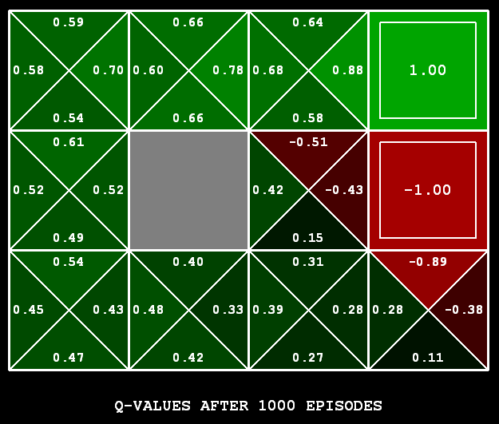

<h1> Reinforcement Learning (from Q Value till the end) </h1>

- [Reinforcement Learning (from Q Value till the end)](#reinforcement-learning-from-q-value-till-the-end)
- [Introduction](#introduction)
- [RL Types of Algorithms](#rl-types-of-algorithms)
- [Q-Learning](#q-learning)
- [Active RL](#active-rl)
    - [Real life example](#real-life-example)
    - [Epsilon greedy strategy](#epsilon-greedy-strategy)
    - [Exploration functions](#exploration-functions)
- [Regret](#regret)
- [Approximate Q-Learning](#approximate-q-learning)
    - [Feature-based representation](#feature-based-representation)
- [Conclusion](#conclusion)
- [Further Reading](#further-reading)
- [References](#references)

<h1> Introduction </h1>

You’ve probably seen how a dog trainer gives a trait to the dogs after they complete a task successfully. That trait is a reward to the brain, and says “Well done! You are going in the right direction.” So after that, the brain tries to do that again in order to get more rewards. This way the dogs will learn and train themselves.
This is sort of what happens in Reinforcement Learning(RL).
Reinforcement learning (RL) is an area of machine learning concerned with how intelligent agents should take actions in an environment in order to maximize the reward by taking a series of actions in response to a dynamic environment. It is the science of making optimal decisions using experiences.

<h1> RL Types of Algorithms </h1>

RL algorithms have 2 main types. **model-based** and **model-free**. A model-free algorithm doesn’t use or estimate the dynamics (transition and reward functions) of the environment for estimating the optimal policy. Whereas, a model-based algorithm uses both for that.
Q-learning is a model-free reinforcement learning algorithm.

<h1> Q-Learning </h1>

Q-learning is a model-free reinforcement learning algorithm to learn the value of an action in a particular state. It is a **values-based** learning algorithm. Value based algorithms update the value function based on an equation.
Q-learning is an **off-policy** learner, which means it learns the value of the optimal policy independently of the agent’s actions. In other words, it converges to optimal policy eventually even if you are acting sub-optimally.
Q-learning is a **sample-based** q-value iteration method and in it, you Learn $Q(s,a)$ values as you go:

- Receive a sample. $(s_{t+1}, s_t, a_t, r_t)$
- Consider your old estimate: $Q(s_t,a_t)$
- Consider your new sample estimate:

  $$sample = R(s,a,s^{\prime}) + \gamma \max_{a^{\prime}}Q(s^{prime},a^{\prime}) = r_t + \gamma \max_aQ(s_{t+1},a)$$
  
- Incorporate the new estimate into a running average:

  $$Q(s,a) \leftarrow (1 - \alpha)Q(s,a) + \alpha(sample)$$
  
  $$\rightarrow Q^{new}(s_t,a_t) \leftarrow \underbrace{Q(s_t,a_t)}\text{old value}<\sub> + \underbrace{\alpha}_\text{learning rate} . \overbrace{(\underbrace{\underbrace{r_t}_\text{reward} + \underbrace{\gamma}_\text{discount factor} . \underbrace{\max_aQ(s_{t+1},a)}_\text{estimate of optimal future value}}_\text{new value (temporal difference target)} - \underbrace{Q(s_t,a_t)}_\text{old value})}^\text{temporal difference}$$
  

<h1> Active RL </h1>

In active RL, an agent needs to decide what to do as there’s no fixed policy that it can act on. Therefore, the goal of an active RL agent is to act and learn an optimal policy. An agent interacts with the environment either by exploring or exploiting. **Exploration** is all about finding more information about an environment, whereas **exploitation** is exploiting already known information to maximize the rewards.

<h2> Real life example </h2>

Say you go to the same restaurant every day. You are basically exploiting. But on the other hand, if you search for new restaurant every time before going to any one of them, then it’s exploration. Exploration is very important for the search of future rewards which might be higher than the near rewards.

<h2> Epsilon greedy strategy </h2>

The tradeoff between exploration and exploitation is fundamental. the simplest way to force exploration is using **epsilon greedy strategy**. This method does a random action with a small probability of $\epsilon$ (exploration) and with a probability of $(1 - \epsilon)$ does the current policy action (exploitation).
The problem with random actions is that you do eventually explore the space, but keep thrashing around once learning is done. one solution is to start with a higher $\epsilon$ rate and as the agent explores the environment, the ϵ rate decreases and the agent starts to exploit the environment.

<h2> Exploration functions </h2>

Another solution is to use **exploration functions**. For example, this function can take a value estimate u and a visit count n, and return an optimistic utility, e.g. $f(u,n) = v + \frac{k}{n}$ . we are counting how many times we did some random action. if it had yet to reach a fixed amount, we should try it more often and if it doesn't return a good output we should just stop exploring it.
So we’ll use a modified Q-update:

$$Q(s,a) \leftarrow \alpha R(s,a,s^{\prime}) + \gamma \max_{a^{\prime}} f(Q(s^{\prime},a^{\prime}),N(s^{\prime},a^{\prime}))$$

in above equation k is fixed. Q is the optimistic utility which is given to f as v. and n is the number of times we visited s' after doing action a' starting from s. which means when the n is low we get to try those actions more often.

<h1> Regret </h1>

Even though most of the RL algorithms we discussed reach optimal policy, they still make mistakes along the way. Regret is a measure of the total mistake cost, the difference between rewards, including and optimal rewards.
Minimizing regret goes beyond learning to be optimal so it requires optimally learning to be optimal!

<h1> Approximate Q-Learning </h1>

Basic Q-learning keeps a table of all Q-values but in real world situations, there are too many states to visit and hold their Q-values. Instead, we can use function approximation, which simply means using any sort of representation for the Q-function other than a lookup table. The representation is viewed as approximate because it might not be the case that the true utility function or Q-function can be represented in the chosen form.

<h2> Feature-based representation </h2>

One way of using this is to use a feature-based representation in which we describe a state using a vector of features. In this method, we respresent a **linear** combination of these features and try to learn wis so that the Q function is near to the main Q-value.

$$V(s) = \omega_1f_1(s) + \omega_2f_2(s) + ... + \omega_nf_n(s)$$

$$Q(s,a) = \omega_1f_1(s,a) + \omega_2f_2(s,a) + ... + \omega_nf_n(s,a)$$

To learn and update wis, we have a method which is similar to the method we had for updating Q-values in basic Q-learning :

$$\omega_m \leftarrow \omega_m + \alpha [r + \gamma \max_aQ(s^{\prime},a^{\prime}) - Q(s,a)] f_m(s,a)$$

<h1> Conclusion </h1>

Q-Learning is a basic form of Reinforcement Learning which uses Q-values (action values) to iteratively improve the behavior of the learning agent.

Q-values are defined for states and actions. $Q(s, a)$ is an estimation of how good is it to take the action a at the state s. This estimation of $Q(s, a)$ will be iteratively computed using the temporal difference update.

This update rule to estimate the value of Q is applied at every time step of the agents interaction with the environment.

At every step of transition, the agent from a state takes an action, observes a reward from the environment, and then transits to another state. If at any point of time the agent ends up in one of the terminating states that means there are no further transition possible. This is said to be the completion of an episode.

$\epsilon$-greedy policy is a very simple policy of choosing actions using the current Q-value estimations.

Active learning is a special case of machine learning in which a learning algorithm can interactively query a user (or some other information source) to label new data points with the desired outputs.

Unlike passive learning which just executes the policy and learns from experience, here we are using active reinforcement learning in which the agent learns the optimal policy by taking actions in the world and finding out what is happenning, and then improving the policy iteratively.

<h1> Further Reading </h1>

To read more about reinforcement learning, Q-learning, active and passive RL and much more, you can visit links below:

- [An introduction to Reinforcement Learning](https://medium.com/free-code-camp/an-introduction-to-reinforcement-learning-4339519de419)
- [Simple Reinforcement Learning with Tensorflow Part 0: Q-Learning with Tables and Neural Networks](https://medium.com/emergent-future/simple-reinforcement-learning-with-tensorflow-part-0-q-learning-with-tables-and-neural-networks-d195264329d0)
- [Diving deeper into Reinforcement Learning with Q-Learning](https://medium.com/free-code-camp/diving-deeper-into-reinforcement-learning-with-q-learning-c18d0db58efe)
- [Introduction to Regret in Reinforcement Learning](https://towardsdatascience.com/introduction-to-regret-in-reinforcement-learning-f5b4a28953cd)
- [Active Learning](https://en.wikipedia.org/wiki/Active_learning_(machine_learning))

<h1> References </h1>

- _Artificial Intelligence, A modern approach_, Russel & Norvig (Third Edition).
- [Reinforcement Learning slides, CE-417, Sharif Uni of Technology.](http://ce.sharif.edu/courses/99-00/1/ce417-2/resources/root/Slides/PDF/Session%2025_26.pdf)
- [Towardsdatascience](http://Towardsdatascience.com)
- [Wikipedia](http://wikipedia.com)
- [freecodecamp](http://Freecodecamp.org)
- [Core-Robotics](http://core-robotics.gatech.edu)
- [GeeksforGeeks](https://www.geeksforgeeks.org)
