# Informed Search

## Table of Contents
1. [Introduction](#Introduction)
2. [Hueristic](#Hueristic)
3. [Greedy Search](#Greedy_Search)
4. [How it may go wrong](#wrong)
5. [Properties of Greedy Search] (#prop1)
6. [A* Search ] (#A*)
7. [Optimality of A*] (#opt1)
8. [Examples] (#examples)
9. [Obtaining admissible heuristics using relaxed problems] (#relaxed)
10. [Iterative-Deepening A*] (#IDA)
11. [Properties of IDA*] (#prop2)
12. [Conclusion] (#Conclusion)
13. [Other Useful Links] (#useful)
14. [References] (#References)

## Introduction 

In the last chapter, blind search was thoroughly discussed and examined. In blind search algorithms - such as BFS, and DFS – we search without any prior knowledge of what lies ahead. In other words, the algorithm has no information about the future of the path it is expanding. 

The main idea of informed search is to first come up with an estimate of the remaining cost for each node, and then, use this extra information to search the solution space more cleverly. 

## Hueristic 
Heuristic as a word, roughly means discovering. In this course however, it is used to describe 
“**an estimate of how close a state is to a goal**”.  
This estimate varies problem by problem and the burden of designing a good heuristic function is -unfortunately- on the programmer!  
To clarify, let us examine the famous game Pac-Man. But for simplicity, let’s ignore the enemies and all the “food” Pac-Man has to eat.

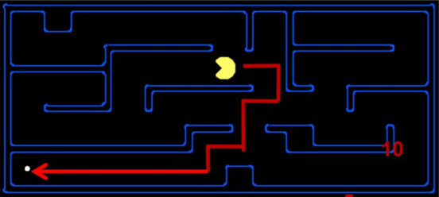

Since the main character can only move in vertical or horizontal lines, we can safely estimate the distance that it has left before reaching its goal state by its Manhattan distance to the goal. 
Note that, in a plane with p1 at (x1, y1) and p2 at (x2, y2),
Manhattan distance is |x1 - x2| + |y1 - y2|.
Clearly, Manhattan distance underestimates the true distance between the source and the goal since the agent’s path is blocked by walls and it has to circumvent these walls by sometimes going further away from the goal.  
Nevertheless, Manhattan distance is not the only function that can be used to estimate the remaining distance. Another example would be Ellucian distance. At this point you might ask which heuristic function should I use. A great question which will be answered shortly!

## Greedy Search 
Now let us discuss how we should put this newly found knowledge to good use. A basic idea would be to run our previous algorithms such as Dijkstra with f(n) = heuristic estimate of state n.
This results in greedy search. For more clarification, pay attention to the figure below.

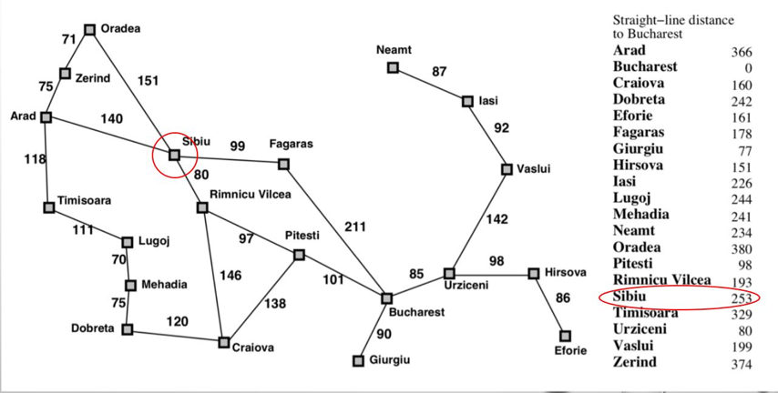

As you might remember, the example of flying from Arad to Bucharest was discussed in the previous chapter. Here we used the straight-line distance to goal, i.e., Ellucian distance, as the heuristic function. We start at Arad. Out of possible nodes to expand at the next step, Sibiu has the least f(n) (= 253), therefore, it is selected for expansion. With the same reasoning, Fagaras, and finally, Bucharest is expanded and a solution has been found. The nice property of this approach is that its search cost is minimal. On the other hand, the presented path is by no means optimal. 

## How it may go wrong 
The following example should clarify the main shortcoming of greedy approach.

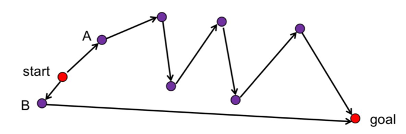

When deciding between A and B, suppose h(A) < h(B). A greedy algorithm would choose A to expand. For every node x in the path between A and goal we have h(x)<h(B). Therefore, B is never expanded. This results in algorithm selecting a suboptimal path.

## Properties of Greedy Search 

* In most cases, greedy best-first search takes you straight to the goal with a suboptimal path. Like the two examples shown above. 
* Incomplete even in finite spaces, similar to DFS.
  In other words, it might get stuck in loops. Consider the example of going from Iasi to Fagaras where the greedy best-first algorithm vacillates between Neamt and Iasi (we assumed tree-search is implemented). With cycle checking, and finite number of states, the algorithm is complete.
* Time complexity is in O(b^m) where m is the maximum depth of the search tree. Keep in mind that this can be significantly reduced by choosing a good heuristic.
* Space complexity is in O(b^m)

## A* Search 

As you might have guessed, some modification to greedy search is required before using heuristic. A solution commonly used is to consider the cost to the node in addition to the cost required to get from the node to the goal. That is to say:
F(n) = g(n) + h(n)
Where g(n) is sum of costs from start to n and h(n) is estimate of lowest cost path from n to goal, and h(goal) = 0. Intuitively, f(n) is the estimated cost of the optimal path going through node n. A* can be viewed as combining the idea of uniform cost search (g(n)), and greedy search (h(n)).
For further clarification of how A* expands nodes, look at the figure below:

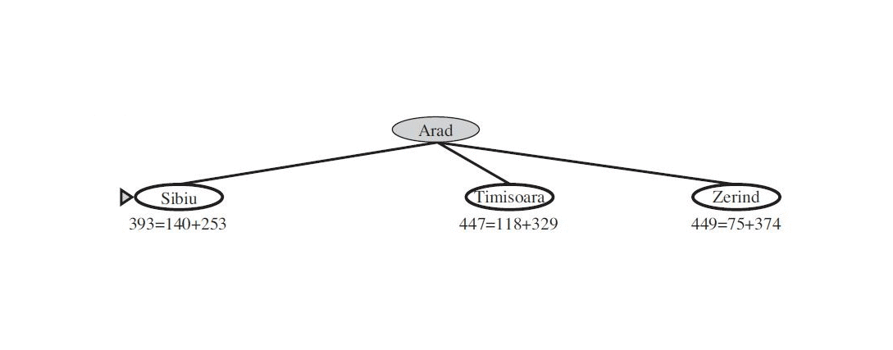

## Optimality of A* 
By optimality, we mean to have an algorithm that finds the optimal solution (a real goal).
### Tree search
   Theorem: If h(n) is **admissible** then A* is optimal in tree search.
### Graph search
   Theorem: If h(n) is **admissible** and **monotonic**, then A* is optimal in graph search.

The first condition that is required for ’s optimality, is to have an admissible heuristic function h(n). we call a heuristic function admissible, if it always underestimates the cost to reach the goal.  Underestimating means that the value returned by h(n) at any point, should be less than the actual cost from the aforementioned point to the goal node. 
For instance, in case of a Maze game as below, if we consider the cross point as current position, the actual cost to the goal equals to d1 + d2 + d3 + d4. However, the value returned by heuristic function should be less than this value, for example d5 is accepted. Such inequality should not be violated at any node; otherwise, h won’t be regarded admissible

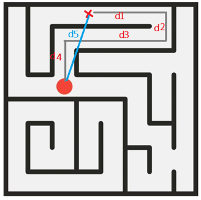

The diagrams below demonstrate the aforementioned point.

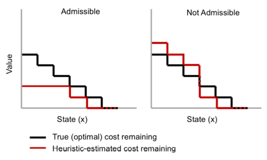

In the left diagram, the heuristic’s estimated cost value always (in all states) remains below the true cost value so h is admissible, however, in the right diagram, h sometimes overestimates the real cost value and violates admissibility condition.
The second important condition on heuristic function is Monotonicity or also called consistency. A heuristic function h(n) is monotonic,  is consistent if, for every node n and every successor  of n generated by any action a, the estimated cost of reaching the goal from n is no greater than the step cost of getting to  plus the estimated cost of reaching the goal from n':
h(n) ≤ c(n, a, n') + h(n') .
If we heed the above formulation, we will be reminded of the general Triangle inequality. The picture below describes this issue:

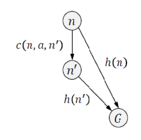

Because h(n) estimates the cost from node n to goal, the above inequality indicates the triangle inequality, the sum of two sides in any triangle, should be more than the third side. Considering admissibility, consistency is a well-understood quality, meaning that if there was a route from n to G via  that was cheaper than h(n), that would violate the property that h(n) is a lower bound on the cost to reach G. 
Monotonicity can be proved using a simple comprehension:

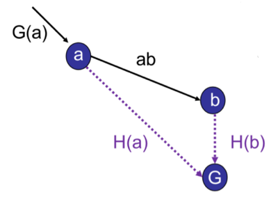

By the theorem and as mentioned before, if a is expanded earlier than b, then f(a) is smaller than f(b) or f is non-decreasing along any path. So, we have.

## Examples 

For the Maze game, Manhattan distance, sum of absolute differences between the coordinates of two point, is a monotonic and admissible heuristic function. 

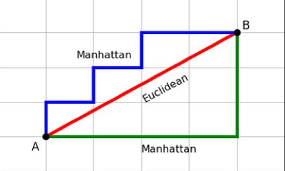

Here is another example. Let’s consider 8-puzzle game (generally n-puzzle); in 8-puzzle, there are 8 tiles that are arbitrarily positioned in the puzzle grid, such as the state below:

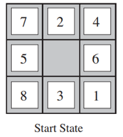

Here each state is considered as any configuration of tiles in the puzzle, action is moving any tile to the empty one (replacing tile with the empty tile), and the goal is to have all tiles in their correct places

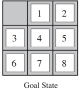

The 8-puzzle was one of the earliest heuristic search problems. The average solution cost for a randomly generated 8-puzzle instance is about 22 steps. The branching factor is about 3. (When the empty tile is in the middle, four moves are possible; when it is in a corner, two; and when it is along an edge, three.)
This means that an exhaustive tree search to depth 22 would look at about  states. It is a burdensome task! If we want to use , we should use an admissible and monotonic heuristic function. Two common candidates are mentioned here:
1. h1= number of misplaced tiles. This is obviously admissible because it just reports how many tiles are not in their correct positions, thus it never overestimates the actual number of operations (nodes to be expanded). In the above example, h1=8, all tiles are misplaced. h1 is also monotonic, since each move reduces the h at most 1 unit

2. h2 = sum of the (Manhattan) distance of every tile to its goal position. h2 is also evidently admissible, because the number of moves required to be done to have each tile in its true position is much more than its distance to the goal. For example, in the configuration above, h2 equals to 3+1+2+2+2+3+3+2 = 18. 

In terms of consistency, any move can increase or decrease h by at most 1 value; and cost is again 1. Thus, the inequality is again satisfied:

The actual cost for the problem above is 26, which is more than the estimated cost of h1 and h2.
3. h3= number of permutation inversions. We can demonstrate that this heuristic function is not admissible. 
So far we have understood the definition of admissibility and monotonicity. It can be shown that monotonicity yields admissibility and we should just check whether or not a heuristic is monotonic.
 But not all monotonic and admissible heuristics are good. Now we want to introduce a very important feature, which is called heuristic dominance.

If h2(n) ≥ h1(n) for all n (both admissible) then h2 dominates h1 and is better for search; because h2 provides us with a more realistic estimation of the actual cost. Proof is simple and straightforward. We know that every node with f(n) <  will surely be expanded, where is the cost of optimal path. This is the same as saying that every node with h(n) <  − g(n) will surely be expanded. But because h2 is at least as big as h1 for all nodes, every node that is surely expanded by  search with h2 will also surely be expanded with h1, and h1 might cause other nodes to be expanded as well. Hence, it is generally better to use a heuristic function with higher values.
Choosing the heuristic function has direct effect on the number of nodes expanded by , so we should select the heuristic that while remaining admissible, dominates other heuristics. For example, the average number of nodes for different depth of solutions in n-puzzle, for h1 and h2 are reported as below:

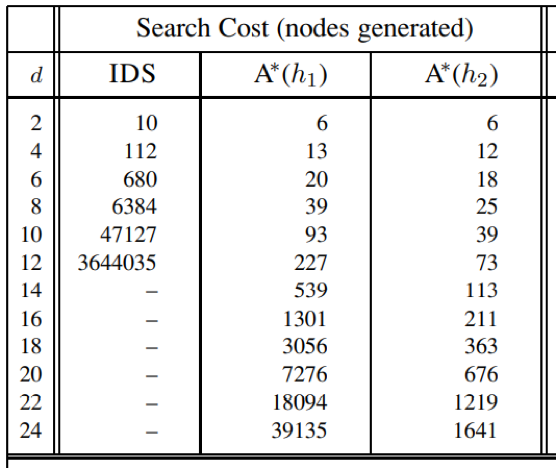

How to generate dominant admissible heuristics? It is pretty easy! Given any admissible heuristics h1 and h2, we may assign h(n) as . h(n) is also admissible because at any node n, h(n) equals either h1(n) or h2(n), which in both cases it is less than . Moreover, based on the feature of max function, at all nodes n, , thus h(n) dominates h1 and h2.

## Obtaining admissible heuristics using relaxed problems 
As one can discern, a constrained minimization problem, can be stated such as below:

By relaxing the problem, we mean to allow the x go beyond the set c1, and lie in a set C2, that is a super set of C1 . Regarding this modification:

If we consider X1 as the optimal heuristic cost (, and X2 as a new heuristic h, then h never overestimates , and is an admissible heuristics. Thus, we should come up with the exact solution of a relaxed version of the problem to generate an admissible heuristic.
For example, in the 8-puzzle problem we may relax the problem in one of these two ways:
1. a tile can move anywhere: Now with this new version of problem, when it comes to minimizing f, number of moves, one can easily realize that each tile can go to its correct position in one move. Consequently, h1= number of misplaced tiles is the optimal solution (and exact solution) of the problem and it can be an admissible heuristic (and of course we know it is)

2. a tile can move to any adjacent square: in the new problem, the exact and optimal solution would be h2 = the Manhattan distance from the current position to the correct position. So, it can be also used as an admissible heuristic function.

Another example: A well-known example in the graph theory is Travelling Salesperson Problem (TSP) which is actually finding the Hamiltonian cycle with minimum cost, is a NP-hard problem. However, we can relax this problem and come up with a heuristic function for that. As we know, a Hamiltonian path, is a specific type of a tree, a tree that is expanded linearly:

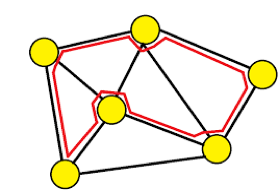

So, if we relax the problem and say that instead of a linearly expanded tree, we would accept any tree, then the problem is relaxed, and we have assuaged the constraints. The new version of TSP problem would be to find a tree with the minimum sum of cost on its edges, it is the famous MST problem which can be solved in polynomial time (by using algorithms such as kruskal or prim) 

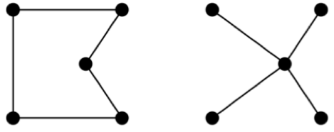

Proof of optimality of  for tree search

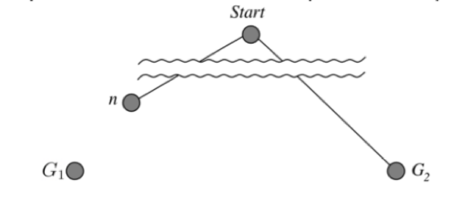

Here we want to prove that  will find the optimal goal using proof by contradiction method. Suppose there is a suboptimal goal G2 that has been generated, and node n be an unexpanded node on the path to the optimal goal G1, that has not been generated by . Here we have:

So, node n can’t be an unexpanded node since we know that  expands n all node with  
In other words, n was a better node than G2 for continuing the search and  mustn't have chosen G2, and proof is finished here.
However, in graph search, monotonicity is also needed. Here we consider an example, in which monotonicity is violated, and  will fail in graph search.

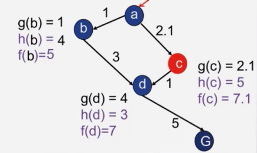

The picture above is the graph state diagram. Started at node a,  chooses node b because its f is less than that  of node c. after expanding node b, there will be node d and c in the fringe:

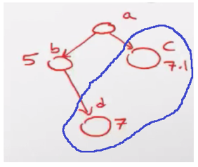

At this moment, selects node d because it has a less f value and d will be expanded. Consequently,  will see node c and G in the fringe and must choose between them.

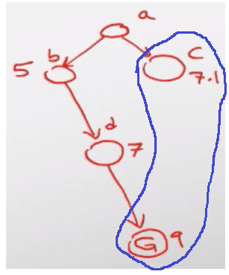

 It selects C because of its lower f value; however, after choosing node c for expansion, it can’t continue the path! Be reminded that in graph search, once a node is expanded, it will be added to the list of visited nodes and won’t be considered again. So, node d has been added to the visited nodes and can’t be chosen after the expansion of c. Subsequently, the only remaining node is G and will be regarded as the goal, and it will purport that has found the optimal path as a – b – d – G. This path is not optimal because a – c – d – G has a cost of 8.1 which is less than 9. Thus,  has failed. 
The reason why  failed is that when the algorithm reached node d, it hadn’t found the optimal path from a to d. a – c – d was a better option, however, it wasn’t chosen because  works based on the evaluation of the values of f(n) at different nodes. Since f wasn’t increasing from c to d,  was forced to mistakenly choose d and eventually it failed. Thus, we can safely conclude that the value of f must be increasing from any node to its children, which is the definition of monotonicity or consistency.

As discussed earlier A* search algorithm has the following features:
*	Tree search version of this algorithm is optimal if h(n) is admissible.
*	Graph search version of this algorithm is optimal if h(n) is consistent.
In order to show the second claim, we need to exploit the following lemmas:
*   If h(n) is monotonic, then the values of f along any path are non-decreasing.
*	Whenever A* selects node n for expansion, the optimal path to that node has been found.
*	Optimal goal, G, has the lowest f(G) among all the goals, when selected for expansion.
*	A* expands all nodes in order of non-decreasing f value.
The proof of the first lemma follows directly from the definition of consistency. If we suppose n’ is a successor of n then: g(n’) = g(n) + c(n,a,n’) and we also have:

The proof of the second lemma:
If we assume the opposite of lemma is true, then there would have to be another frontier node n’ on the optimal path from the start node to n, by the graph separation property of the figure below:

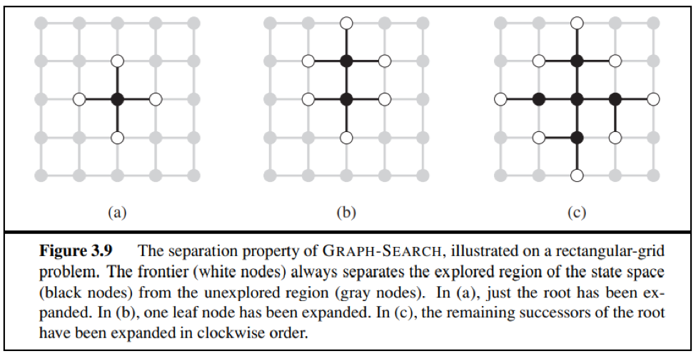

From the two preceding observations, it follows that the sequence of nodes expanded by A∗ using GRAPH-SEARCH is in non-decreasing order of f(n). Hence, the first goal node selected for expansion must be an optimal solution.
To sum up, we demonstrate the properties of A* search algorithm:
**Complete**: Yes, if there is a lower bound on costs  
**Time**: For uniform cost, reversible action: exponential in [relative error in hd]  
**Space**: This algorithm keeps all nodes in memory  
**Optimal**: Yes  
It is worth mentioning that A∗ expands no nodes with f(n) > C*, for example: Timisoara is not expanded in the figure below even though it is a child of the root.

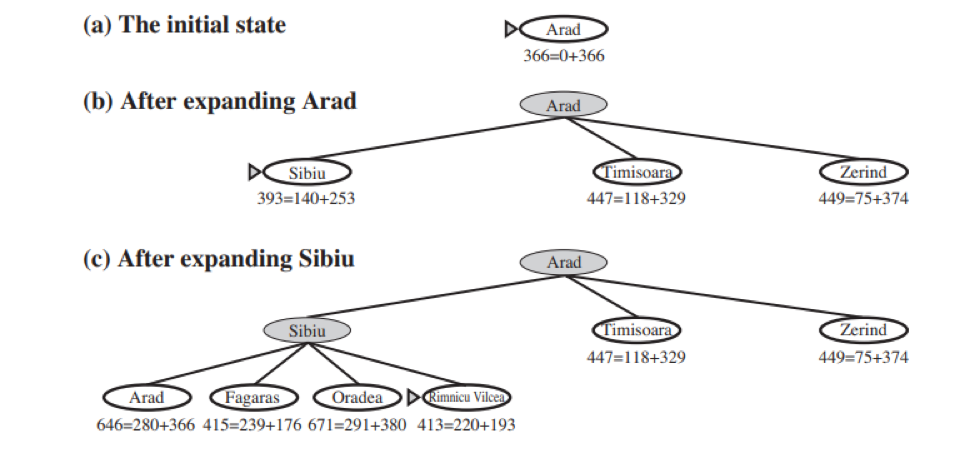

One final observation is that among optimal algorithms of this type A∗ is optimally efficient for any given consistent heuristic. That is, no other optimal algorithm is guaranteed to expand fewer nodes than A∗ (except possibly through tie-breaking among nodes with f(n) = C∗. This is because any algorithm that does not expand all nodes with f(n) < C∗ runs the risk of missing the optimal solution.
The proof of this is as follows:
*	Let f* be the cost of the shortest path to a goal. Consider any algorithm A’ that has the same beginning node as A*, exploits the same heuristic and fails to expand some path p’ expanded by A* for which cost(p’) + h(p’) < f*. Assume that A’ is optimal.

*	Consider a different search problem which is as the same as the original and on which h returns the same estimate for each path, except that p’ has a child path p’’ which is a goal node, and the true cost of the path to p’’ is  f(p’).

*	A’ would behave identically on this new problem
*	Cost of the path to p’’ is lower than the cost of the path found by A’
*	This violates our assumption that A’ is optimal
Therefore among the optimal algorithms of this type A∗ is **optimally efficient** for any given consistent heuristic. 

A* search algorithm maintains priority queue and can get exponentially big. Also it requires us to harness Non artificial intelligence power to define an appropriate heuristic. To address these cons of A* algorithm Iterative-Deepening A* has been introduced.

## Iterative-Deepening A* 
Iterative deepening A* (IDA*) is a graph traversal and path search algorithm that can find the shortest path between a designated start node and any member of a set of goal nodes in a weighted graph. Like A*, IDA* is guaranteed to find the shortest path leading from the given start node to any goal node in the problem graph.
This algorithm is nothing but iterative-deepening but has a slight difference. In iterative deepening search we set a limit on the depth, but in iterative deepening A* we set this limit on cost function or f(n). This algorithm works as follows:
*	At first, it starts with f-limit = h(start)
*	Then it performs depth-first search(instead of using queue, it uses stack)
*	Then it prunes any node if f(node) > f-limit
*	Then the values of f-limit changes to f-limit = min-cost of any node pruned

## Properties of IDA* 
It is complete and optimal (space usage ∝ depth of solution). And in each iteration of this algorithm DFS is performed but with no queue priority. Expanded nodes in this algorithm depends on the number of unique values of heuristic function. For example in TSP(Traveling Salesman) problem each f value is unique : 

Where n = nodes the A* expands. It is obvious that if n is too big for main memory, n2 is too long to wait. To address this issue, we need to either change our heuristic function of A* algorithm steps. But there is another way! Another algorithm called SMA* or Simplified memory bounded A* is developed to circumvent the memory problem. In this algorithm, we define how much memory we have, and therefore how many nodes should be expanded.  SMA* stores all expanded nodes and open the nodes in memory, and if the memory is full it deletes the leaf with highest f value and backs up the value in its parent. You can find an example of this algorithm in the pictures below:

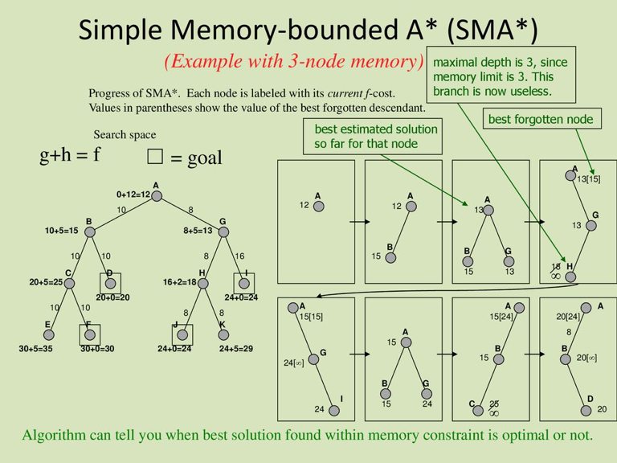

## Conclusion 

In this section we discussed the use of hueristic functions in order to search the space of solutions more intelligently and save time and computation power. Furthermore, properties of the A* algorithm and the conditions that guarantee optimality were explained and proved in addition to examples and IDA*.

## Other Useful Links 

[Difference between Informed and Uninformed Search in AI] (https://www.geeksforgeeks.org/difference-between-informed-and-uninformed-search-in-ai/)  
[Informed Search] (https://www.cs.iusb.edu/~danav/teach/c463/5_informed_search.html)  
[Indian explaination!] (https://www.youtube.com/watch?v=PzEWHH2v3TE&ab_channel=Education4u)  
[Indian explaination 2!] (https://www.youtube.com/watch?v=5F9YzkpnaRw&ab_channel=GateSmashers)

## References 

[1] *Artificial Intelligence A Modern Approach Third Edition*

