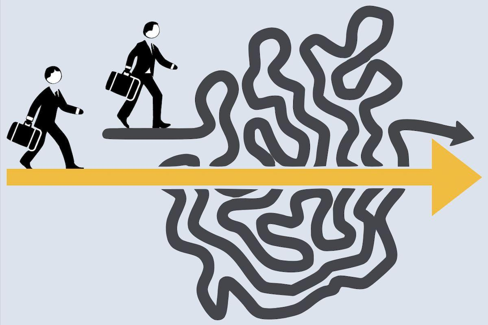
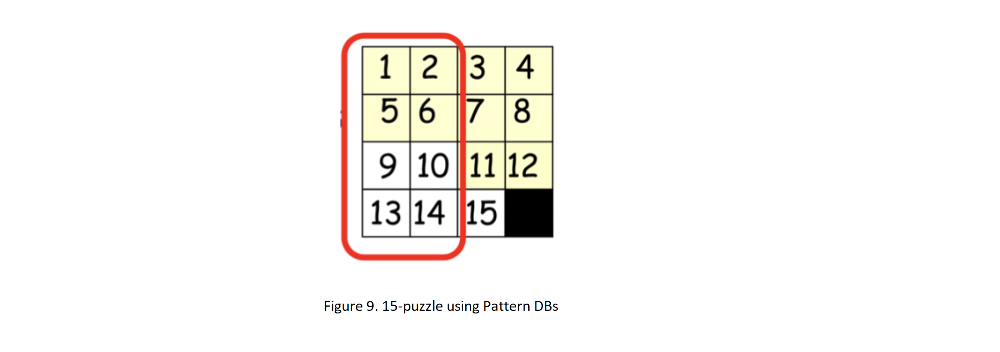

	
		

			
				

                <b>Advanced Heuristics</b>

				

			
			
By Fatemeh Bahrani, Rosta Roghani, Yasaman Shaykhan
            
			

 

	
        
Heuristic Functions
        
         
        

		
            <b>Definition:</b>
        
		

This function takes a state of the environment and estimates the shortest path of the node to the target and returns it. In fact, this function is one of the search criteria for selecting estimates of the cost of the route so that it succeeds in reaching the nearest goal. The better h is, the less mistakes we make and the faster we get the answer. The most common way that transfers problem information to a search operation is called a heuristic function, usually denoted by h (n).    
	

	
In the case of heuristic functions, two features are important; Being <b>monotonic</b> and <b>admissible</b>.
         
&#9679; Being “Admissible” means that the heuristic function underestimates the cost of reaching goal from node.
        
	

	
&#9679; Being “Monotonic” means that f values never decrease from node to descendants. 
	

 
<figure class="half" style="display:flex">
    
    
</figure>

 

	
It should be noted that being monotonic is a sufficient condition for being admissible. (Nonetheless, most admissible heuristics are also consistent.) 
         
        <b>Proof:</b>
        
	

 

	
<b>How to make a heuristic function Monotonic (or Consistent):</b>
       
     
    In case of Tree Search, only the condition of h being admissible is required.
Two conditions are required for the h function in Graph Search: 1. being Admissible and 2. being Monotonic.
  
         <b>&lowast;</b> Finding the optimal h (h&lowast;) is difficult in some cases, and this is an important choice. The closer h is to h&lowast;, the fewer nodes open. If h &le; h*, it will find the optimal answer.If h and h&lowast; are equal, it only opens the path to the optimal answer. But if h &gt; h&lowast; it may not find the optimal answer. 
         
        Counterexample:
         
	

 

 

	
        
Heuristic Dominance
        
         
        

		

It is used to compare the performance of two heuristic functions.
         
        &#9679; If h2  &ge; h1 for all n (both admissable) then h2  dominates  h1  
         h2is better for search
         
        &#9679; Typical earch costs (average number of nodes axpanded) for 8-puzzle problem
         
        &ensp; &nbsp; &nbsp;
        d = 12 :  
        &emsp; &emsp; &emsp; IDS = 3,644,035 nodes  
        &emsp; &emsp; &emsp; A&lowast;(h1) = 227 nodes  
        &emsp; &emsp; &emsp; A&lowast;(h2) = 73 nodes  
        &ensp; &nbsp; &nbsp;
        d = 24 :  
        &emsp; &emsp; &emsp; IDS = too many nodes  
        &emsp; &emsp; &emsp; A&lowast;(h1) = 39,135 nodes  
        &emsp; &emsp; &emsp; A&lowast;(h2) = 1,641 nodes
	

	
<b>heuristic function design constraint relaxation:</b>
         
        There are ways to improve the heuristic function. One of these ways is relaxation. In this method, we look for the answer in a space with fewer terms and conditions; and instead of minimizing the cost, we find the lower bound. As a result, it has become easier to solve.
    
        In general, admissible heuristic functions represent the cost of exact solutions to simplified or relaxed versions of the original problem (Pearl, 1984). For example, in a sliding-tile puzzle, to move a tile from position x to position y, x and y must be adjacent, and position y must be empty. By ignoring the empty constraint, we get a simplified problem where any tile can move to any adjacent position. We can solve any instance of this new problem optimally by moving each tile along a shortest path to its goal position, counting the number of moves made. The cost of such a solution is exactly the Manhattan distance from the initial state to the goal state. Since we removed a constraint on the moves, any solution to the original problem is also a solution to the simplified problem, and the cost of an optimal solution to the simplified problem is a lower bound on the cost of an optimal solution to the original problem. Thus, any heuristic derived in this way is admissible.
         
        <b>More Relaxed Heuristic Functions</b>:
         
&emsp; &minus; Pattern Database Heuristics  
&emsp; &minus; Linear Conflict Heuristics  
&emsp; &minus; Gaschnig’s Heuristics
	

 

 

 

	
        
Pattern Database:
        
         
		

We can consider a subset of the search space and consider others as "don't care". In this case, the interaction between the cells inside this subset is considered and the independence is reduced. The function h can then be obtained by combining "h"s from different subsets (search space separation).

Pattern databases are for exploratory estimation of storing state-to-target distances in state space. Their effectiveness depends on the choice of basic patterns. If it is possible to divide the subsets into separate subsets so that each operator only affects the subsets in one subset, then we can have a more acceptable exploration performance. We used this method to improve performance in 15-puzzles with a coefficient of more than 2000 and to find optimal solutions for 50 random samples of 24-puzzles.
        
        
 How do we combine the “h” s of the separated subset of state space?

&emsp; &minus; MAX: Which has diminishing.  
&emsp; &minus; ADD: In this case, the limitation is removed and it is admissible.  
Using a Pattern Database helps us solve many problems, but it is flawed in very large cases and is not scalable.
          
        
            Drawbacks of Pattern DBs:
        
         
            &#9679; Since we can only take max  
&emsp; &#9679; Diminishing returns on additional DBs  
&emsp; &#9679; Consider bigger problem instances.  
&emsp; &emsp; &emsp; &#9679; Subproblems should be small to be scalable.  
&emsp; &emsp; &emsp; &#9679; If hi(n) from each database is at most x, then maxi hi would be at most x.  
        &#9679; Would like to be able to add values 
	

 

 

	
        
Disjoint of Pattern DBs:
        
         
		

What if we make patterns be disjoint sets? Can we take summation of heuristics by pattern DBs as an admissible heuristic? In order to fix this, take number of moves made to the specified tiles as hi instead.
        
        
Why does summation result in an admissible heuristic in that case?
         
        <b> Proof: </b>
         

Manhattan dist. is a trivial example of a disjoint DBs, where each group contains only a single tile. 
As a general rule, when partitioning the tiles, we want to group together tiles that are near each other in the goal state, since these tiles will interact the most with one another. 

Using this method, the 15-puzzle problem is solved 2000 times and the 24-puzzle problem is 12 million times faster
	

 

	
		
Resources
        
		
       
        <ul>
            <li>
           www.cs.stackexchange.com/questions/63481/how-does-consistency-imply-that-a-heuristic-is-also-admissible
            </li>
            <li>
            www.courses.cs.washington.edu/courses/cse473/12sp/slides/04-heuristics.pdf           
            </li>
            <li>
            www.sciencedirect.com/science/article/pii/S0004370201000923
            </li>
            <li>
            www.researchgate.net/publication/222830183_Disjoint_pattern_database_heuristics
            </li>
              <li>
            www.aaai.org/Papers/JAIR/Vol22/JAIR-2209.pdf
            </li>
             <li>
            www.link.springer.com/chapter/10.1007/978-3-540-74128-2_3
            </li>
                        <li>
               www.stackoverflow.com/questions/46554459/intuitively-understanding-why-consistency-is-required-for-optimality-in-a-searc
            </li>
        </ul>
	

