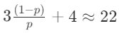
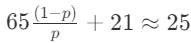
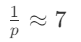
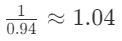

# Local Search

## Contents

- [Introduction](#introduction)
	 - [What is Local Search?](#WhatIsLocalSearch)
	 - [Advantages](#Advantages)
- [Methods](#methods) 
	-  [Hill Climbing](#hillClimbing)  
	-  [Tabu Search](#tabuSearch)  
	-  [Local Beam Search](#localBeamSearch) 
    -  [Simulated Annealing](#SimulatedAnnealing) 
	-  [Genetic Algorithms](#geneticAlgorithms)
	-  [Large Neighborhood Search](#largeN) 
- [Summary](#summary)
- [References](#references)

## 1. Introduction <a name="introduction"></a>

### 1.1. What is Local Search? <a name="WhatIsLocalSearch"></a>

Local Search is a heuristic method for solving computationally hard constraint satisfaction or optimization problems. The family of local search methods is typically used in search problems where the search space is either very huge or infinite. In such Problems, classical search algorithms do not work efficiently. 

Usually, local search is used for problems that have a state as its solution, and for many problems the path to the final solution is irrelevant. The procedure of this method is quite simple, at first the algorithm starts from a solution that may not be optimal, or may not satisfy all the constraints, and by every step or iteration, the algorithm tries to find a slightly better solution. This gradual improvement of the solution is done by examining different neighbors of the current state and choosing the best neighbor as the next state of the search. 

An example of the application of local search is solving the travelling salesman problem. In each step, we may try to replace two edges with two other edges which may result in a shorter cycle in the graph.

<p align="center">
  
</p>


### 1.2. Advantages <a name="Advantages"></a>

Local search has a memory complexity of O(1) which is very efficient. This is the case because only the current state of the program is saved in memory. The time complexity of local search is O(T) which T is the number of iterations. 

<!--stackedit_data:
eyJoaXN0b3J5IjpbMzIzNDYwNDMxLDczMDk5ODExNl19
-->
## 2. Methods <a name="methods"></a>

### 2.1. Hill Climbing <a name="hillClimbing"></a>
Imagine you want to climb a mountain and you need to find a path that leads to the peak. And ofcourse you want to do this as fast as possible. What would you do if you were in this situation?
The first inituitive idea that comes to mind is roughly simple, in each step try to go as high as possible, done. This is what '*Hill Climbing*' algorithm do. This iterative algorithm starts with a random state and in each iteartion tries to do the best, which means chossing a neighbor that has the highset value among all other neighbors. This algorithm continues till we reach a local maximum.

```
function Hill-Climbing(problem) returns a state
    current <- make_node(problem.initial-state)
    while (True):
        neighbor <- highest-valued successor of current
        if neighbor.value <= current.value:
            return current
        current <- neighbor
```
<p align="center">
  
</p>

###### Example 2.1.1 (8-queens Problem)
This is one of the problmes which can be formulated as a *'local search'* problem. Our goal is to place 8 queen on a chess board in a way that no queen attacks the others. Each state is a placing of queens on board and the value of each state is 'the number of attacking queens'. This problem is a minimization version of local search and our goal is to find a state that has the least cost(value). The successor of each state comes from moving just one queen in her column.

Using *'hill climbing'* to solve this problem leads to following results:

- (Probability of sucesse for a random initial state) p = 0.14
- Average number of moves to terminate per trial:
	- 4 when succeeding
	- 3 when getting stuck
- Expected total number of moves for an instance:
	-  moves needs

<p align="center"></p>

#### 2.1.1 Hill Climbing Pros and Cons
This greedy algorithm is simple enough to implement, it just consists of a loop and a search to find best neighbor. Also it doesn't require any special data structure cause in each state we just need current state and its neighbores. But this simplisity comes with costs. Unfortunately *'hill climbing'* will not work well in the following situations:

- **Local Maxima**: First of all, by using this algorithm we might stuck in local maxima! A local maxima is an state which has higher value than all of its neighbors. If algorithm starts from near this states, it will stuck in this points and will not find global maxima. so this version of 'hill climbing' is *incomplete*.(Below Figure)
- **Ridges**: Ridges are situations that there exist some local maxima but they are not connected directly to each other and its hard for algorithm to choise where to go when reachs this points. (Below Figure)
- **Plateaus**: This is a situation that there exist a flat area or flat maxima in space. In case of flat maxima again we stuck in local maxima, and in case of flat area (shoulders) algorithm will terminate cause current value is equal to or greather than all other its neighbors, but it hasn't find any maximal point.

<p align=center></p>

To solve above problme of *'hill climbing'*, different versions of this algorithm have been developed. In the next section we are going to briefly talk about this versions.
#### 2.1.2 Versions of Hill Climbing
##### 2.1.2.1 Using Sideway Moves
This version has been invented to solve *'Plateaus'* problem. The only different is that in this version, algorithm is allowed to move along plateaus in hope to get out of shuolders. But if we use sideway moves without any consideration, it might get stuck in a flat maxima cause it will go back and forth between this region states. To solve this problem we add a limitation on the number of consecutive sideway moves to prevent algorithm from getting stuck in infinite loops.

###### Example 2.1.2 (8-queens)
If we run 'hill climbing with sideway moves' on 8-queens problem, the results get much better but it comes with a cost. The number of moves for algorithm increase.

- (Probability of success) p = 0.94
- Average number of moves to terminate per trial:
	- 21 when succeeding
	- 65 when getting stuck
- Expected total number of moves for an instance:
	-  moves needs

##### 2.1.2.2 Stochastic hill climbing
This version has been developed to solve *'incompletness*' of hill climbing, but does not completely solve this problem. It only helps to have chance to escape from local maximas. The different of this version and original *'hill climbing*', comes from 'choosing neighbors' step. This algorithm doesn't always choose the best neighbor, however with probability p does so, and with probability 1-p choose a random neighbor. This stochastic neighbor selection helps algorithm to be able to escape from getting stuck in local maximals. But as said before, this approach doesn't completely solve *'incompleteness'* problem of *'hill climbing'*

##### 2.1.2.3 Random-restart hill climbing
This version has been developed to solve *'local maxima'* problem. In this version we don't change the core of 'hill climbing', but we just run the original algorithm many times till we find the optimal goal. This version of *'hill climbing'* is complete with probability approaching 1, cause it will eventually generate a goal state as the initial state. If each run of *'hill climbing'* success with probabilty p,  then the expected number of restarts we need will be 1/p.

###### Example 2.1.3 (8-queens)
Running 8-queens problem with this algorithm results as follow:
- Without sideway moves: (p = 0.14)
	- Expected number of iterations: 
- With sideway moves: (p = 0.94)
	- Expected number of iterations: 

### 2.2 Tabu Search <a name="tabuSearch"></a>
This algorithm is similar to *'hill climbing'* but uses a trick to prevent from stucking in local maxima. This is actualy a meta-heuristic algorithm that means it helps to guide and control actual heuristic. But how this strategy helps us to find global optimal?

First of all, it has a list called 'tabu list' which has some states. Like hill climbing, from each state we are going to find its neighbors and choose one of them. But here we are not allowed to choose those states that are in tabu list, they are taboo. Also we don't stop if the best neighbor is not as good as current state, if it was so, we update best solution and move to that state and if it wasn't, we just move to the new state. The termination creteria can be a limitation on number of iterations. Below you can find a flowchart of this algorithm steps. 

<p align="center"></p>

Here we suppose to have a strategy to determine which states should be added to tabu list and which should take out of this list.

### 2.3 Local Beam Search <a name="localBeamSearch"></a>
Imagine you are living on Kepler-442b (which is an Earth-like exoplanet) and you've found a wide plain that consists of treasure. But you don't know where the treasure is, and you just know how probable is a cell of this field to have treasure beneath it. What strategy do you adopt to find the most probable cell to have treasure?

<p align="center"></p>

Ofcourse using *'hill climbing'* will be one of the answers but it might find local maxiam while you want to find global maxima. What about calling your friends and searching the field together? (and may or may not divide treasure with them)

This will be a good strategy to search the field together (you and k-1 of your friends), in a way that each of you broadcasts the list of neighbors of his current cell to others, and you all have a shared list which consists of all neighbors all of you currently see. Then choose the best k neighbors and each of you visit one of these neighbors and again broadcast new neighbors and ... . Continue this approach till the best of k neighbors you choose is less than or equal probable to the best of your current cells.

The strategy you adopt to find treasure is called *'Beam Search'*. The different of this algorithm and k run of parallel *'hill climbing'* is clear. In this algorithm you might continue searching by one of your friends neighbor cell but, in parallel *'hill climbing'* you just follow your path and starts from different part of the field.

```
function Local-Beam-Search(problem) return state
	current[k] <- k-initial state
	while True:
		neighbors[k] <- k-best neighbors of all state in current[k]
		if best_of(neighbor[k]) <= best_of(current[k]):
			return best_of(current[k])
		current[k] <- neighbors[k]
```

### 2.4 Simulated Annealing <a name="SimulatedAnnealing"></a>

The Simulated Annealing (SA) algorithm is based upon Physical Annealing in real life. Physical Annealing is the process of heating up a material until it reaches an annealing temperature and then it will be cooled down slowly in order to change the material to a desired structure. When the material is hot, the molecular structure is weaker and is more susceptible to change. When the material cools down, the molecular structure is harder and is less susceptible to change.
        
Simulated Annealing (SA) mimics the Physical Annealing process but is used for optimizing parameters in a model. This process is very useful for situations where there are a lot of local minima algorithms would be stuck at.

<p align="center">
  
</p>
    
In problems like the one above, if a local minima algorithm like Gradient Descent started at the starting point indicated, it would be stuck at the local minima and not be able to reach the global minima.

#### 2.4.1 Algorithm

0. Preparation
    * Temperature reduction function 
1. Start with an initial solution s = S₀. This can be any solution that fits the criteria for an acceptable solution. We also start with an initial temperature T = t₀.
2. Select a neighbour randomly among neighbourhood of the current solution. The neighbourhood of a solution are all solutions that are close to the solution. For example, the neighbourhood of a set of 5 parameters might be if we were to change one of the five parameters but kept the remaining four the same.
3. Decide whether to move to the neighbour found in step 2. Mostly by calculating the difference in cost between the current solution and the new neighbour solution. if the difference in cost between the current and new solution is greater than 0 (the new solution is better), then accept the new solution. If the difference in cost is less than 0 (the old solution is better), then accept it by the probabilty function respected to the difference and T.
4. Decrease the temperature according to temperature reduction function.
5. Repeat steps 2, 3, 4 until the termination conditions are reached.

<p align="center">
  
</p>

##### Psudocode

```
    Simulated_Annealing(problem, schedule) returns a solution state
    
        current = make_node(problem.initial_state)
        for t = 1 to +INF:
            T = schedule(t)
            if T=0 then return current
            next = a randomly selected successor of current
            delta = next.value - current.value
            if delta > 0 then current = next
            else current = next only with probability of e^(delta/T)
```

#### 2.4.2 Temperature reduction function
    
temperature reduction function determines how to reduce the temerature in each iteration. there are usually 3 main types of temperature reduction rules: (there are some arbitrary constants in most of temperature reduction functions which should be tuned)
    
- Linear Reduction Rule: t = t - alpha
- Geometric Reduction Rule: t = t * alpha
- Slow-Decrease Rule: t = t/(1 + beta * t)

The mapping of time to temperature and how fast the temperature decreases is called the Annealing Schedule.
    
#### 2.4.3 Probabilty function

Probabilty function determines chance of going to new neighbour. The equation has been altered to the following:

<p align="center">
  
</p>
 
Where the delta c is the change in cost and the t is the current temperature.

#### 2.4.4 High vs. Low temperature

Due to the way the probability is calculated, when the temperature is higher, is it more likely that the algorithm accepts a worse solution. This promotes Exploration of the search space and allows the algorithm to more likely travel down a sub-optimal path to potentially find a global maximum.

<p align="center">
  
</p>
    
When the temperature is lower, the algorithm is less likely or will not to accept a worse solution. This promotes Exploitation which means that once the algorithm is in the right search space, there is no need to search other sections of the search space and should instead try to converge and find the global maximum.

<p align="center">
  
</p>
    
So at first, the high temprature causes more bad moves and the acceptation probability drops slowly(low slope). and as the temperature decreases, the bad moves' probability converges to zero so fast(high slope).

In this exmaple, SA is searching for a maximum. By cooling the temperature slowly, the global maximum is found.

<p align="center">
  
</p>

#### 2.4.5 Simulated Annealing in practice

- Defining the schedulability
There is only one theorem about this.

- **Theorem:** If T is decreased sufficiently slow, global optima will be found approximately with probability of 1.

- Convergence can be guaranteed if at each step, T drops no more quickly than C/logn, where C is a constant and problem dependent and n is the number of steps so far. In practice different Cs are used to find the best choice for problem.

#### 2.4.6 Pros and Cons

- **Positive points:**
    - Easy to implement and use
    - Provides optimal solutions to a wide range of problems
    
    
- **Negative points:**
    - Can take a long time to run if the annealing schedule is very long
    - There are a lot of "tuneable" parameters in this algorithm

#### 2.4.7 Applications:
    
- [Traveling salesman](https://en.wikipedia.org/wiki/Travelling_salesman_problem)
- [Graph partitioning](https://en.wikipedia.org/wiki/Graph_partition)
- [Graph coloring](https://en.wikipedia.org/wiki/Graph_coloring)
- [Scheduling](https://en.wikipedia.org/wiki/Scheduling_(computing))
- [Facility layout](https://www.managementstudyguide.com/facility-layout.htm)
- [Image processing](https://en.wikipedia.org/wiki/Digital_image_processing)
- ...

### 2.5 Genetic algorithms <a name="geneticAlgorithms"></a>

Genetic algorithms is a group of algorithms which are search heuristic that are inspired by Charles Darwin’s theory of natural evolution. These algorithms reflect the process of natural selection where the fittest individuals are selected for reproduction in order to produce offspring of the next generation.

<p align="center">
  
</p>

In a genetic algorithm, a population of candidate solutions (called individuals, creatures, or phenotypes) to an optimization problem is evolved toward better solutions. Each candidate solution has a set of properties (its chromosomes or genotype) which can be mutated and altered; traditionally, solutions are represented in binary as strings of 0s and 1s, but other encodings are also possible.

The evolution usually starts from a population of randomly generated individuals, and is an iterative process, with the population in each iteration called a generation. In each generation, the fitness of every individual in the population is evaluated; the fitness is usually the value of the objective function in the optimization problem being solved. The more fit individuals are stochastically selected from the current population, and each individual's genome is modified (recombined and possibly randomly mutated) to form a new generation. The new generation of candidate solutions is then used in the next iteration of the algorithm. Commonly, the algorithm terminates when either a maximum number of generations has been produced, or a satisfactory fitness level has been reached for the population.

#### 2.5.1 Algorithm
    
0. Preparation
    - Genetic representation
    - Fitness function
1. Initial population
2. Selection
3. Genetic operators
    - Crossover
    - Mutation
4. Repeat 2 and 3 until Termination
    
#### Psudocode

    Genetic-Algorithm(population, Fitness-Fn) returns individual
    
        repeat
            new_population = empty_set
            for i = 1 to Size(population) do
                x = Random_Selection(population, Fitness_Fn)
                y = Random_Selection(population, Fitness_Fn)
                child = Reproduce(x, y)
                if(small random probabilty) then child = Mutate(child)
                add child to new_population
            population = new_population
        until some individual is fit enough, or enough time has elapsed
        return the best individual in population, according to Fitness_Fn
    
    Reproduce(x, y) returns an individual
    
        n = length(x); c = random between 1 to n
        return append(substring(x,1,c),substring(y, c+1, n))

##### 2.5.1.1 Preparation

###### Genetic representation
In the genetic algorithms, An individual is characterized by a set of parameters (variables) known as Genes. Genes are joined into a string to form a Chromosome (solution). The genetic representation is the way that the individuals are modeled to be used in the algorithm. The most standard one which is used in the genetic algorithms is an array of bits. other representations can be true in some questions but the crossover or mutation will be more complex than array of bits.

<p align="center">
  
</p>
        
###### Fitness function
The fitness function determines how fit an individual is (the ability of an individual to compete with other individuals). It gives a fitness score to each individual. The probability that an individual will be selected for reproduction is based on its fitness score.


##### 2.5.1.2 Initial population

The process begins with a set of individuals which is called a Population. The population size depends on the nature of the problem and often the initial population is generated randomly, allowing the entire range of possible solutions (the search space).

##### 2.5.1.3 Selection

The idea of selection phase is to select the fittest individuals and let them pass their genes to the next generation. Two pairs of individuals (parents) are selected based on their fitness scores. Individuals with high fitness have more chance to be selected for reproduction.
Note that there exist both asexual and sexual reproduction which in asexual reproduction, the parents are not limited but in sexual reproduction, a child has a mother and a father so a woman can not be a child's father. thus the genetic operators of sexual reproduction is different. And also there are more selection methods which for more information you can follow link below:
    
- [Roulette Wheel Selection](https://en.wikipedia.org/wiki/Fitness_proportionate_selection)
- [Scaling Selection](https://link.springer.com/referenceworkentry/10.1007%2F978-0-387-31439-6_242)
- [Tournament Selection](https://en.wikipedia.org/wiki/Tournament_selection)
- [Rank Selection](https://en.wikipedia.org/wiki/Selection_(genetic_algorithm))
- [Hierarchical Selection](https://link.springer.com/article/10.1007/BF00130162)


##### 2.5.1.4 Genetic operators

- ***Crossover***    
Crossover is the most significant phase in a genetic algorithm. For each pair of parents to be mated, a number of crossover points are chosen at random from within the genes. Offspring are created by exchanging the genes of parents among themselves until the crossover points are reached. The new offspring are added to the population and replace their parents.(population size must be fixed)

<p align="center">
  
</p>

<p align="center">
  
</p>

<p align="center">
  
</p>
   
- ***Mutation***
In certain new offspring formed, some of their genes can be subjected to a mutation with a low random probability. This implies that some of the bits in the bit string can be flipped. Mutation occurs to maintain diversity within the population and prevent premature convergence.
        
<p align="center">
  
</p>

##### 2.5.1.5 Termination
    
This generational process is repeated until the population converge or termination condition has been reached.

##### Example 2.5.1: 8-Queens
Put 8 queens in 8 * 8 board which queens cannot attack eachother. 

<p align="center">
  
</p>
    
##### Preparations
- **Genetic representation**: 8 byte array is used which indices of array show the columns and the values in the array show the rows(1 <= values <= 8) which queens exist. for example, array[i] = j means that a queen exists in (j, i) of the chess board. ([2, 4, 7, 4, 8, 5, 5, 2] for above figure)
- **Fitness function**: Number of non-attacking pairs of queens. (24 for above figure)
    

##### Initial population
randomly POPULATION_SIZE individuals are created.
        

##### Selection
Each individuals have the probabilty according to their fitness((fitness of x) / total fitness of population). Then the parents are selected (number of popualtion should be fixed).
    

    
##### Crossover
New offspring are generated by selecting some genes from one parent and the rest from another.
 
<p align="center">
  
</p>

 ##### Mutation
 With the propabilty of P, some genes of new children change.

<p align="center">
  
</p>

In the picture below overview of the solution has shown:

<p align="center">
  
</p>

#### 2.5.2 Pros and Cons
    
- **Positive Points:**
    - Random exploration can find solutions that local search can't (via crossover primarily)
    - Appealing connection to human evaluation ("neural" networks, and "genetic" algorithms are metaphors!)
    
    
- **Negative Points:**
    - Large number of "tunable" parameters
    - Lack of good empirical studies comparing to simpler methods
    - Useful on some (small?) set of problems but no convincing evidence that GAs are better than hill-climbing with random restarts in general

#### 2.5.3 Applications
    
It has wide variety of applications in:
- [Automotive Design](https://en.wikipedia.org/wiki/Automotive_design) ([Relation to simulated annealing](https://www.researchgate.net/publication/221182599_Application_of_Genetic_Algorithms_for_the_Design_of_Large-Scale_Reverse_Logistic_Networks_in_Europe's_Automotive_Industry))
- [Finance and Investment Strategies](https://en.wikipedia.org/wiki/Investment_strategy) ([Relation to simulated annealing](https://www.wiley.com/en-us/Genetic+Algorithms+and+Investment+Strategies-p-9780471576792))
- Encryption and Code Breaking ([Relation to simulated annealing](https://citeseerx.ist.psu.edu/viewdoc/download?doi=10.1.1.324.5081&rep=rep1&type=pdf))


### 2.6 Large Neighbourhood Search <a name="largeN"></a>

Large Neighbourhood Search (LNS) is an iterative local search method for solving optimization problems using Contraint Programming(CP). The algorithm is as follows:

- Start from initial solution S (obtained by CP search)
- At each iteration of LNS:
    - Randomly freeze some variables to take their value as in the current S.
    - Perform CP search on the non-frozen variables in order to find a better solution, replacing S if found.
    - Repeat from step 2 until a good enough solution is found.

Since LNS requires an initial solution to start from, LNS cannot be directly applied to satisfaction problems, as the initial solution would be final solution. Therefore we have to soften some constraints in order to use LNS for satisfaction problems, so that an initial soft solution can be found and then improved gradually into an actual solution via LNS.

#### 2.6.1 Softening constraints by penalties

A generic way of softening is to replace some constraints by penalty functions, and try to minimize the total penalty. for example:

- Hard constraint: x + y = z
- Penalty: p = |x + y - z|

##### Example 2.6.1: Sum Of Subsets Problem

Given a set of positive integers a1, a2,…., an upto n integers. Is there a non-empty subset such that the sum of the subset is given as M integer? For example, the set is given as [5, 2, 1, 3, 9], and the sum of the subset is 9; the answer is YES as the sum of the subset [5, 3, 1] is equal to 9.
    

Imagine the set is {10, 7, 5, 18, 12, 20, 15} and the sum is 30.

##### Formulate the problem
    
   - **Constraints**:
        - x1 * a1 + x2 * a2 + .... + xn * an = M
        - for each i, xi = {0, 1}
        
   - **Softening constraints by penalties**:
   
        - p = | x1 * a1 + x2 * a2 + .... + xn * an - M |    =>     p = | x1 * 10 + x2 * 7 + x3 * 5 + x4 * 18 + x5 * 12 + x6 * 20 + x7 * 15 - 30|
        
        - for each i, xi = {0, 1}

##### Find an initial solution using softened constraints:

- Because in our search there is no constraints to cause backtrack, the answer "for each i, xi = 1", is chosen.
- the penalty is 57

##### Freeze some variables randomly and repeat the constraint search to find lower(better) penalty than current penalty. when it is found, break and go to the next iteration.

- Freeze {x1, x2, x3, x5, x7}
- Constraint search for non-frozen variables ({x4, x6})

<p align="center">
  
</p>

So as you see, the lower penalty is found, so we update {x1, x2, x3, x4, x5, x6, x7} and p. Then go to the next iteration.

We continue the second step until we reach a good enough penalty and the return the answer.

#### 2.6.2 Pros and Cons:

- **Positive points:**
    - As shown in figure below for a problem like [car sequencing](https://perso.ensta-paris.fr/~diam/ro/online/cplex/cplex1271/OPL_Studio/opllanguser/topics/opl_languser_app_areas_CP_carpb.html), LNS can solve more instances in compare to hard constraint attitude.
    - LNS can be quickly put together from existing components. an existing construction heuristic or exact method can be turned into a repair heuristic and a destroy method based on random selection is easy to implement. Therefore we see a potential for using simple LNS for benchmark purposes when developing more sophisticated methods.
    
    
- **Negative points:**
    - As shown in figure below, LNS takes longer runtime than hard constraint attitude.
    - It seems that the initial solution found by LNS is very insufficent and moreover maybe the choices for better neighbourhoods are not well enough. It can be better if we combine some atrributes of backtrack and LNS in each step to reach the better condition. There is a version called Non-failing LNS which has done this and you can look for more details in this [link](https://www.youtube.com/watch?v=VKUxuBaBAkc).
    
<p align="center">
  
</p>

#### 2.6.3 Applications
    
- [Routing problems](https://en.wikipedia.org/wiki/Vehicle_routing_problem) ([Relation to LNS](https://link.springer.com/chapter/10.1007/3-540-49481-2_30))
- [Scheduling problems](https://www.quinyx.com/blog/scheduling-problems) ([Relation to LNS](http://kth.diva-portal.org/smash/record.jsf?pid=diva2%3A1530574&dswid=9745))

## 3. Summary <a name="summary"></a>
As mentioned before, local search methods can be used widely in search problems with very big search spaces. In such spaces, classic search algorithms cannot work efficiently due to their exponential usage of either memory or time. In contrast, local search methods have a very low memory usage of O(1) which is because of the irrelevance of the path to the current solution, and also the time complexity of these methods is O(T) which T is the number of iterations. 

Many local search algorithms have been introduced above, and many have been proved to be very efficient for optimization problems, Hill climbing for instance was a method to solve such problems. An important challenge for these optimization algorithms was the possibility of getting stuck in a local optimum, other methods like Simulated Annealing was proposed to face this challenge and have been shown to be effective.

## 4. References <a name="references"></a>

- https://towardsdatascience.com/optimization-techniques-simulated-annealing-d6a4785a1de7

- https://www.geeksforgeeks.org/genetic-algorithms/

- https://github.com/chengxi600/RLStuff/blob/master/Genetic%20Algorithms/8Queens_GA.ipynb

- https://en.wikipedia.org/wiki/Genetic_algorithm#Optimization_problems

- https://www.youtube.com/watch?v=VKUxuBaBAkc

- AI course at Sharif University of Technology (Fall 1400)
