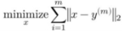
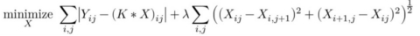
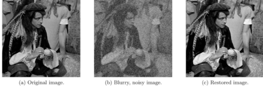

# ** Search in Continuous Space
# **Table of Contents**
- [Introduction](#introduction)
- [Types of optimization techniques](#types-of-optimization-techniques)
  * [Linear programming (LP) and nonlinear programming (NLP)](#linear-programming--lp--and-nonlinear-programming--nlp-)
  * [Continuous optimization and integer programming (IP)](#continuous-optimization-and-integer-programming--ip-)
  * [Constrained optimization and unconstrained optimization](#constrained-optimization-and-unconstrained-optimization)
  * [Differentiable optimization and non-differentiable optimization](#differentiable-optimization-and-non-differentiable-optimization)
    + [Cost functions](#cost-functions)
- [Convexity](#convexity)
  * [Convex versus non-convex optimization problems](#convex-versus-non-convex-optimization-problems)
  * [Local and global optimization](#local-and-global-optimization)
    + [Local optimization](#local-optimization)
    + [Global optimization](#global-optimization)
  * [Locally optimal for a convex optimization problem](#locally-optimal-for-a-convex-optimization-problem)
  * [Hessian being positive semi-definite iff convexity (theorem one: one dimensional)](#hessian-being-positive-semi-definite-iff-convexity--theorem-one--one-dimensional-)
  * [Hessian being positive semi-definite iff convexity (theorem two: multi-dimensional)](#hessian-being-positive-semi-definite-iff-convexity--theorem-two--multi-dimensional-)
  * [Examples of convex functions](#examples-of-convex-functions)
- [Gradient](#gradient)
  * [Gradient descent](#gradient-descent)
  * [Challenges with gradient descent](#challenges-with-gradient-descent)
    + [Local minima and saddle points](#local-minima-and-saddle-points)
    + [Vanishing and exploding gradients](#vanishing-and-exploding-gradients)
- [Conclusion](#conclusion)
- [References](#references)

#
#

# **Introduction**
In real life optimization problems, we mostly face continuous environments which are made of continuous variables such as time and location. Thus, in this lecture note we will discuss some useful search methods in continuous spaces. The typical problems are linear programming (LP) and diverse kinds of nonlinear programming (such as convex programming, quadratic programming or semidefinite programming). In this lecture note we will discuss different types of optimization techniques in continuous spaces, the differences between different types of optimization techniques, how convexity will help us solve optimization problems easier, difference between local and global optimization, gradient descent method and the challenges with finding the best learning rate.

**Example.1** (Weber Point) Given a collection of cities (assume on 2D plane) how can we find the location that minimizes the sum of distances to all cities? We model this problem by denoting the locations of the cities as y(1), …,y(m)  and write the optimization problem as:

**Example.2** (Image deblurring and denoising) Given corrupted imageY∈Rm×n, reconstruct the image by solving the optimization:

where K \* denotes convolution with a blurring filter.

*Figure1. reconstructed image after solving the optimization*

# **Types of optimization techniques**
An essential step to optimization technique is to categorize the optimization model since the algorithms used for solving optimization problems are customized as per the nature of the problem. Various optimization problem types are: 
## Linear programming (LP) and Nonlinear programming (NLP)
Linear programming is a method to achieve the best outcome in a mathematical model whose requirements are represented by linear relationships whereas nonlinear programming is a process of solving an optimization problem where the constraints or the objective functions are nonlinear. Thus, this is the main difference between linear and nonlinear programming.
## **Continuous optimization and integer programming (IP)**
In order to conceptualize the difference, linear programming can solve problems about minimizing (or maximizing) an objective function by continuous variables. For instance, maybe the optimal solution for a problem to be x1=5,46 and x2=2,65. But in integer programming we can only use integers as variables and we can’t have fractional numbers.
## Constrained optimization and unconstrained optimization 
A constrained optimization problem is the problem of optimizing an objective function subject to constraints on the variables. In general terms,

Where f* and the functions ci(x) are all smooth, real-valued functions on a subset of Rn and ε and τ are index sets for equality and inequality constraints, respectively. The feasible set is the set of points x that satisfy the constraints.

We denote the set of points for which all the constraints are satisfied as C, and say that any x ∈ C (resp. x ∈/ C) is feasible (resp. infeasible)

In unconstrained optimization problems the answers are constrained into being subject of set C as the picture bellow shows: 

*Figure2. constrained vs unconstrained optimization*

##
## **Differentiable optimization and non-differentiable optimization**
Non-differentiable optimization is a category of optimization that deals with objective that for a variety of reasons is non-differentiable and thus non-convex. The functions in this class of optimization are generally non-smooth. These functions although continuous often contain sharp points or corners that do not allow for the solution of a tangent and are thus non-differentiable. In practice non-differentiable optimization encompasses a large variety of problems and a single one-size fits all solution is not applicable however solution is often reached through implementation of the sub gradient method. Non-differentiable functions often arise in real world applications and commonly in the field of economics where cost functions often include sharp points.

*Figure3. Non-differentiable function*

### **Cost functions**
In many cases, particularly economics the cost function which is the objective function of an optimization problem is non-differentiable. These non-smooth cost functions may include discontinuities and discontinuous gradients and are often seen in discontinuous physical processes. Optimal solution of these cost functions is a matter of importance to economists but presents a variety of issues when using numerical methods thus leading to the need for special solution methods.

In this lecture we don’t discuss non-differential optimization and non-smooth functions and the text above was for introduction and further information on this topic. If you want to know more about it, see these links: [nondifferentiable optimization via approximation](https://www.mit.edu/~dimitrib/Nondiff_Approx.pdf) and [non-convex optimization](https://www.cs.cornell.edu/courses/cs6787/2017fa/Lecture7.pdf).

# **Convexity**
A set C is convex if for any two points  x,y ∈C , αx + (1 – α)y ∈ C  for all α∈ [0,1], i.e., all points on the line between x and y also lie in C. Some examples of convex sets are:

- All points C = Rn  where n is a non-negative integer
- Intersection of variable number of convex sets
- Intervals C = {x ∈ Rn | l ≤ x ≤ u}

A function f is convex if its domain C is convex and

for all α∈ [0,1],  i.e., the line segment between (x, f(x)) and (y, f(y))* , which is the chord from x to y, lies above the graph of f.

*Figure4. In convex function f, for every two point x,y∈domainf, the line segment between them lies above the graph of f.*

For an affine function we always have equality in (\*), so all affine (and therefore also linear) functions are both convex and concave. Conversely, any function that is convex and concave is affine.

A function is convex if and only if it is convex when restricted to any line that intersects its domain. In other words, f is convex if and only if for all x ∈ domain (f) and all v, the function g(t) = f(x + tv)  is convex (on its domain, {t| x + tv ∈ domain(f) }* ). This property is very useful, since it allows us to check whether a function is convex by restricting it to a line.

*Figure5. A Non-convex function vs a Convex function*

Some examples of convex functions are:

- Exponential functions: f(x) = exp(ax), a ∈ R
- Negative logarithm: f(x) = -log(x), x > 0
- Euclidean norm: f(x) = ||x||2

## **Convex versus non-convex optimization problems**
A convex optimization *problem* is a problem where all of the constraints are convex functions, and the objective is a convex function if minimizing, or a concave function if maximizing. In a convex optimization problem, the feasible region is a convex region, as pictured below.

*Figure6. convex region*

With a convex objective and a convex feasible region, there can be only one optimal solution, which is globally optimal.  Several methods will either find the globally optimal solution, or prove that there is no feasible solution to the problem.  Convex problems can be solved efficiently up to very large size.

A *non-convex optimization problem* is any problem where the objective or any of the constraints are non-convex, as pictured below.

*Figure7. Non-convex region*

Such a problem may have multiple feasible regions and multiple locally optimal points within each region.  It can take time exponential in the number of variables and constraints to determine that a non-convex problem is infeasible, that the objective function is unbounded, or that an optimal solution is the "global optimum" across all feasible regions.
##
## **Local and global optimization:**
### **Local optimization**
In local optimization, the compromise is to give up seeking the optimal x, which minimizes the objective over all feasible points. Instead we seek a point that is only locally optimal, which means that it minimizes the objective function among feasible points that are near it, but is not guaranteed to have a lower objective value than all other feasible points. 

Local optimization methods can be fast, can handle large-scale problems, and are widely applicable, since they only require differentiability of the objective and constraint functions.

There are several disadvantages of local optimization methods, beyond (possibly) not finding the true, globally optimal solution. The methods require an initial guess for the optimization variable. This initial guess or starting point is critical, and can greatly affect the objective value of the local solution obtained.
### **Global optimization**
In global optimization, the true global solution of the optimization problem is found; the compromise is efficiency. The worst-case complexity of global optimization methods grows exponentially with the problem size. 

The hope is that in practice, for the particular problem instances encountered, the method is far faster. While this favorable situation does occur, it is not typical. Even small problems, with a few tens of variables, can take a very long time (e.g., hours or days) to solve. Global optimization is used for problems with a small number of variables, where computing time is not critical, and the value of finding the true global solution is very high.

So, to summarize, A maximum or minimum is said to be local if it is the largest or smallest value of the function, respectively, within a given range. However, a maximum or minimum is said to be global if it is the largest or smallest value of the function, respectively, on the entire domain of a function. The image shows it clearly.

*Figure8. local and global maximum and minimum*
##
## **Locally optimal for a convex optimization problem**
A fundamental property of convex optimization problems is that any locally optimal point is also (globally) optimal. To see this, suppose that x is locally optimal for a convex optimization problem, i.e., x is feasible and

for some R > 0. Now suppose that x is not globally optimal, i.e., there is a feasible y such that f0(y) < f0(x). Evidently ||y – x||2 > R, since otherwise f0(y) < f0(x). Consider the point z given by 

Then we have ||z – x|| = R/2 < R, and by convexity of the feasible set, z is feasible. By convexity of f0 we have 

which contradicts (@). Hence there exists no feasible y with f0(y) < f0(x), i.e., x is globally optimal.
## **Hessian being positive semi-definite iff convexity (theorem one: one dimensional)** 
One way of checking a function’s convexity is by checking its Hessian matrix. let Ø ≠ M ⊆ Rn be a convex set and let f(x) be a function differentiable on an open superset of M then f(x) is convex on M if and only if for every x1,x2 ∈ M

Proof: ⇒ let x1,x2 ∈ M and  λ∈ (0,1) be arbitrary. Then

By the limit transition λ ⟶0 we get (\*) utilizing the chain rule for the derivative of a composite function g(λ) = g(x1 + λ(x2 – x1)) with respect to λ.

⇐ Let x1,x2 ∈ M and consider a convex combination x = λ1x1 + λ2x2  by (\*) we have:

Multiply the first inequality by λ1, the one by λ2 and summing up we get 

## **Hessian being positive semi-definite iff convexity (theorem two: multi-dimensional)**
Now we prove the same property for n-dimensional functions. let Ø ≠ M ⊆ Rn be an open convex set of dimension n, and suppose that a function f: M→R is twice continuously differentiable on M. Then f(x) is convex on M if and only the Hessian ∇2f(x) is positive semi-definite for every x∈M.

Proof:let x\* ∈ M be arbitrary. Due to continuity of the second partial derivatives we have that for every λ∈R and y ∈ Rn, x\* + λy ∈ M, there is θ∈ (0,1) such that

⇒ from theorem one we get:

so, we can conclude that 

By the limit transition λ ⟶0 we have 

⇐ due to positive semi-definitiveness of the Hessian, we have yT∇2 f(x\* + θλy)y ≥ 0. Hence:

which shows the convexity of f(x) in the view of Theorem one.

## **Examples of convex functions:**
In this section we check the convexity of two functions using the theorems we learned.

- f(x) = 2x3 – 18x2 : 

differentiating this function, we have f’’(x) = 12x – 36. The second derivative is negative if x<3 and positive if x>3. Hence, the function is convex on the interval (3,+∞).

- f(x1,x2, x3) = x12 + 2x22 + 3x32 + 2x1x2 + 2x1x3

The Hessian is:

The leading principal minors of the Hessian are 2 > 0, 4 > 0, and 8 > 0. Therefore the Hessian is positive semi-definite and the function is convex.
# **Gradient**
A gradient simply measures the change in all weights with regard to the change in error. We can also think of a gradient as the slope of a function that has more than one input variable. The higher the gradient, the steeper the slope and the faster a model can learn. But if the slope is zero, the model stops learning. 

## **Gradient descent**
Gradient descent is an optimization algorithm used for training a machine learning model. It works on a convex function and changes the function’s parameters iteratively to find the local minimum (Since the function is convex, by finding local minimum we also find the global minimum).

*Figure9. The gradient field of function f = x2 – 4x + y2 + 2y*

To find the local minimum, we must take steps proportional to the negative of the gradient (move away from the gradient) of the function at the current point. If we take steps proportional to the positive of the gradient, we will approach a local maximum of the function, and the procedure is called Gradient Ascent.

*Figure10. The way Gradient Descent works*

Gradient descent performs two steps iteratively:

1. **Computes the gradient** (slope), the first order derivative of the function at that point
1. **Moves in the direction opposite to the gradient**

This algorithm can be written as followed:

Here Alpha is called Learning rate and determines the length of the steps. For gradient descent to reach the local minimum we must set the learning rate to an appropriate value. If alpha is too high, algorithm may not reach the local minimum because it keeps changing. If we set the learning rate to a very small value, gradient descent will eventually reach the local minimum but it may take a while because the function changes very slowly.

Note: While moving towards the local minima, both gradient and the size of the step decreases. So, the learning rate can be constant over the optimization.

*Figure11. The effect of learning in Gradient Descent*

In Figure 10, four different learning rates have been used for a function f. We can make the following observations:

a) Learning rate is optimal, model converges to the minimum

b) Learning rate is too small, it takes more time but converges to the minimum

c) Learning rate is higher than the optimal value, it overshoots but converges ( 1/C < η <2/C)

d) Learning rate is very large, it overshoots and diverges, moves away from the minima, performance **decreases on learning**

*Figure12. Four different learning rates working on function f*

## **Challenges with gradient descent**
Although gradient descent is the most common approach for optimization problems, it has its own challenges. Some of them include:
### Local minima and saddle points
In nonconvex problems, gradient descent can have difficulties in finding the global minimum.

In the previous section we mentioned that when the slope of the cost function is at or close to zero, the model stops learning. Other than global minimum, local minima and saddle points can also reach this slope. Local minima have the same shape as the global minimum, where the slope of the cost function increases on either side of the current point. Saddle points, have negative gradient on one side and a non-negative gradient on the other side, causing them to reaching a local maximum on one side and a local minimum on the other. We can use noisy gradients to escape local minimums and saddle points.

*Figure13. Local minima and Saddle point can face problems using Gradient Descent*

### **Vanishing and exploding gradients**
In deeper neural networks we can also encounter two other problems:

Vanishing gradients: This occurs when the gradient is too small. As we move backwards during backpropagation, the gradient continues to become smaller, so the earlier layers in the network learn more slowly than later layers. When this happens, the weight parameters update until they become insignificant and the algorithm stops learning.

Exploding gradients: This happens when the gradient is too large and creates an unstable model. In this case, the model weights will grow too large, and they will eventually be represented as NaN.

# **Conclusion**
In this lecture we talked about the different types of optimizations in continuous spaces. It has been proven that finding an epsilon-optimal minimizer that has the following relationship with the optimal solution x\*

is impossible. However, we introduced a feature called convexity which can help us solve some of these problems. We proved that if a function’s Hessian matrix is positive semi-definitive, it is convex and vice versa. Now if a function is convex, its local minimums are also global. So, by using a decent iterative algorithm, like Gradient Descent, we can find its solutions. But keep in mind that this algorithm can face problems if used on non-convex functions or deeper neural networks

# **References**
[1] Vandenberghe. <https://web.stanford.edu/~boyd/cvxbook/bv_cvxslides.pdf>

[2] Vandenberghe. <https://web.stanford.edu/class/ee364a/lectures/problems.pdf>

[3] Hladík, Milan. *Discrete and Continuous Optimization*. <https://kam.mff.cuni.cz/~hladik/DSO/text_dso_en.pdf>

[4] Stein, Oliver. *What is continuous optimization?* Institute of Operations Research Karlsruhe Institute of Technology (KIT) <https://kop.ior.kit.edu/downloads/continuous_optimization.pdf>

[5] Patriksson, Michael. Evgrafov, Anton. Andreasson, Niclas. *An Introduction to Continuous Optimization: Foundations and Fundamental Algorithms*. <http://apmath.spbu.ru/cnsa/pdf/monograf/Andreasson,%20Evgrafov,%20Patriksson.%20An%20introduction%20to%20continuous%20optimization.pdf>

[6] Wolkowicz, Henry. *Continuous Optimization and its Applications.*

<https://www.math.uwaterloo.ca/~hwolkowi/henry/reports/talks.d/t06talks.d/06msribirs.d/continuous_optimization.pdf>

