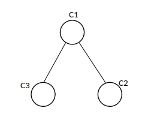
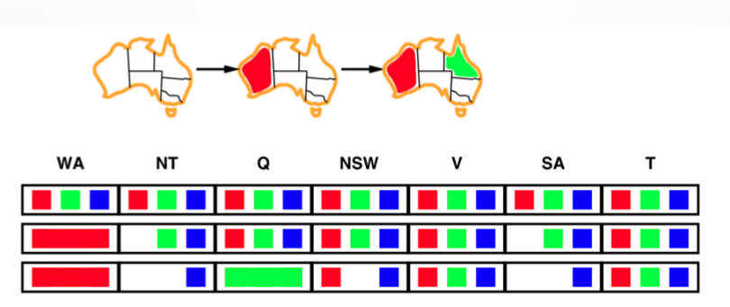

Constraint Satisfaction
==============
- [Constraint Satisfaction](#constraint-satisfaction)
- [Introduction](#introduction)
- [Examples](#examples)
  - [Map-Coloring](#map-coloring)
  - [Constraint Graph](#constraint-graph)
  - [N-Queens](#n-queens)
  - [Real World CSPs](#real-world-csps)
- [CSP Varieties](#csp-varieties)
- [Constraint Varieties](#constraint-varieties)
- [Converting n-ary CSP to binary CSP](#converting-n-ary-csp-to-binary-csp)
- [Standard Search Formulation (incremental)](#standard-search-formulation-incremental)
- [Backtracking Search](#backtracking-search)
- [Improving Backtrack](#improving-backtrack)
  - [The Minimum Remaining Value (MRV)](#the-minimum-remaining-value-mrv)
  - [Degree Heuristic](#degree-heuristic)
  - [Least Constraining Value](#least-constraining-value)
  - [Forward Checking](#forward-checking)
  - [Constraint Propagation <div id='CP'/>](#constraint-propagation-div-idcp)
  - [Arc consistency (AC3) <div id='AC3'/>](#arc-consistency-ac3-div-idac3)
  - [Extending to cases which have n-ary constraints <div id='EXT'/>](#extending-to-cases-which-have-n-ary-constraints-div-idext)
  - [Arc-Consistency limitations <div id='ACL'/>](#arc-consistency-limitations-div-idacl)
  - [k-Consistency <div id='KC'/>](#k-consistency-div-idkc)
  - [Strong k-Consistency <div id='SKC'/>](#strong-k-consistency-div-idskc)
  - [Using problem structure <div id='PS'/>](#using-problem-structure-div-idps)
- [Summary](#summary)
# Introduction

In Constraint Satisfaction Problems, we are dealing with special form of search problems. These problems try to find some search algorithms that require new conditions. The conditions are Constraints.

In CSPs, we have some variables $X_i$ that we should declare some values from domain $D_i$.
We may have more than one goal state in CSP and each goal satisfy **all** constraints.

Usually, there is a function for solving Constrains Satisfaction Problems that returns a Boolean value. Either there is an answer or not.
We start with some famous CSPs.

# Examples
## Map-Coloring


In this problem, we want to color all regions of Australia with three colors in a way which two adjacent regions must not have same colors.

**Variables**: Western Australia, Northern Territory, South Australia, Queensland, New South Wales, Victoria, Tasmania

**Domains**: $\{Red, Green, Blue\}$

**Constraints**: two adjacent regions must have two different colors.

**Solution(s)**: all assignments with satisfying all constraints. 

For example:
$[WA : Red, NT : Green, SA : Blue, Q : Red, NSW : Green, V : Red, T : Green]$


But why we try to formulate a problem as a CSP format? One reason is that CSPs yields a natural representation for a wide variety of problems; so if we already have a CSP-solving system, it is easier to solve a problem using that rather than design a custom solution using another search technique. Also CSP solvers are generally faster than normal search algorithms. In map coloring for example, if we assign $SA = blue$, for five neighbors only colors of green and red are available. Without CSP technique, we must consider $3^5=243$ assignments for five neighbors but by using CSP format, we never have to consider blue as a value, therefore we have only $2^5=32$ assignments. A $87\%$ reduction!

## Constraint Graph

For binary CSPs, we use constraint graph. Binary CSP is a problem that each constraint relates to at most two variables. (For example in map coloring, in every step we are looking at $2$ regions that can’t have same color.)  The nodes of graph correspond to variables and a link connected to two nodes is a constraint that those variables participate in the constraint


## N-Queens
Another famous Constraint Satisfaction Problem is N-Queens. In this problem, we want to put n-queens on a $n \times n$ chess board in a way that no queen is able to treat another. In other words, there must be exactly one queen in each row or column or dimeter. All tiles of the board have either one queen or none. CSP formulation for this problem is as follow:

**Variablex:** $X_{ij}$ which represents a queen in row i and column j.

**Domains:** $\{0, 1\}$

**Constraint:**
$$ \forall i,j,k \quad (X_{ij}, X_{ik}) \in \{(0,0), (0,1), (1,0)\} $$
$$ \forall i,j,k \quad (X_{ij}, X_{kj}) \in \{(0,0), (0,1), (1,0)\} $$
$$ \forall i,j,k \quad (X_{ij}, X_{j+k,k+j}) \in \{(0,0), (0,1), (1,0)\} $$
$$ \forall i,j,k \quad (X_{ij}, X_{j+k,j-k}) \in \{(0,0), (0,1), (1,0)\} $$
$$ \sum_{i,j} X_{ij} = N $$

The variables, $X_{ij}$, represents a queen in row i and column j. The domain is binary because for every tile we can show if there is a queen or there is not.

This problem is not a binary CSP because of the last constraint. We have every other constraint in the last one.


The picture above shows a solved 8-Queens.

## Real World CSPs
What we see so far, were some famous CSPs that may not deal with them in real world. Some real world CSPs are:

- Assignment problems: e.g., Who teaches what class
- Timetabling problems: e.g., Which class is offered when and where?
 - Hardware configuration
- Transportation scheduling
 - Factory scheduling
  - Circuit layout
- Fault diagnosis
- And…
Usually real-world problems involve real-valued variables.

# CSP Varieties
Base on variables, we can classify CSPs into two parts: Discrete variables and Continuous variables. Discrete variables can also divide into two parts of Finite domain and Infinite domain. Our main focus is on discrete variables specially finite domain ones. 
- Discrete variables:
  - Finite domains:
    - Size $d$, $O(d^n)$ complete assignments.
    - e.g., Boolean CSPs, incl. Boolean satisfiability (NP-complete).
   - Infinite domains (integers, strings, etc.)
      - e.g., job scheduling, variables are start/end days for each job.
      - need a constraint langage, e.g., StartJob1 + 5 ≤ StartJob3.
      - Linear constraints solvable, nonlinear undecidable.
- Continuous Variables:
    - e.g., start / end times for Hubble Telescope observations.
    - linear constraints solvable in poly time by LP methods.

# Constraint Varieties
Based on constraints, we have different kinds of constraints.
- Unary: Constraints involve a single variable.
e.g., SA ≠ green
- Binary: Constraints involve pairs of variables.
e.g., SA ≠ WA
- High-Order: Constraints involve 3 or more variables.
e.g., cryptarithmetic column constraints
- Preferences: Soft constraints.
e.g., red is better than green.
Often represents by a cost for each variable assignment.
It is not a Constraint Satisfaction Problem, it is called Constrained Optimization Problem (COP).

# Converting n-ary CSP to binary CSP
Is it possible to convert every n-ary problem (not binary constraints) to a binary CSP?

Dual constraint graph is a graph which its vertices are not variables but constraints. The vertices are connected to each other if they have a variable in common. In other words, the arc between two constraints check if the common variables take the same value in both constraints.

Consider n-ary CSP problem:

**Variable:** $X, Y, Z$

**Domain:** $\{1, 2, 3\}$

**Constraint:** $C_1: X + Y + Z \le 3,\quad C_2: X+Y \le 2, \quad C_3: Z \ge 1 $

Dual form of this problem with new constraint($X, Y, Z$ be consistent in $C_1, C_2, C_3$) is as follow:



#  Standard Search Formulation (incremental)

Now we want to come up with a general standard solution based on search technique then try to improve it and make it special for CSP. The first approach is a simple approach, partial state formulation in search. In this approach, states are defined by the values assigned so far.

**Initial state:** the empty assignment, {}

**Successor function:** assign a value to an unassigned variable that does not conflict with current assignment. If there is no legal assignment, then failure is output of function.

**Goal state:** when the current assignment is complete.

Note that for all CSPs, this formulation is the same.
We want to assign values to all n variables; therefore, the solution –if there is any- must be in depth n. So it’s reasonable to use DFS (Depth First Search) algorithm.

In the initial state, we can choose n variables to assign with $d$, size of domain. So at the initial state, we will have $n\times d$ branch factors, maximum successors of a node. Appling the same method to each one in the first layer, each node in depth 1 has $(n-1) \times d$ branch factors, so the maximum number of leaves is $nd \times (n-1)d \times \dots \times d = n!d^n$.

# Backtracking Search
With backtracking, we can reduce the number of leaves. If we consider one order of assignment and continue that, we will get to solution because the variable assignments are commutative. 

E.g., the assignments $[WA=red \; then \; NT=green]$ is the same as $[NT=green \; then\;  WA=red]$. With this trick, each node needs to assign to only a single variable and reduce the number of leaves to $d^n$.

Depth-first search for CSPs with single variable assignments is called backtracking. The name is chosen because when the algorithm fails to assign a variable, it will go to previous depth and starts searching again.

Backtracking search is the basic uniformed algorithm for CSPs and can solve n-queens for $n \approx 25$.


```python
def Backtracking-Search(csp):
    return Recursive-Backtracking ({}, csp)

def Recursive-Backtracking(assignment, csp):
  if assignment is complete:
     return assignment
  var = Select-Unassigned-Variable(Variables[csp], assignment, csp)
  for value in Order-Domain-Values(var, assignment, csp):
    if value is consistent with assignment given Constraints[csp]:
  add {var = value} to assignment
  result = Recursive-Backtracking(assignment, csp)
  if result ≠ failure:
     return result
  remove {var = value} from assignment
  return failure
```

Backtracking search tries to find acceptable values for all variables recursively. Returns solution if it finds any, otherwise if the last assignment is leading to conflict, it removes that value for that variable and try other values. If no value is accepted, it backtracks to the previous assignment and changes that.


# Improving Backtrack
Now we want to improve backtracking. These are four methods and ideas that help us to gain speed in backtracking search:
- Which variable should be assigned next?
- In what order should its values be tried?
- Can we detect inevitable failure early?
- Can we take advantage of problem structure?

For each we will give an answer Let’s start from the first question.

## The Minimum Remaining Value (MRV)
For the first question we introduce The Minimum Remaining Value (MRV).
This heuristic tells us which variable should be the next variable to be assigned. In each assignment, the possible values for the next assignment may be reduced due to the problem’s assignments. In map coloring, after coloring the first state, the neighbors cannot have the same value. If we assign randomly in each state, we might reach to a point where a variable becomes so limited that it can’t have any values.


If we don’t use MRV and choose a variable randomly, at the last step in the picture, we may color the north-west region, there will be no available values for the southern region and we have to backtrack. Clearly, we don’t need to backtrack if we use MRV.

## Degree Heuristic
At a tie-breaker situation in MRV, we may use Degree heuristic. Degree heuristic prioritize the variable with the most constraints on remaining variables. Like at the beginning of the problem, when there is no colored state.


## Least Constraining Value
For the second question, we may use least constraining value. In this approach, for a given variable, it chooses the least constraining value: the one that rules out the fewest values in the remaining variables.


In the above situation, if we assign the north west region with blue value, we will have no available value for the southern region but assigning it to red value, it allows to have an available value for the southern region and we can avoid failure.

Note that in the previous heuristics, we try to find a dead end sooner but in the last one, we are doing the opposite. This contradictory is because in MRV and degree heuristic, we are choosing a variable to be assigned but in the least constraining value, we are choosing a value. Each variable has to assigned to a value in our search and we fail to assign a variable, we will get to failure inevitably. But there is no such obligation for values. In other words, a value can unassigned and not be use in a solution.

Combining these heuristics, makes 1000 queens feasible.

## Forward Checking

Now we want to see if we can detect failure sooner. The idea is to keep track of remaining legal values for unassigned variables. It terminates search when there is no available value for any variable.


$ dsa $

$dsa$

In each state, we show the possible values for each variables. The first table is the first state. Then after two steps and choosing the variables $WA$ and $Q$, the updated table will become the last table.

## Constraint Propagation <div id='CP'/>

Forward checking method, detects failures in only one level higher than ordinary MRV. As a result, in many cases it fails to detect failures.



For instance, In this example NT and SA can't be blue at the same time but Forward Checking doesn't detect that.

Constraint Propagation method can detect failure when in a higher height. In order to explain this algorithm, we must first define **consistency** for an edge.

 $X \rightarrow Y$ edge is consistent iff for every value $x$ in Domain of $X$, there exists some allowed (does not violate any constraint) $y$ in Domain of $Y$.

By making every edge consistent (if possible), Constraint Propagation causes many of non-allowed states (which violate constraints) not to appear in search.

Consider coloring example. Suppose in allowed domain of $X, Y$, which are neighbors, remains $\{g, b, r\},\{g\}$ respectively. In this situation, $X \rightarrow Y$ edge is not consistent because if we attribute value $g$ to $X$, there remains no allowed option for $Y$. However If we **delete** $g$ from domain of $X$, we can make this edge consistent. But we have to note that all edges which $X$ exists as the destination, may become inconsistent. So for example if $Z \rightarrow X$ become inconsistent, one or more member of Domain of $Z$ will be deleted and by continuing this process (spreading consistency over all edges) we can have a new *equivalent problem* which there exists *less members* in Domain of the variables and by deleting many states, we can save time.

## Arc consistency (AC3) <div id='AC3'/>


One algorithm which is based on this concept is **AC-3**. (AC-3 Description)


This algorithm can reduce *search algorithms* time، 
However, It takes $O(n^2d^3)$ time to only execute this algorithm alone.

 It takes $O(d^2)$  time to execute Remove-Inconsistent-Value function and each edge may calls this function $O(d)$ times and because there is $O(n^2)$ edges it can lead to $O(n^2d^3)$ execution time overall. One solution is to execute AC-3 algorithm limited times. However, this trade-off still remains.

## Extending to cases which have n-ary constraints <div id='EXT'/>

To check consistency of a constraint in a n-ary case we have two options. One of them is to convert these constraints to binary constraints via the previous method or via performing intelligent methods. 

Another option is to divide variables into two categories via different methods (we can actually do this in $2^n - 2$ different ways) and each time consider a member of the first category and check if there is a member in the second category which satisfies constraints or not. Then we can say this constraint is consistent.
As it seems the second method is more complex and leads to a combinatory problem. The first method is more efficient. 

## Arc-Consistency limitations <div id='ACL'/>

Although this method makes algorithms more efficient, in many cases it **can’t** detect early failures.


For example, in this case all edges are consistent but it's obvious that we can't assign values to all nodes.

One way to confront these problems is to use *“Strong k-Consistency”* concept. In order to define this concept, we must first define k-Consistency.

## k-Consistency <div id='KC'/>

 For each $k$ nodes, any consistent assignment to $k-1$ can be extended to the $k$ th node. We must note that checking some k-Consistencies which $k$ is large, will have a high complexity. However, in our previous example if we check $k = 2$, we will see that we can detect failure.

## Strong k-Consistency <div id='SKC'/>

Includes 1-Consistency, …, k-Consistency.

We must note that one **can’t** achieve (k-1)-Consistency from k-Consistency. That’s due to the fact that in order to have k-Consistency, it’s necessary to have $k-1$ consistent nodes (to expand to $k$) and if there is no $k-1$ consistent nodes, due to vacuous truth (in logic), we will have k-Consistency and obviously it’s possible that we don’t have (k-1)-Consistency.

However, checking Strong k-Consistency **is not** an easy job(!) and has a high complexity. To the extent that Strong n-Consistency is equal to solving the problem without backtracking. That’s because we can choose any assignment to a variable and by 2-Consistency get to 2 variables. Then by 3-Consistency get to 3 variables and all the way up to $n$ variables which is equivalent to finding the solution.

## Using problem structure <div id='PS'/>

one of the ways we can use the problem structure is to see whether constraint graph has separated connected component or not. If it has connected components, then we can solve the problem by finding solution for each of components independently.


Of course, in real problems we will not see cases like the previous example very often. But one of the cases which often occurs is when there is a modular structure in the graph. With some considerations, we can solve the problem for each module independently and achieve a better time complexity.

**Modular Structure**: 
in some subgraphs there are some dense connections which have sparse connections with other subgraphs, as in figure below:


Another way to use the problem structure is to see whether constraint graph is in tree form or not. If it is in tree form, we can solve the problem in $O(nd^2)$  which is way better than time complexity of a general case problem which is $O(d^n)$. To solve the problem, we first choose a node as the root of the graph and then we sort nodes from the highest to deepest, as in figure below:


Then we delete all inconsistent values from node $n$ to node 2. (In AC-3 language, we call Remove-Inconsistent function for node $n$ to node 2). Because all edges are consistent, we can assign a value to $X_1$ (root) and then for each $X_i$ we will assign a value in order not to become inconsistent with respect to just its father. *Due to Arc-Consistency*, that’s possible.

In cases which are almost tree form, there is a minimum cutset which includes a few members. In these cases, we can use *Conditioning method*. In this method, we first assign values to variables of the cutset in different ways. Then we solve the problem for other variables (which form a tree). If we consider $c$ as the size of the cutset, this method includes $d^c$ value assignments and then solving problem for the remaining tree which we know it has $O((n-c)d^2)$ time complexity. Hence, this method has $O(d^c.(n-c)d^2)$ time complexity which is good for small $c$. 

# Summary
- CSPs are kind of problem with a set of variable/value pairs that represent a state.
These pairs represent the conditions of solution by a set of constraints on variables.
- Backtracking search is a form of depth first search that is commonly used for solving CSPs.
- Variable ordering and value selection heuristics help to improve backtracking. The minimum remaining variable and degree heuristics are methods for ordering variables and least constraining value heuristics decides which value should be try first.
- Forward checking is used to detect inevitable failure before we reach it.
- Tree-structured problems can be solved in linear time.
- Custset conditioning can make a general CSP structure to a tree-structured one. It is very efficient for small cutsets.
- Tree decomposition technique transform the CSP into a tree of subproblems. It is very efficient if tree width of the constraint graph is small. 
- Time complexity of CSP is related to the structure of its constraint graph. 