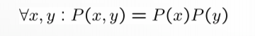
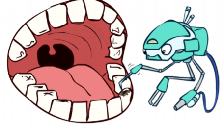
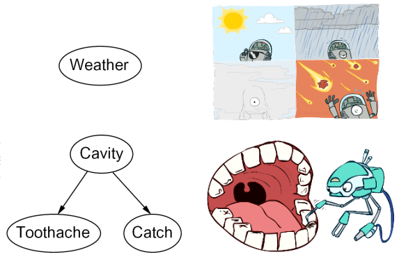

# Bayesian Network: Inference

## Table of Content

- [Introduction](#introduction)
- [Probabilistic Models](#Probabilistic-Models)
- [Conditional Independence](#Conditional-Independence)
- [Introduction to Bayes’ Networks](#Introduction-to-Bayes’-Networks)
## Introduction

- ## Probabilistic Models

  - ### Instroduction

    Suppose insurance wants to insure a personal car forone year
    Criteria to be considered
    Individual information

    - machine type
    - Age
    - education
    - History
    - and ..

    Based on these criteria, consider how likely a person is to have an accident and examine the amount and cost of the accident.

    We face uncertainty in determining the amount of insurance and we can not model it exactly
    Now to make a smart decision we need to have a model based on **statistics**
    Then, from this statistical modeling, we can draw a statistical conclusion from how much it is probable that the person will suffer damages in the next year and how much it will have to be paid by the insurance company.

    **How to build a statistical model ?**  
     **How to use it to make the right decision ?**
     

    **Let us first give an example :**  
    &nbsp;&nbsp;&nbsp;&nbsp; **A Reasoning Scenario**

    <To style="padding-left:19px">I'm at work, neighbor John calls to say that my alram is ringing, but neighbor Mary doesn't call. Sometimes it's set off by minor earthquakes. Is there a burglar?
    To answer this question, we must first make a statistical model and then draw a statistical inference
    So we have statistical language:

  - Variables:  

    
     - B: + | - (boolean) (true for exsit burglar).  
     - J: + | - (boolean) (true if John call me).  
     - M: + | - (boolean) (true if Mery call me).  
     - A: + | - (boolean) (true if alarm is ringing).  
      
     **P(B=+b , J=+j , M=+m)/p(A) A=( J=+j , M=-n)**  

        
     Which is the interpretation of the above speech  
     **Are the variables independent of each other?**      
     **Should John call us randomly, is there any trust in her words?**    
     So it must be said that these variables will have an interdependence
    And this is not how the probability can be calculated and we need more information, which we will get acquainted with later, a concept called
    **joint property distribution**  

    Now suppose we know the probability that a series of random variables will occur together, in this example John and Marry and alarms and earthquakes (in this example each of these variables is binary and makes things easier for us)
    That we have five variables that must create two to the power of five states
    Which creates a 32-row table whose columns are variables and the last column is the probability  
    Now, in the probability of calculating theft in this example, there is no earthquake in our conditional probability, and the states in which the earthquake occurs and does not occur must also be calculated in the table.  
    The difficulties of this can be said:  
    &nbsp;&nbsp;&nbsp;&nbsp;&nbsp;1. The number of random variables is so much, which causes the number of rows to increase exponentially  
    &nbsp;&nbsp;&nbsp;&nbsp;&nbsp;2. The second difficulty is in the inference section
    

  - ### independence
    • Two variables are independent if:  

    <!--      -->

    $$\begin{cases}
     \gamma   x,y P(x, y) = P(x)P(y)
    \end{cases}$$  

    This says that their joint distribution factors into a product two simpler distributions  
    Independence is a simplifying modeling assumption
    #### Example:   

      

    So we turn it into two more tables where we can work with two variables instead of three.  
    and make order from 2 power n to 2n .

- ### Conditional Independence
    #### Let us first give an example:
    ### first example:
     

    Suppose we have three variables in tooth decay : 
    1.cavity  
    2.toothache  
    3.catch  
    • If I have a cavity, the probability that the probe catches in it.
      doesn't depend on whether I have a toothache:   

    - P(+catch | +toothache, +cavity) = p(+catch | +cavity)  

    • The same independence holds if I don’t have a cavity:  
      - P(+catch | +toothache, -cavity) = p(+catch| -cavity)

    Now to reduce the dependencies, imagine that the person's tooth has a cavity. Two variables of the person have a toothache and the catch of a bad tooth is defined as two separate variables.  
    The catch and toothache dependence is due to the cavity. If we know that the cavity has occurred, it is as if we have eliminated the catch and toothache dependence.
        
    
    Equivalent statements:    
    1. P(Toothache | Catch , Cavity) = P(Toothache | Cavity)    
    2. P(Toothache, Catch | Cavity) = P(Toothache | Cavity) P(Catch | Cavity)    

    One can be derived from the other easily

  

    #### another Example : 
    ### seccond example:
    

     Here are three variables:  
    1. smoke
    2. Fire
    3. alarms  

    we have
Are these three variables conditional or not?
Can a variable be found here that causes two other things?
Here, unlike the previous example, when the breakdown caused two other reasons, there is a chain that connects this fire and alarm to the existence of a smoke variable, and if we remove smoke from the environment in some way, the other two variables, fire and alarm, have nothing to do with They do not have each other

In general, all world events can be divided into common and causal chains

    

  

 
    
<!-- - Model:
        Low pressure might cause rain (R is dependent to L) and rain might cause traffic. A ballgame being hold also might cause traffic and rain causes drips from stadium roof. Russell's tooth cavity (name of the green monster) is independent from other variables, so BN of this environment is presented in the following figure:

-variable
-B
dfasdf -->

<!--
- ## Problem Definition
  - ### Independence
  - ### Conditional Independence
  - ### Conditional Independence and the Chain Rule
  - ### Example -->

<!-- In the previous lecture, we were introduced to a new technique for describing complex joint distribution models using conditional probabilities called **Bayesian Network**. BN is a acyclic directed graph whose nodes contain *Conditional Probability Tables* (CPT). Each represents the following probability:
$$ P(X_i|Parents(X_i))$$
where Xi shows the random variable of node i. BN also encodes the whole joint probability distribution of Xi random varaibles using following formula:
$$ P(x_1,x_2,x_3,..,x_n) = \prod_{i=1}^{n} P(x_i|Parents(X_i))$$

In this lecture note we will discuss some methods that help us *infer* useful information from BN and calculate some given condtional probability distributions using those methods. -->

## Introduction to Bayes’ Networks  

 
  
 - ### Definition
      • Two problems with using full joint distribution tables
    as our probabilistic models:  
   1.    Unless there are only a few variables, the joint is WAY too
big to represent explicitly  
   2. Hard to learn (estimate) anything empirically about more
than a few variables at a time    

   Bayes' nets: a technique for describing complex joint distributions (models) using simple, local distributions
  (conditional probabilities)  
   -  More properly called graphical models
   - We describe how variables locally interact  
   - Local interactions chain together to give global, indirect
 interactions
    -  we’ll be vague about how these
 interactions are specified

- ### Graphical Model Notation
    - Nodes: variables (with domains)  
        - Can be assigned (observed) or unassigned
(unobserved)
    - Arcs: interactions
        - Similar to CSP constraints
        - Indicate direct influence between variables
        - Formally: encode conditional independence
(more later)
        - For now: imagine that arrows mean direct
causation (in general, they don’t!)

The question that was first created for us for insurance now we show with Bayes Net :

