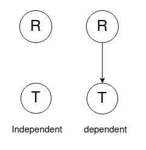
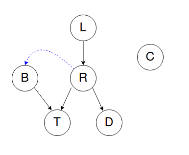
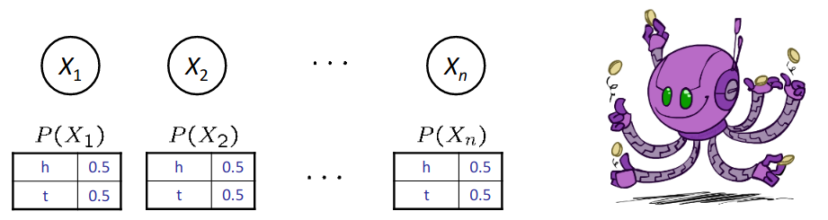
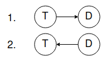
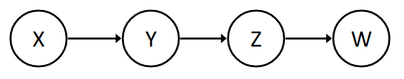

# **Bayesian Network: Representation**

## **Table of Content**
- [**Bayesian Network: Representation**](#bayesian-network-representation)
  - [**Table of Content**](#table-of-content)
  - [**Bayes' Net Examples**](#bayes-net-examples)
    - [**Coin Flips** 1](#coin-flips-1)
    - [**Traffic** 1](#traffic-1)
    - [**Second Traffic** 1](#second-traffic-1)
    - [**Alarm Network** 1](#alarm-network-1)
  - [**Bayes' Net Semantics**](#bayes-net-semantics)
    - [**example**](#example)
    - [**Joint Dist. Validation**](#joint-dist-validation)
    - [**What Cond. Independencies could be implied?**](#what-cond-independencies-could-be-implied)
      - [**Proof**](#proof)
    - [**Bayes' Net Probability Examples**](#bayes-net-probability-examples)
      - [**Coin Flips** 2](#coin-flips-2)
      - [**Traffic** 2](#traffic-2)
      - [**Reverse Traffic** 1](#reverse-traffic-1)
      - [**Alarm Network** 2](#alarm-network-2)
  - [**Bayes' Net Size Analysis**](#bayes-net-size-analysis)
  - [Does Bayes' Net Necessarily Represent Causal Relations?](#does-bayes-net-necessarily-represent-causal-relations)
    - [What Does Bayes' Net Really Represent?](#what-does-bayes-net-really-represent)
  - [Conditional Independencies in Bayes' Net](#conditional-independencies-in-bayes-net)

## **Bayes' Net Examples**
These are some examples of how uncertain environment variables can be modeled as Bayesian Network. Try to justify relations between those variable to get a better grasp of how BN works.

### **Coin Flips** 1
  Problem of tossing n independent coins is an example of modeling a probabilistic environment. No interaction between coins results in absolute independency.

  <figure>
  
  <figcaption>BN for independent coin flip of n coins</figcaption>
  </figure>

### **Traffic** 1
  - Variables:
      - R: It rains
      - T: There is a traffic on the road.
  
  - Two models can be considered for such a problem:
    
    
     
    An agent using dependent model usually is more realistic.
  

### **Second Traffic** 1
  
  
  - Variables:
    - T: Traffic.
    - R: It rains.
    - L: Low air pressure.
    - D: Stadium roof drips.
    - B: There is a ballgame.
    - C: There is a cavity in *Russell* 's teeth (name of the green monster).

  - Model: 
      Low pressure might cause rain (R is dependent to L) and rain might cause traffic. A ballgame being held also might cause traffic and rain causes drips from stadium roof. *Russell*'s tooth cavity  is independent of other variables, so BN of this environment is presented in the following figure:

      
      
      In this environment rain can cause ballgame be canceled, so B is slightly dependent on R which is shown by blue arrow from R to B, but to keep our model as simple as possible, we tend to not include this relation in our BN. This results in ignoring some information from problem's environment, So we need to keep a balance between model simplicity and information loss.

### **Alarm Network** 1
  Previousy, we were interoduced to this problem to get familiar with probabilistic environment and problem scenarios. Here we present its varaibles and related Bayesian Network:
  - Variables:
    - B: Burglary
    - A: Alarm goes off
    - M: Marry calls
    - J: John calls
    - E: Earthquake
  - Representation:  
    

## **Bayes' Net Semantics**
BN is a directed acyclic graph in which every node refers to the probability of a random variable X conditioned to its parents. Here 
$$P(X | A_1, A_2, A_3, .., A_n)$$
means probability distribution of any x conditioned to every possible combination of its parents (A1, A2, A3, ....An).  All these probability combinations are gathered in a table called conditional probability table (CPT). The following figure shows an example of CPT:

So every BN consists of **Topology**(graph) and **Local Conditional Probabilities**.

Bayes' Net *implicitly* encodes joint distribution. Joint distribution of random variables included in a BN is calculated using the product of all local conditional distributions. The following equation shows explicit formula:

$$P(x_1,x_2,x_3,..,x_n) = \prod_{i=1}^{n}P(x_i|parents(X_i))$$

where xi is an observation of Xi.

### **example**
Here is an example of how a joint distribution is embedded in a BN:

To compute P(+cavity, +catch, -toothache):
$$P(+cavity, +catch, -toothache) = \\P(+cavity|parents(Cavity))  \times P(+catch|parents(Catch)) \\\times P(+toothache|parents(Toothache)) \\
= P(+cavity) \times P(+catch|+cavity) \times P(-toothache|+cavity)$$

### **Joint Dist. Validation**
So far we presented a joint distribution formula using BN, but we have not proved that it is a valid probability distribution.
There are 2 conditions for every joint distribution:
$$
\begin{cases}
    P(x_1,x_2,x_3,..,x_n) \ge 0 \qquad for \quad every \quad X_i\\
    \sum_{X_1, X_2, ..,X_n}  P(x_1,x_2,x_3,..,x_n) = 1  
\end{cases}
$$

The first condition is directly concluded from the definition. For the second condition, we can replace joint destribution with the defined formula. If we sort Xis as topological order, we have:

$$
\sum_{X_1, X_2, ..,X_n}  P(x_1,x_2,x_3,..,x_n) = \sum_{X_1, X_2, ..,X_n} \prod_{j \in \{1,..n\}} P(x_i|parents(X_i)) \\
= \sum_{X_1} \sum_{X_2} \quad .. \prod_{j \in \{1,..n-1\}} P(x_i|parents(X_i)) \sum_{X_n} P(x_n|parents(X_n)) \\
= \sum_{X_1} \sum_{X_2} \quad .. \prod_{j \in \{1,..n-1\}} P(x_i|parents(X_i)) 
= 1
$$

So this joint distribution is valid.

### **What Cond. Independencies could be implied?**
Using chain rule we already know:
$$
P(x_1,x_2,x_3,..,x_n) = \prod_{i=1}^{n}P(x_i|x_1,x_2,x_3,..,x_{i-1})
$$
Now assume this equation hold:
$$
P(x_i|x_1,x_2,x_3,..,x_{i-1}) = P(x_i|parents(X_i))
$$
This results in:
$$
\Rightarrow P(x_1,x_2,x_3,..,x_n) = \prod_{i=1}^{n}P(x_i|parents(X_i))
$$
These equations show that there are some independency assumptions embedded in a BN; every node conditioned to its parents is independent of non-parent nodes that come before it, according to topological order - called *predecessors* for short.

Now does the reverse procedure also hold? In other way does 
$$
P(x_1,x_2,x_3,..,x_n) = \prod_{i=1}^{n}P(x_i|parents(X_i))
$$
conclude this:
$$
P(x_i|x_1,x_2,x_3,..,x_{i-1}) = P(x_i|parents(X_i))\qquad ?
$$ 
#### **Proof**
$$
P(x_i|x_1,x_2,x_3,..,x_{i-1}) = \frac{P(x_1,x_2,x_3,..,x_i)}{P(x_1,x_2,x_3,..,x_{i-1})} 
$$
We already know that:
$$
P(x_1,x_2,x_3,..,x_{i}) = \sum_{X_{i+1}, X_{i+2}, ..,X_n}  P(x_1,x_2,x_3,..,x_n) \\
= \sum_{X_{i+1}, X_{i+2}, ..,X_n} \prod_{j=1}^{n}P(x_j|parents(X_j))
$$
Considering topological order we have:
$$
P(x_1,x_2,x_3,..,x_{i}) 
=  \prod_{j=1}^{i}P(x_j|parents(X_j))
$$
$$
\Rightarrow \frac{P(x_1,x_2,x_3,..,x_i)}{P(x_1,x_2,x_3,..,x_{i-1})}  = \frac{\prod_{j=1}^{i}P(x_j|parents(X_j))}{\prod_{j=1}^{i-1}P(x_j|parents(X_j))} = P(x_i|parents(X_i))
$$
$$
\Rightarrow P(x_i|x_1,x_2,x_3,..,x_{i-1}) = P(x_i|parents(X_i)) \quad \square .
$$

### **Bayes' Net Probability Examples**

#### **Coin Flips** 2
 

#### **Traffic** 2

 

#### **Reverse Traffic** 1

 

#### **Alarm Network** 2

## **Bayes' Net Size Analysis**
As shown the [Alarm Network](#alarm-network-2) example every node holds a CPT of 2number of parents probabilities. This makes BN a very more efficient method to present joint probability distribution.
$$
\sum_{any \ node \ x} 2^{\ number \ of \ parents \ of \ x} \le 2^n
$$

## Does Bayes' Net Necessarily Represent Causal Relations?
When BN reflects true causal patterns:
- nodes have fewer parents and it makes the BN simpler, 
- it's easier to think about what the BN mean, 
- and the interpretation from it is very easier.

Assume we have 3 random variables:
- R: It rains.
- T: There is traffic.
- D: Roof drips.

Its BN would be like this:

 

Now if our agent is not able to know about whether it's raining or not, It will have only 2 random variables (T, D) and the BN will be one of these two(since T and D are not independent):

 

So there might be an arrow from T to D or back from D to T, when there is no causal relation between them. In conclusion, BN do not necessarily reflect a causal pattern.

### What Does Bayes' Net Really Represent?
BN topology may happen to encode causal structure, but what it really encodes is conditional independence (Local Cond. Indep.)

## Conditional Independencies in Bayes' Net

 

In this BN we already know these relations:
$$
\begin{cases}
    W \mkern10mu \rlap{\_}|| \mkern10mu X \mkern10mu | \mkern10mu Z \\
    W \mkern10mu \rlap{\_}|| \mkern10mu Y \mkern10mu | \mkern10mu Z
\end{cases}
$$
is the following independency concluded?
$$
W \mkern10mu \rlap{\_}|| \mkern10mu X \mkern10mu | \mkern10mu Y
$$
We'll prove P(W|X,Y) is constant with respect to X.
$$
P(W|X,Y) = \sum_Z P(W,Z|X,Y) = \sum_Z \frac{P(W,Z,X,Y)}{P(X,Y)} \\
= \sum_Z \frac{P(X)P(Y|X)P(Z|Y)P(W|Z)}{P(X)P(Y|X)} = \sum_Z P(Z|Y)P(W|Z) \\ \Rightarrow const.\ w.r.t.\ X
$$

So here is a cond. independency that can be concluded from BN. Is there any algorithm that can exploit all possible cond. independencies?