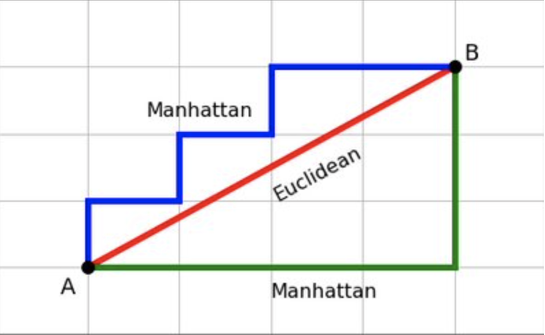
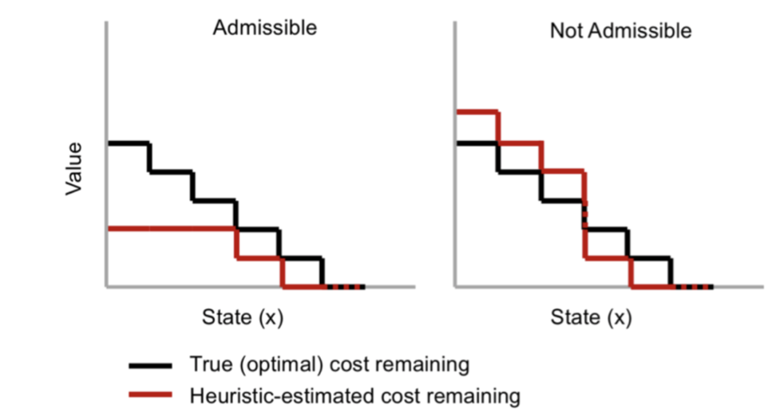
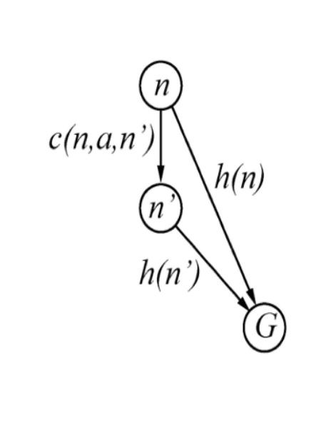
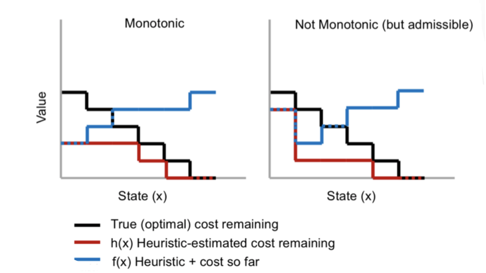
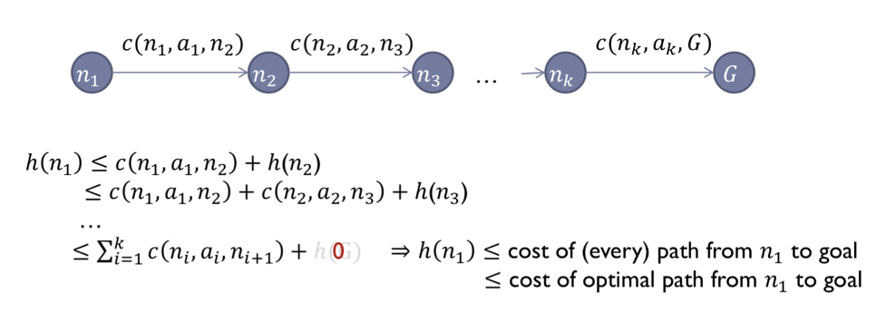

# Advanced Heuristics
#### Kahbod Aeini, Mohammadreza Daviran and Sepehr Kianian

## Contents
1.[Introduction](https://github.com/mmdrez4/notes/blob/master/notebooks/advanced_heuristics/index.md#introduction)

2.[Body](https://github.com/mmdrez4/notes/blob/master/notebooks/advanced_heuristics/index.md#body)
  

&nbsp;&nbsp;&nbsp;&nbsp;&nbsp;&nbsp;&nbsp;&nbsp; * [Distance](https://github.com/mmdrez4/notes/blob/master/notebooks/advanced_heuristics/index.md#distance)

&nbsp;&nbsp;&nbsp;&nbsp;&nbsp;&nbsp;&nbsp;&nbsp; * [Heuristic](https://github.com/mmdrez4/notes/blob/master/notebooks/advanced_heuristics/index.md#heuristic)

&nbsp;&nbsp;&nbsp;&nbsp;&nbsp;&nbsp;&nbsp;&nbsp; * [Monotonicity implies admissibility](https://github.com/mmdrez4/notes/blob/master/notebooks/advanced_heuristics/index.md#monotonicity-implies-admissibility)

&nbsp;&nbsp;&nbsp;&nbsp;&nbsp;&nbsp;&nbsp;&nbsp; * [Monotonic heuristic function](https://github.com/mmdrez4/notes/blob/master/notebooks/advanced_heuristics/index.md#monotonic-heuristic-function)

&nbsp;&nbsp;&nbsp;&nbsp;&nbsp;&nbsp;&nbsp;&nbsp; * [Heuristic dominance](https://github.com/mmdrez4/notes/blob/master/notebooks/advanced_heuristics/index.md#heuristic-dominance)

&nbsp;&nbsp;&nbsp;&nbsp;&nbsp;&nbsp;&nbsp;&nbsp; * [Relaxing](https://github.com/mmdrez4/notes/blob/master/notebooks/advanced_heuristics/index.md#relaxing)

&nbsp;&nbsp;&nbsp;&nbsp;&nbsp;&nbsp;&nbsp;&nbsp; * [Pattern DB](https://github.com/mmdrez4/notes/blob/master/notebooks/advanced_heuristics/index.md#pattern-db)

&nbsp;&nbsp;&nbsp;&nbsp;&nbsp;&nbsp;&nbsp;&nbsp; * [Combining Pattern DB](https://github.com/mmdrez4/notes/blob/master/notebooks/advanced_heuristics/index.md#combining-pattern-db)

&nbsp;&nbsp;&nbsp;&nbsp;&nbsp;&nbsp;&nbsp;&nbsp; * [Disjoint Pattern DB](https://github.com/mmdrez4/notes/blob/master/notebooks/advanced_heuristics/index.md#disjoint-pattern-db)

3.[Conclusion](https://github.com/mmdrez4/notes/blob/master/notebooks/advanced_heuristics/index.md#conclusion)

4.[References](https://github.com/mmdrez4/notes/blob/master/notebooks/advanced_heuristics/index.md#references)

## Introduction
nothing yet!

## Body

### Distance
First we review some basic definitions:
 
Distance is a numerical measurement of how far apart objects or points are:
* [Euclidean Distance](https://en.wikipedia.org/wiki/Euclidean_distance) calculates the distance between two real-valued vectors.
* [Manhattan Distance](https://en.wikipedia.org/wiki/Taxicab_geometry) is sum of the absolute differences of their Cartesian coordinates.

  

 

### Heuristic
* Heuristic guidance means how far is the goal state from a given state approximately.
 
***Admissiblity of a heuristic function means value of the function is always a Lower Bound of the remaining cost.***
 
So an **Admissible Heuristic** is a *non-negative* function h of nodes, where **h(n)** is *never greater than the actual cost of the shortest path from node n to a goal.* thus it means that the cost to reach the goal is never overestimated.
 
Effect of **Admissibility** on a Heuristic is shown in the below schema:

 
Now we define **f(n)** function as **f(n) = h(n) + g(n)** where g(n) is sum of costs from root to n node.

***Monotonicity or Consistency is that the heuristic function holds in triangle inequality.*** Namely **f(n) is never Decreasing.**

Effect of **Monotonicity** on a Heuristic is shown in the below schema:

for more information and better understanding watch this video: [watch](https://www.youtube.com/watch?v=CJmlP03ik5g)

 

### Monotonicity implies admissibility
We will prove that **Consistency** implies **Admissibility** whereas the opposite is not necessarily true.

 
Now we want to show an **inconsistent, admissible example!**
So consider this figure:

 
If our heuristic is admissible, we have that **h(n) $\le$ h*(n)** for every node n where **h*** is the real cost to the goal. So we deduct that **h(A) $\le$ 4**, **h(C) $\le$ 3** and **h(G) $\le$ 0**.
 
If we want our heuristic to be *Consistent* we should have **h(G) = 0** and **h(n) $\le$ cost(n, c) + h(c)** so in our case we have **h(A) $\le$ 1 + h(C)** and **h(C) $\le$ 3 + h(G) = 3**
 
Because of the *Admissibility* **h(C) should be less than 3**, but if **h(A) > 1 + h(C)** then our heuristic is *Inconsistent!*. Hence if we assume that **h(C) = 1**, **h(G) = 0** and **h(A) = 4** our heuristic is *Admissible but Inconsistent!*
 

 

### Monotonic heuristic function
We also can make a non-monotonic heuristic, monotonic with some changes!
For this we only need to define a new and more appropriate heuristic like the below schema.

 
 
 
**$\overline{h}$(n’) = max(h(n’), ℏ(n’) - c(n, a, n’))**
 
Above Heuristic is defined Recursively.

**$\overline{h}$(n’) $\ge$ $\overline{h}$(n) - c(n, a, n')**
 
So obviously we have **$\overline{h}$(n’) + c(n, a, n') $\ge$ $\overline{h}$(n)**
 

 

### Heuristic Dominance
 
For one heuristic to dominate another, all of its values must be greater than or equal to the corresponding values of the other heuristic.
So if $h_{2}$ dominates $h_{1}$(both are admissible) it means that A* algorithm expands less nodes with $h_{2}$ in the target path than $h_{1}$.
On another hand it means if a node is expanded by $h_{2}$ it will be expanded by $h_{1}$(consider that it’s not a biconditional proposition!)
 
*Proof:*
 
If $h_{2}$ dominate $h_{1}$, A* with $h_{2}$ expands at most the same number of nodes as when using $h_{1}$.
 
A* opens all node with **f(n) < C** and some with **f(n) = C**.
 
 
Note that 
**$h_{2}(n)$
$\ge$ 
$h_{1}(n)$**
 
If node n is expanded by A* with $h_{2}$ then **$h_{2}(n)$ < C - g(n)**
 
So ***$h_{1}(n)$ $\le$ $h_{2}(n)$ < C - g(n)*** and it would be expanded by A* with $h_{1}$ as well.

We also can improve our heuristic by some methods.
 
We are always trying to lower the difference between h* and h, expanded nodes and algorithm time complexity by making change in our heuristic.
 
One of the main ways for improving heuristics is **Relaxing** the problem.
 
In this procedure we try to enlarge the feasible answers set by simplifying the problem.

 

### Relaxing
 
One of the most common ways to find efficient heuristic function is that we convert our hard problem which is indissoluble in reasonable time, to a *more general problem with larger state space*.
 
Discussing more specifically, original problem has a set of constraints. Noe we **ignore some constraints** and solve the expanded problem. Since number of constraints have decreased, we have more goal states and our state space expands.
 
***Proof that Relaxing works***
 
Consider h as the answer and h' as our heuristic
 
h' = min(S'), h = min(S) $\Lambda$ S $\subseteq$ S' $\Lambda$ $\forall$ s, s' if s $\subseteq$ s' => $min(s') \le min(s)$ => $h' \le h$
 
 ***Example***

 In below problem, which is an NP-hard problem (indissoluble in linear time), we want to find the Hamiltonian path with least weight.

Hamilton path is a tree which every its inner node have exactly one leaf. Hence, the problem is converting above graph to a 1-array tree, which covers all nodes of the graph with existing edges and minimum sum of edges' weight. Now we ignore being 1-array tree constraint to convert original problem to a more general one. Accordingly our problem is now a Minimum Spaning Tree problem which is soluable in $n^{2}$ time complexity.

 

### Pattern DB

In previous sectionwe introduced relaxing method which improves heuristic function by lowering constraints. Pattern DB is yet another way to improve heuristic function which is actually a subset of Relaxing method.

In this method we choose a subset of constraints by a specific pattern and ignore the other constraints. Since we ignored some constraints we did relaxing method and hence answer of the converted problem is a heuristic gfunction.

 

### Combining Pattern DB

We can act further and use couple of patterns and choose couple of constraints' subsets. Therefore we have couple of heuristic functions. This helps dominancy of our heuristic function. First thing to do finding the dominant heuristic function is to choose the maximum function of the obtained heuristic functions. Since every heuristic is always less than the real answer, maximum of these functions is a lower bound of the real answer and for every set of obtained heuristic functions we can implement this method to find a dominant heuristic function.

 

### Disjoint Pattern DB

One of the main flaws of choosing maximum of the obtained heuristic functions is that in many cases, there is an upper bound for these functions. Therefore even by expanding subset of chosen constraints, we will not cross the upper bound.

One solution for solving this drawback is Disjoint Pattern DB. In this method we apport set of constraints and define independent actions for the general problem. Now we can sum the obtained heuristic function to achieve a greater heuristic function, which improves the time complexity. It is proven that the sum of obtained heuristic functions is still a lower bound of real answer of the probelm.

**Example**

First practical problem of the first mini project of the course is an example of this method. In this problm we have an undirected graph, which each of its nodes is a florist shop and has some flower breeds. Two brothers should march from start_node towards goal_node in a way that has the least cost and they met every existing flower breeds. In this case we choose a subset of flower breeds S that reach goal_node by a specific pattern and set goal_state as satisfying path with the least cost and meeting every existing flower breeds of set S. Hitherto we used pure Pattern DB.

Now we can have souple of flower breeds subset  and combine obtained answers by them. For example if we have K flower breeds, we can solve the problem for each flower breed and calculate its heuristic function and then choose maximum of the functions. So we used Combining Pattern DB to achieve a better heuristic function.

## Conclusion

## References
