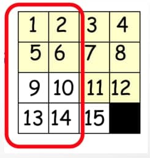
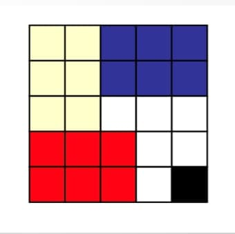
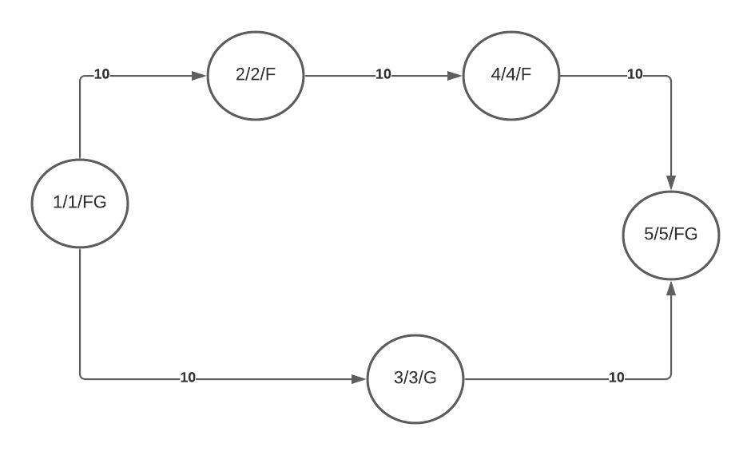

# Advanced Heuristics
#### Kahbod Aeini, Mohammadreza Daviran and Sepehr Kianian

## Contents
[Introduction](https://github.com/mmdrez4/notes/blob/master/notebooks/advanced_heuristics/index.md#introduction)

* [Distance](https://github.com/mmdrez4/notes/blob/master/notebooks/advanced_heuristics/index.md#distance)
&nbsp;&nbsp;&nbsp;&nbsp;&nbsp;&nbsp;&nbsp;&nbsp; 
* [Heuristic](https://github.com/mmdrez4/notes/blob/master/notebooks/advanced_heuristics/index.md#heuristic)
&nbsp;&nbsp;&nbsp;&nbsp;&nbsp;&nbsp;&nbsp;&nbsp; 
* [Monotonicity implies admissibility](https://github.com/mmdrez4/notes/blob/master/notebooks/advanced_heuristics/index.md#monotonicity-implies-admissibility)
&nbsp;&nbsp;&nbsp;&nbsp;&nbsp;&nbsp;&nbsp;&nbsp; 
* [Monotonic heuristic function](https://github.com/mmdrez4/notes/blob/master/notebooks/advanced_heuristics/index.md#monotonic-heuristic-function)
&nbsp;&nbsp;&nbsp;&nbsp;&nbsp;&nbsp;&nbsp;&nbsp; 
* [Heuristic dominance](https://github.com/mmdrez4/notes/blob/master/notebooks/advanced_heuristics/index.md#heuristic-dominance)
&nbsp;&nbsp;&nbsp;&nbsp;&nbsp;&nbsp;&nbsp;&nbsp; 
* [Relaxing](https://github.com/mmdrez4/notes/blob/master/notebooks/advanced_heuristics/index.md#relaxing)
&nbsp;&nbsp;&nbsp;&nbsp;&nbsp;&nbsp;&nbsp;&nbsp; 
* [Pattern DB](https://github.com/mmdrez4/notes/blob/master/notebooks/advanced_heuristics/index.md#pattern-db)
&nbsp;&nbsp;&nbsp;&nbsp;&nbsp;&nbsp;&nbsp;&nbsp; 
* [Combining Pattern DB](https://github.com/mmdrez4/notes/blob/master/notebooks/advanced_heuristics/index.md#combining-pattern-db)
&nbsp;&nbsp;&nbsp;&nbsp;&nbsp;&nbsp;&nbsp;&nbsp; 
* [Disjoint Pattern DB](https://github.com/mmdrez4/notes/blob/master/notebooks/advanced_heuristics/index.md#disjoint-pattern-db)

[Conclusion](https://github.com/mmdrez4/notes/blob/master/notebooks/advanced_heuristics/index.md#conclusion)

[References](https://github.com/mmdrez4/notes/blob/master/notebooks/advanced_heuristics/index.md#references)

## Introduction
Heuristics are methods for solving problems in a fast way. Actually It's about using a practical method that doesn’t necessarily need to be perfect! Heuristic methods speed up the process of reaching a satisfactory solution.
In this lecture we review some prerequisites then we present a couple of approaches and Heuristics, which seeked to be flawless, but the space and time complexity of these algorithms is not sufficient. So we try to improve the Heuristics to eliminate the recent obstacles and make our heuristics more efficient. we call these methods advanced heuristics!
We'll show how to detect complex problems then solving them by advanced heuristics and compare them with the previous methods.

### Distance
First we review some basic definitions:
 
Distance is a numerical measurement of how far apart objects or points are:
* [Euclidean Distance](https://en.wikipedia.org/wiki/Euclidean_distance) calculates the distance between two real-valued vectors.
* [Manhattan Distance](https://en.wikipedia.org/wiki/Taxicab_geometry) is sum of the absolute differences of their Cartesian coordinates.

  

 

### Heuristic
* Heuristic guidance means how far is the goal state from a given state approximately.
 
***Admissiblity of a heuristic function means value of the function is always a Lower Bound of the remaining cost.***
 
So an **Admissible Heuristic** is a *non-negative* function h of nodes, where **h(n)** is *never greater than the actual cost of the shortest path from node n to a goal.* thus it means that the cost to reach the goal is never overestimated.
 
Effect of **Admissibility** on a Heuristic is shown in the below schema:

 
Now we define **f(n)** function as **f(n) = h(n) + g(n)** where g(n) is sum of costs from root to n node.

***Monotonicity or Consistency is that the heuristic function holds in triangle inequality.*** Namely **f(n) is never Decreasing.**

A heuristic is consistent if: <em>h(n) &le; c(n, a, n’) + h(n’)</em>

if h is consistent, we have: <em>f(n’) = g(n’) + h (n’) = g(n) + c(n, a, n’) + h(n’) &ge; g(n) + h(n) [= f(n)]</em>

I.e., f(n) is nondecreasing along any path.

Effect of **Monotonicity** on a Heuristic is shown in the below schema:

for more information and better understanding watch this video: [watch](https://www.youtube.com/watch?v=CJmlP03ik5g)

 

### Monotonicity implies admissibility
We will prove that **Consistency** implies **Admissibility** whereas the opposite is not necessarily true.

<em> h(n1) &le; c(n1 ,a1 , n2) + h(n2) </em>
<em> &le; c(n1 ,a1 , n2) + c(n1 ,a1 , n3) + h(n3) &le;</em>

…
<em> &le; &Sigma; c(n1 ,a1 , ni+1) + 0 &#8658; h(n1) &le; cost of (every) path from n1 to goal &le; cost of optimal path from n1 to goal </em>
 
Now we want to show an **inconsistent, admissible example!**
So consider this figure:

 
If our heuristic is admissible, we have that **h(n) &le; h*(n)** for every node n where **h*** is the real cost to the goal. So we deduct that **h(A) &le; 4**, **h(C) &le; 3** and **h(G) &le; 0**.
 
If we want our heuristic to be *Consistent* we should have **h(G) = 0** and **h(n) &le; cost(n, c) + h(c)** so in our case we have **h(A) &le; 1 + h(C)** and **h(C) &le; 3 + h(G) = 3**
 
Because of the *Admissibility* **h(C) should be less than 3**, but if **h(A) > 1 + h(C)** then our heuristic is *Inconsistent!*. Hence if we assume that **h(C) = 1**, **h(G) = 0** and **h(A) = 4** our heuristic is *Admissible but Inconsistent!*
 

 

### Monotonic heuristic function
We also can make a non-monotonic heuristic, monotonic with some changes!
For this we only need to define a new and more appropriate heuristic like the below schema.

 
 
 
**ℏ(n’) = max(h(n’), ℏ(n) - c(n, a, n’))**

 
Above Heuristic is defined Recursively.

**ℏ(n’) &ge; ℏ(n) - c(n, a, n')**
 
So obviously we have **ℏ(n’) + c(n, a, n') &ge; ℏ(n)**
 

 

### Heuristic Dominance
 
For one heuristic to dominate another, all of its values must be greater than or equal to the corresponding values of the other heuristic.
So if h2 dominates h1(both are admissible) it means that A* algorithm expands less nodes with h2 in the target path than h1.
On another hand it means if a node is expanded by h2 it will be expanded by h1(consider that it’s not a biconditional proposition!)
 
*Proof:*
 
If h2 dominate h1, A* with h2 expands at most the same number of nodes as when using h1.
 
A* opens all node with **f(n) < C** and some with **f(n) = C**.
 
 
Note that 
**h2(n)
&ge;
h1(n)**
 
If node n is expanded by A* with h2 then **h2(n) < C - g(n)**
 
So ***h1(n) &le; h2(n) < C - g(n)*** and it would be expanded by A* with h1 as well.

 

### Relaxing

We also can improve our heuristic by some methods. We are always trying to lower the difference between h* and h, expanded nodes and algorithm time complexity by making change in our heuristic.
One of the main ways for improving heuristics is **Relaxing** the problem .In this procedure we try to enlarge the feasible answers set by simplifying the problem.
So one of the most common ways to find efficient heuristic function is that we convert our hard problem which is indissoluble in reasonable time, to a *more general problem with larger state space*.
 
Discussing more specifically, original problem has a set of constraints. Noe we **ignore some constraints** and solve the expanded problem. Since number of constraints have decreased, we have more goal states and our state space expands.
 
***Proof that Relaxing works***

Consider Our problem as P. To calculate heuristics in relaxing way, we omit some Constraints and turn P into a more general Problem called P'.
then, Consider S as the set of answers that are valid for P, and S' as the set of answers that are valid for P'. then, if you consider h as our answer and h' as our heuristic function, we can say:
 
h' = min(S'), h = min(S) &and; S &SubsetEqual; S'

And as you know that: &forall; s, s': if s &SubsetEqual; s' &#8658; min(s') &le; min(s)

We can conclude that: h' &le; h
 
 ***Example***

 In below problem, which is an NP-hard problem (indissoluble in linear time), we want to find the Hamiltonian path with least weight.

Hamiltonian path is a rooted tree which every its inner has have exactly one son. Hence, the problem is converting the above graph to a 1-ary tree, which covers all nodes of the graph with existing edges and minimum sum of edges' weight. Now we ignore being 1-ary tree constraint to convert original problem to a more general one. Accordingly our problem is now a Minimum Spaning Tree problem which is soluable in n2 time complexity.

 

### Pattern DB

In previous section we introduced relaxing method which improves heuristic function by lowering constraints. Pattern DB is yet another way to improve heuristic function which is actually a subset of Relaxing method.

In this method we choose a subset of constraints by a specific pattern and ignore the other constraints. Since we ignored some constraints we did relaxing method and hence answer of the converted problem is a heuristic function.

for further information watch this video: [watch](https://www.youtube.com/watch?v=HZWV4uOJWk8)

  

 

### Combining Pattern DB

We can go further and use couple of patterns and choose couple of constraints' subsets. Therefore we have couple of heuristic functions. This helps dominancy of our heuristic function. First thing to do finding the dominant heuristic function is to choose the maximum function of the obtained heuristic functions. Since every heuristic is always less than the real answer, maximum of these functions is a lower bound of the real answer and for every set of obtained heuristic functions we can implement this method to find a dominant heuristic function.

  

 

### Disjoint Pattern DB

One of the main flaws of choosing maximum of the obtained heuristic functions is that in many cases, there is an upper bound for these functions. Therefore even by expanding subset of chosen constraints, we will not cross the upper bound.

One solution for solving this drawback is Disjoint Pattern DB. In this method we apport set of constraints and define independent actions for the general problem. Now we can sum the obtained heuristic function to achieve a greater heuristic function, which improves the time complexity. It is proven that the sum of obtained heuristic functions is still a lower bound of real answer of the probelm.

**Example**

As you can see in this problem we have an undirected graph, which each of its nodes is a florist shop and has some flower breeds. Two brothers should march from their home towards their mother's place in a way that has the least cost and they met every existing flower breeds. In this case we choose a subset of flower breeds S that reach the goal_node(mother's place) by a specific pattern and set goal_state as satisfying path with the least cost and meeting every existing flower breeds of set S. Hitherto we used pure Pattern DB.

Now we can have couple of flower breeds subset and combine obtained answers by them. For example if we have K flower breeds, we can solve the problem for each flower breed and calculate its heuristic function and then choose maximum of the functions. So we used Combining Pattern DB to achieve a better heuristic function.

## Conclusion
At first we were facing with problems and previous Uninformed methods, which solved those problems with exponential time and space complexity. Therefore we introduced some new methods, namely Informed Methods, which used a heuristic function to solve those problems more efficient. Later we introduced some efficient ways to make our heuristic closer to the real answer. some of them were to make our heuristic monotonic and Dominant, or to make a dominant heuristic based on some heuristics we had. Some advanced ways were even for more basic problem, namely how to create a heuristic function for a problem. these included Relaxing problems and Patternal DBs. We then Entered into the Patternal DBs And introduced ways to improve them a lot. despite all these ways, there are so many problems that aren't solvable by even these ways, and there are so many ways ahead of us that you have to learn & use further. thanks for reading all of these concepts and we wish you have a great future. a bid farewell.

## References
https://machinelearningmastery.com/distance-measures-for-machine-learning/

https://artint.info/2e/html/ArtInt2e.Ch3.S6.SS2.html

https://en.wikipedia.org/wiki/Consistent_heuristic

https://courses.cs.washington.edu/courses/cse473/12sp/slides/04-heuristics.pdf
