# Table of Contents

---


+ ### <font size = 4.5 color=Orange>
  ### [Introduction](https://github.com/mothegoat/notes/blob/master/notebooks/adversarial_search_fall_2021/index.md#introduction-1)
  </font>
  
  ### <font size = 3 color=green>
  ### [The concept of adversarial search and an introduction to Game Theory](https://github.com/mothegoat/notes/blob/master/notebooks/adversarial_search_fall_2021/index.md#the-concept-of-adversarial-search-and-an-introduction-to-game-theory-1)
    </font>
    
  - <font size = 3 color=green>
    <b>Game Theory Explanation and Deterministic Games</b>
    </font>

  - <font size = 3 color=green>
    <b>Different catergories of games</b>
    </font>
  
+ ### <font size = 4.5 color=Orange>
  ### Different Types of Trees for games
  </font>
  
  - <font size = 3 color=green>
    <b>Single-Agent Trees</b>
    </font>

  - <font size = 3 color=green>
    <b>Adverserial Agent Trees</b>
    </font>

+ ### <font size = 4.5 color=Orange>
  ### Minimax Strategy
  </font>
  
  - <font size = 3 color=green>
    <b>Pseudocode of Minimax Strategy</b>
    </font>

  - <font size = 3 color=green>
    <b>Properties of Minimax Strategy</b>
    </font>

+ ### <font size = 4.5 color=Orange>
  ### Resource Limit
  </font>
  
  - <font size = 3 color=green>
    <b>Depth-limited Search</b>
    </font>

  - <font size = 3 color=green>
    <b>Evaluation Functions</b>
    </font>

  - <font size = 3 color=green>
    <b>Iterative Deepening Search</b>
    </font>
  
+ ### <font size = 4.5 color=Orange>
  ### Pruning
  </font>

  - <font size = 3 color=green>
    <b>Houston, We Have A Problem!</b>
    </font>
  
  - <font size = 3 color=green>
    <b>Minimax Pruning</b>
    </font>

  - <font size = 3 color=green>
    <b>Alpha-Beta Pruning</b>
    </font>
  
+ ### <font size = 4.5 color=Orange>
  ### Expectimax Search
  </font>
  
  - <font size = 3 color=green>
    <b>Node Values in Expectimax Search</b>
    </font>
  
+ ### <font size = 4.5 color=Orange>
  ### Other Types of Games
  </font>
  
  - <font size = 3 color=green>
    <b>Multi-Agent Utilities</b>
    </font>

+ ### <font size = 4.5 color=Orange>
  ### Conclusion
  </font>
+ ### <font size = 4.5 color=Orange>
  ### Reference
  </font>

## <font size = 5 color=red>
## Introduction
</font>
<br>

### <font size = 3 color=#FF7500>
### The concept of adversarial search and an introduction to Game Theory
</font>

In previous lectures, we discussed situations in which we had only a single agent. We didn't consider other parameters affecting our environment but in this chapter, a new type of search called **Adversarial Search** is introduced. In adversarial search, we define our problem in a multi-agent context. For instance, while playing a game, our agent has to consider the other agent's moves (adversarial moves) to play in an efficient way. Even in some games we can define a winning stategy which means we can guarantee that in every state of our game, no matter how bad it is, our agent is able to win the game.
To gather more information about the concept of adversarial search, visit <a href="https://www.techslang.com/definition/what-is-adversarial-search/">this link</a>.

### <font size = 3 color=#FF7500>
### Game Theory Explanation and Deterministic Games
</font>
<br>
Briefly, Game Theory is designing the strategies and the steps of our player to interact in the best way, according to the rival's steps and strategies. In other words, Game theory is the study of mathematical models of strategic interactions among rational decision-makers.
To achieve this goal, we need to express our game and its rules and actions in a mathematical form. The common model used to represent games is the model below:

1. States of the game: $S_i$, starting with $S_0$\
    Which means how the game will look after each action of competitors.
    <br>
<br>

2. Players: $P = ${$1,2,...,n$}\
    represents the agents playing the game where the index varies from 1 to n.
    <br>
<br>

3. Actions: $A_i$\
    In every state, each player has a set of legitimate moves to change that state to another state by playing its turn.
    <br>
<br>

4. Transition functions: S x A -> S\
    Transition function is a function which takes a state S, and does the action A to that state, and returns another state which is built as a consequence of that action.
    <br>
<br>

5. Terminal tests: S -> {True, False}\
    It is a boolean function which determines whether our game has reached a final state or not.
    <br>
<br>

6. Terminal utilities: S ✕ P -> R\
    It takes a state S, and a player P, and returns a Real number which indicates the score of the player P (The utility of the P, to be more precise) till that moment.
    <br>
<br>

7. Policy/Strategy: S -> A <br>
    The Policy is the strategy defined by our AI program. It takes a state S, and according to the program, does the action A which is the best action for that situation. 
    <br>
<br>

### <font size = 3 color=#FF7500>
### Different catergories of games
</font>
<br>

Before we discuss types of games, we need to define a concept named **Utility Function** first. Each player has some states that will be more willing in them. For example, if the player P has a State S which is more satisfied in it, this means that P has better moves in S toward the goal state and is able to win the game more easily. So each player has a utility function which indicates that in every state, how satisfied the player is and what is the best result that it can score, starting with that state. Naturally in goal states, which the game has been finished, the utility function is maximum for that player.
<ul>
    <li>Zero-Sum games</li>
    In Zero-Sum games, the sum of utility functions for all the agents is equal to zero. For instance, in a two-agent game, if the player P1 has the utility finction with the value of 10 in an specific state, the player P2 has a utility function with the value -10 in that state. So this game becomes totally adversarial and competetive in a way that we have a single value for utility function and one of the players wants to maximize that value and another one wants to minimize it.
    <p align="center">
    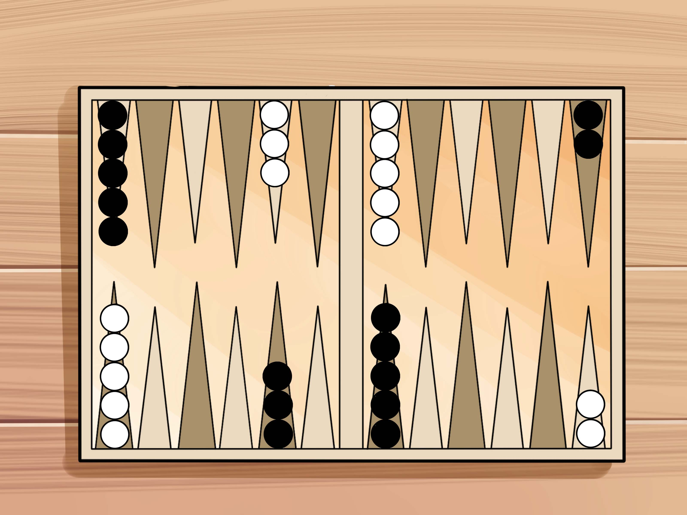</br>
    <em>Backgammon, a classic zero-sum game.</em></br>
</p>
    <li>General games</li>
    In this type of games, each of the agents has its own utility function. These utility functions may be independant, so in some stages of the game, the agents may even have to cooperate in addition to competing and indifferenting to increase their own utility function value. This type of the game is more general and also complicated compared to Zero-Sum games.
</ul>
 To know the game theory better, you can stop by <a href="https://en.wikipedia.org/wiki/Game_theory">here</a>.


<p align="center">
    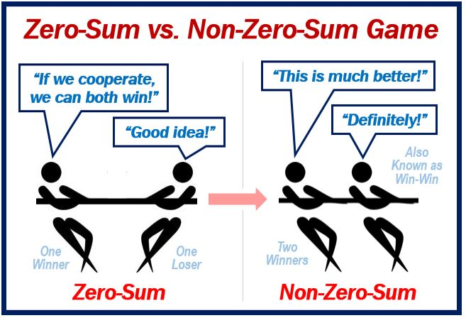</br>
    <em>A good example on zero-sum vs. non-zero-sum games. (Credit: Market Business News)</em></br>
</p>

## <font size = 5 color=red>
## Differnt Types of Trees for games</b>
</font>
<br>

<font size = 3 color=#FF7500>
<b>Single Agent Trees</b>
</font>
<br>

Consider the game Pacman which has only an agent playing the game. Starting from an initial state, our agent can either move to left or right. based on this, and its following moves, we can form a tree called **Single Agent Tree**. Each node of this tree indicates an state of the game and the utility function has an specific value in every one of them. We call the leaves of the tree **The Terminal Nodes**. In these terminal nodes, the game is finshed and the utility values are defined. The main question is how can we obtain the utility value of a node? According on what's been said, we have the utility values of the leaves. Recursively, to get the utility value of a node N, we calculate the utility value of every successor of N and we choose the maximum of those numbers as the utility value of the node N.
<br>
<font size = 3 color=#FF7500>
<b>Adversarial Agent Trees</b>
</font>
<br>
Like the previous Example, we explain this concept with the game Pacman but this time, the game has another agent called the adversarial agent or specific to this game, **The Ghost**.
Like Single Agent Trees, we can form a tree to express the moves of the agents, but the difference is that at each level of the tree, only one agent can play. For example if we start with the player P1 at the root of the tree, based on its move, we gain 2 successors and we go to the first level of the tree. At this level of tree, only the other player called P2 can move and each of the 2 nodes will have 2 successors based on P2's move. So we have 4 nodes in the second level and the game will continue this way till the end. In this Configuration, how can we calculate the utility value of nodes? This will be our next topic.  

## <font size = 5 color=red>
## Minimax Strategy
</font>
<br>
To gain the value of every node in Adversarial tree, we classify the nodes into two groups:
<ol>
    <li>The nodes our agent does action on them. The utility value of these kind of nodes is assigned by the maximum of the utility values of its successors. Because we want the maximum utility value for our agent. (The max side of the Strategy) </li>
    <li>The nodes that the adversial agent does action on them. The utility value of these kind of nodes is assigned by the minimum of the utility values of its successors. Because we want the minimum utility value for the adversary agent. (The min side of the Strategy) </li>
</ol>
Now that we have every node's utility value, we are able to find the best action for each state. The main idea is at each state, we choose the node with the greatest minimax value and move to it.
Why does this strategy work? Because while forming the tree and assigning the utility function, we've always considered the best move for the enemy in his/her point of view and the worst move in our point of view. So we assumed that the enemy always plays its best shot. Now Two situations are possible to emerge:
<ol>
    <li>The adversary agent is very smart. In this case, we are ready beacuse the strategy is based on this situation.</li>
    <li>The adversary agent is too naive and may do some inoptimal actions. In this case, we may even score more than what we gained as utillty value.</li>
</ol>
As a conclusion of what's said before, we can say that the utility value that we calculate for nodes in minimax strategy, is a floor value of what we may actually score.


<font size = 3 color=#FF7500>
<b>Pseudocode of Minimax Strategy</b>
</font>
<br>

```python
def max_value(state):
    if leaf?(state), return U(state)
    initialize v = -∞
    for each c in children(state):
        v = max(v, min_value)
    return v


def min_value(state):
    if leaf?(state), return U(state)
    initialize v = ∞
    for each c in children(state):
        v = min(v, max_value)
    return v
```

<font size = 3 color=#FF7500>
<b>Properties of Minimax Strategy</b>
</font>
<br>
<br>


<font size = 2 color=#green>
<b>Complete:</b>
</font>

<br>

Yes, It is complete if the tree formed for the game is finite.

<font size = 2 color=#green>
<b>Optimal:</b>
</font>
<br>

Yes, It is optimal if the opponent acts optimally not naivly. otherwise, we will surely win the game but not in an optimal way because we could've won the game sooner and with a higher score.
<br>

<font size = 2 color=#green>
<b>Time Complexity:</b>
</font>
<br>

$O(b^m)$, as it's obvious, it's dependant on the branching factor and the level the tree goes down. So on a game like chess with $b$ = $35$ and $m$ = $100$, we can't use this strategy because the time complexity will be huge.
<br>

<font size = 2 color=#green>
<b>Space Complexity:</b>
</font>
<br>

$O(bm)$, because it's like DFS and only stores the nodes on the current path.


## <font size = 5 color=red>
## Resource Limits
</font>
<br>
Although the minimax algorithm would be proper for problems with relatively small state space, it isn't an efficient and feasible one for problems with more complicated and larger state space. Since the number of game states it has to examine, is exponential in relation to the depth of the tree.

Consider a _reasonable_ chess game with $b \approx 35$ and $m \approx 100$ . Due to the time complexity of this algorithm which is $O(b^m)$, solving the game is not possible at all. We'll discuss some ideas to solve the problem in details below.

<font size = 3 color=#FF7500>
<b>Depth-limited search</b>
</font>
<br>
One idea might be running the algorithm up to a specified depth instead of searching the whole tree, which we call <b>depth-limited search</b> .

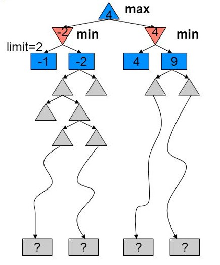

But using this technique is not much satisfying because it leads to another issue: _How can we find the minimax value while there is no solution at a limited depth?_
Recall how we find the minimax value of each node in the original form. We continue searching until we reach a final state and then use recursion to calculate the parents' values. But in the _limited_ format, there are no goal states at depth $k < m$.

Now to deal with this issue, we'll introduce _*Evaluation function*_.

<font size = 3 color=#FF7500>
<b>Evaluation Functions</b>
</font>
<br>
The goal of an evaluation function is to answer to the question: <b>How good is the current position?</b> Or <b>How probable is it to reach to winning terminal state from this position?</b>

Let us make this idea more concrete. An evaluation function returns an _estimate_ of the utility in each game state, just like the _heuristic_ functions that estimate the remaining cost to a goal state which were discussed before.

Obviously, defining an appropriate and precise evaluation function is strongly effective on the player's performance. Actually an inaccurate evaluation function may lead to a losing position in the game.

Most evaluation functions calculate the value of the position by using a _weighted sum of features_:

$Eval(s) = w_1f_1(s) + w_2f_2(s) + ... + w_nf_n(s)$

Each of the $f_i s$  is calculating a specific _feature_ of the state _s_.For instance, in chess, we would have features for the number of white pawns, black pawns, white queens, black queens, and etc. To differentiate the effect of each feature better, we multiply them by _weights_.

Ideally, evaluation function returns exactly the minimax value of the current state.


<font size = 3 color=#FF7500>
<b>Iterative Deepening Search</b>
</font>
<br>
The accuracy of the evaluation function is critical in shallower states. And the deeper in the tree we search, the less the quality of the evaluation function matters.
So a good idea is to maximize the depth of our search as much as possible, considering the limits that we have. In other words, we are looking for an algorithm that can return an acceptable solution whenever we ask. This kind of algorithms are called _anytime algorithms_. These algorithms are expected to find better and better solutions the longer they keep running.

So simply instead of running the depth-limited-search once, we start running the algorithm with an initial depth limit ($k$). Then after we found s policy, increase the depth limit ($k' > k$) and run the algorithm again with this new limit to find a better and more accurate solution. We continue the iteration until the program reaches the time limit.
This algorithm is called _iterative-deepening search_.


## <font size = 5 color=red>
## Pruning 
</font>
<br>

<font size = 3 color=#FF7500>
<b>Houston, We have a problem!</b>
</font>
<br>

So far, we have seen some imporvements upon our original Adversarial Search algorithm. But the problem with minimax search is that the number of game states it has to examine is **exponential** in the depth of the tree. The logical way to tackle this problem is to cut off some nodes and not to see them at all. This brings us to the idea of "Pruning" which we use a lot when we can in AI algorithms. In the following chapter, we see two ways to prune our tree so we can solve our problem in less time.

<font size = 3 color=#FF7500>
<b>Minimax Pruning</b>
</font>
<br>

If we take a look at how minimax works, it is noticeable that it explores some parts of the tree that are not necessary at all. In other words, exploring some branches are totally useless but time-consuming. If we can predict which branches are not worthy to be explored so that we can  _prune_ them, we can improve minimax algorithm significantly.

To understand better, consider the following example:
<div width="50%" height="50%">
    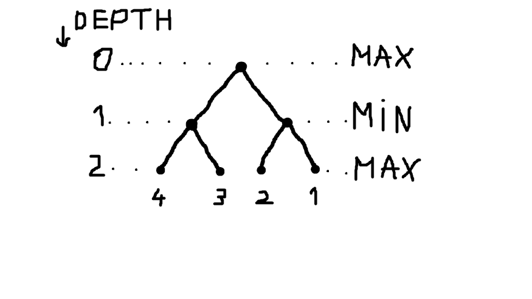
</div>

We start searching with respect to the assumption that we visit leftmost nodes first. Finally when we reach the terminal node with utility 4, _we can deduce that the value of it's parent node(which is a *Min* node) is definitely less than or equal to 4_:

<div width="50%" height="50%">
    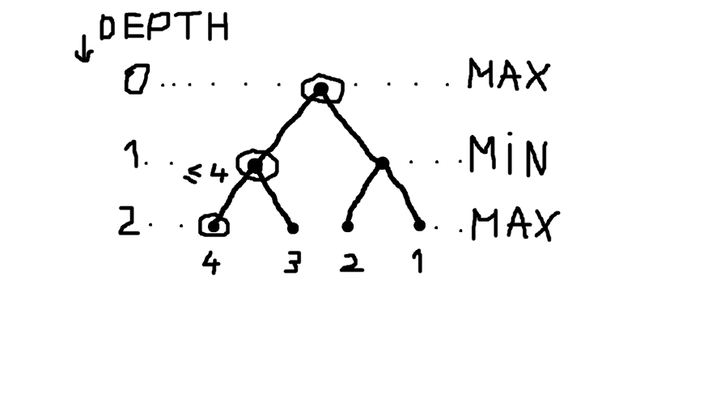
</div>

At this point, this information doesn't help us a lot. So let's continue searching. When we visit the terminal node with utility 3, we find that the value for the parent is also 3. An important observation here is that we can _predict_ that the value of the root _is more than or equal to 3_. That's because the root is a * Max * node.


<div width="50%" height="50%">
    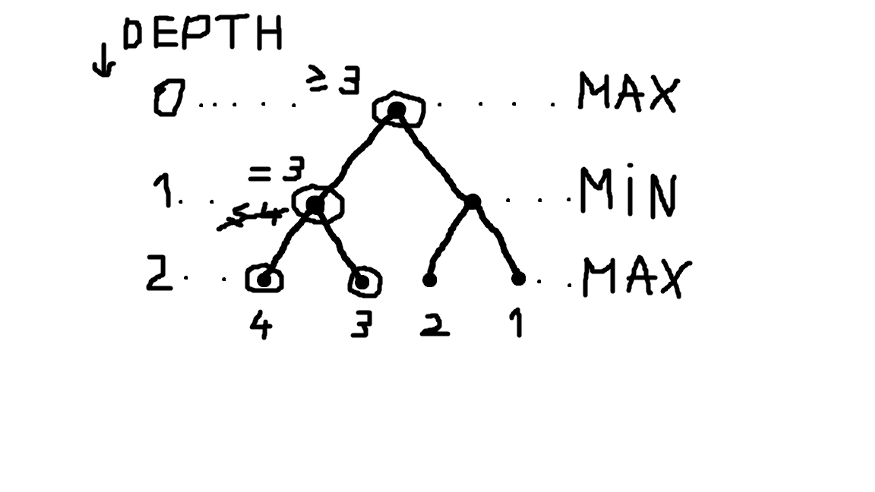
</div>


After that, we continue searching, a terminal leaf with utility 2 will be discovered, and just like before, we can immediately notice that the value of it's parent is _less than or equal to 2_.

<div width="50%" height="50%">
    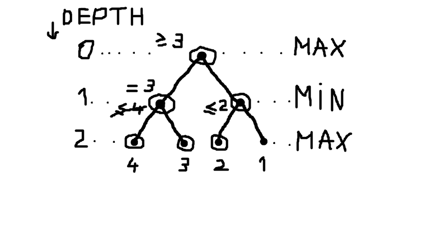
</div>

Now, let's ask ourselves: _Is it necessary that we explore the rightmost node?_. The answer is <b>No</b>. Because we already know that the value of the root is at least 3, while the maximum value of the right child of root is 2. So we can easily ignore exploring the last node and find that the minimax value of the root is 3:

<div width="50%" height="50%">
    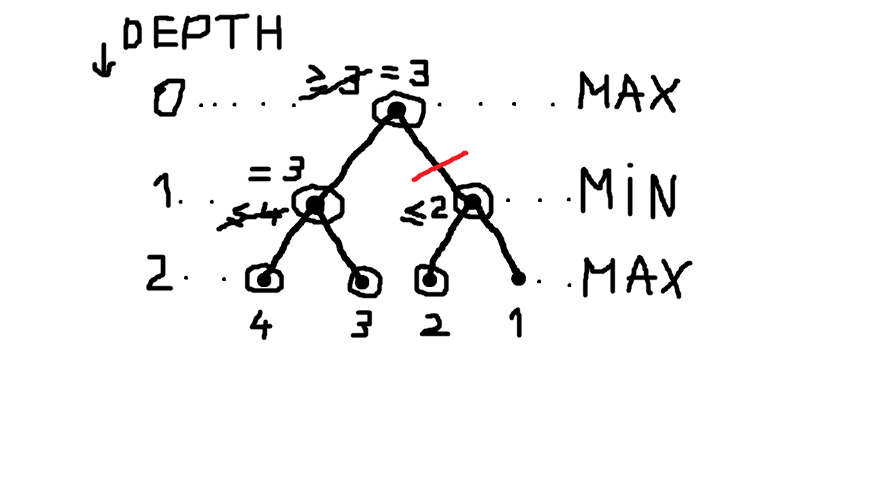
</div>

This idea helps us finding a general and systematic algorithm to predict the _bad branches_ and stop exploring them, which is called $\alpha-\beta $ _pruning_.

<font size = 3 color=#FF7500>
<b>Alpha-Beta Pruning</b>
</font>
<br>


As we are trying to improve our algorithm even more, there is another approach to prune branches that cannot possibly influence the final decision. So in the last section, we talked about Minimax Pruning, but how can we implement it? 

The approach we are trying to explain here as you can see in the title is called Alpha-Beta Pruning.

The main idea here is that if a node (e.g. $m$) has a better choice than another node (e.g. $n$) or its parents, then that another node ($n$) will never be wanted to expanded. So we can prune it and never check its successor nodes.

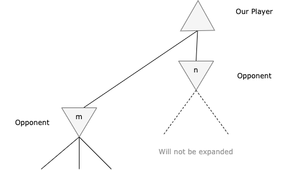</br>
*As $m$ can give the root node a higher value, $n$ will be pruned.* 


We do this by keeping track of two parameters:

+  $\alpha$: The value of best choice (i.e. highest value) we have found so far for a Maximizing Node (i.e. our player).
+  $\beta$: The value of best choice  (i.e. lowest value) we have found so far for a Minimizing Node (i.e opponent player).

### Sample Code:

Here is a Python function to make you understand the concept better.

```python
def alpha_beta_pruning(position, depth, alpha, beta, maximizing_player):
    if depth == 0 or game_state(position) == GAMESTATE.GAMEOVER:
        if terminal_utility(position):
            return terminal_utility(position)
        return eval_func(position)

    if maximizing_player: #for maximizing player (our player)
        max_eval = - math.inf
        for child in position.children:
            eval = alpha_beta_pruning(child, depth - 1, alpha, beta, false)
            max_eval = max(max_eval, eval)
            alpha = max(max_eval, eval)
            if beta <= alpha:
                break
        return max_eval
    else: #for minimizing player(opponent player)
        min_eval = + math.inf
        for child in position.children:
            eval = alpha_beta_pruning(child, depth - 1,alpha, beta, true)
            min_eval = min(min_eval, eval)
            beta = min(beta, eval)
            if beta <= alpha:
                break
        return min_eval
```     


So to initialize this function, first we need to give alpha the worst value for our player, which is $-inf$, and give beta the worst value for the opponent, which is $+inf$.

```python
    #initialization
    alpha_beta_pruning(current_position, 0, - math.inf, + math.inf, true)
```

Now let's look at an example while running this code.

<p align="center">
    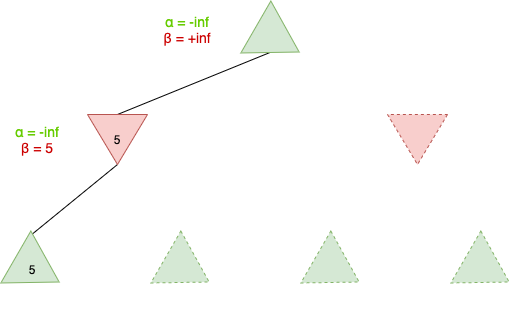</br>
    <em>We approach the first leaf and since the parent is a Minimizing Node, its beta value gets updated</em></br>
    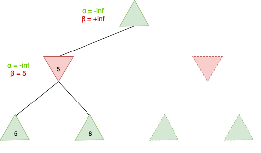</br>
    <em>Second leaf has a bigger value, so since beta always updates at a lower value, nothing changes here</em></br>
    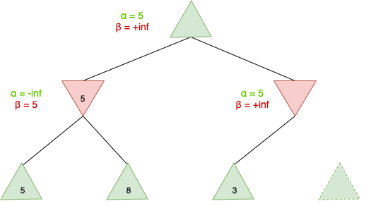</br>
    <em>The algorithm goes back to the root's second child and then goes to the third leaf. Keep in mind that the parent's alpha and beta values always gets passed to their children.</em></br>
    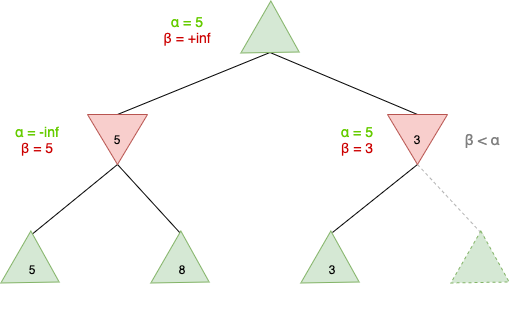</br>
    <em>Now since beta is less than alpha, we know that our root's best possible value from this child will be a 3 which is lower than its other child (i.e. 5), so we prune the other leaf.</em></br>
</p>


## <font size = 5 color=red>
## Expectimax Search
</font>
<br>


As we can see in the real world, not all the games are played only based on players' skills. We have so many games with stochastic variables in them, like throwing a dice or picking a random card. These games are called **stochastic games**.

Even when there is no element of luck, we can expect unpredicted behaviors from our agent or the opponent's agent, like robot slipping on the wet floor, or the opponent taking a worse route.

So the problem we face here is that while we know what legal actions we can take, we can't afford to know what moves will the opponent be able to take as takes its random element into use.(i.e. The transition function will be variable as the game goes on.).

Let's introduce a new definition called **chance nodes**. We represent these kind of nodes as a circle in the game tree.

Let's look at this with a example from the epic, legendary game, Snakes And Ladders.

<p align="center">
    </br>
    <em>This games is played by two or more players. Each can throw a dice at its turn and should move as many as the dice number.</em></br>
</p>

So in this game, there is an element of chance. if the opponent rolls the dice on 1, it can move one square, if it rolls the dice on 2, it can move two squares, and so on. So the main point here is that the action the opponent can make depends on a random number from dice which its probability is $1/6$ at a time.

So the new game tree will be something like this:

<p align="center">
    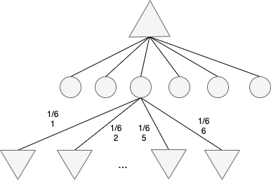</br>
    <em>The minimal expectimax tree for snakes ladder game.</em></br>
</p>


<font size = 3 color=#FF7500>
<b>Node values in Expectimax Search:</b>
</font>
<br>

As we deal with probability in this kind of search so much, we expect to calculate the values based on some kind of probabilty.

Terminal nodes and MAX and MIN nodes (for which the dice roll is known) work exactly the same way as before. So how should we calculate the value of chance nodes?

For every chance node, the value is calculated from the expected value of its childer. 
For example the value of every chance node in Snake ladder will be:

$1/6 * 1 + 1/6 * 2 + 1/6 * 3 + 1/6 * 4 + 1/6 * 5 + 1/6 * 6$

So the general formula for values will be as follows:

| value   | condition |
|------|--------|
| UTILITY(s) | s = terminal node |
|max EXPECTIMAX(Eval(s, a)) | PLAYER(s) = MAX|
|min EXPECTIMAX(Eval(s, a)) | PLAYER(s) = MIN|
| $\sum_{r}$ P(r)EXPECTIMAX(RESULT(s,r)) | PLAYER(s)= CHANCE|

## <font size = 5 color=red>
## Other types of games 
</font>
<br>
On top of what's been discussed before, we can count another type of game called <b>Mixed Layer Types</b>. In this type, in addition to players' action, we have another random factor affecting the game. So in our computations we must consider this factor. Foe example, Backgammon is a Mixed layer types game, because rolling the dice will affect the states and result of the game.

To do some calculations about the depth of the game tree, we can state:

$b$ = $21$ because 21 dintinct states are created as an outcome of rolling 2 dices.

$legal moves \approx 20$ 

So if we want to build the tree till the depth of 2, we will have $20 * (21 * 20) ^ 3$ leaves and termainal states. As we go deeper in tree, this number increases.

As the deepness increases, the probability to reach a goal state gets smaller and limiting the depth gets less damaging. So the usefulness of search will be threatened and pruning becomes trickier. 

Td-Gammon is a computer backgammon program developed in 1992. It uses a 2-depth search, a very good evaluation function plus reinforcement learning and what we get, is a champion-class player! TD-Gammon was the first AI world champion in any game!

<font size = 3 color=#FF7500>
<b>Multi-Agent Utilities</b>
</font>
<br>
In games with multiple players, terminal states have utility in form of tuple values and each player tries to maximize its own part. This idea can raise the cooperation and competetion strategies dynamically.

## <font size = 5 color=red>
## Conclusion
</font>
<br>

Before this, we only discussed games with a single player. But we use Adversarial search when there are other players and agents in the game too, often with opposite objectives. With adversarial search, we are seeking a method called **Playing Strategy** that gives us correct directions and instructions at each state of game.

We classified games in two main groups based on utility functions:
- Zero-Sum Games: The sum of agents' utility functions is equal to zero. (pure competition)
- General Games:  independent utility functions. (cooperation may be beneficial)

We formed trees for both single and adversarial agent games and we found a strategy to obtain the value of nodes in both situations.

Optimal strategy against an opponent playing perfectly can be found using **Minimax strategy**. We can also determine a floor value of the score that can be achieved in every game.
A complete search is often impossible in minimax because of resource limits. So There are two options:
- Replace the utility function with an **Evaluation Function** that estimates utility. This function must be defined very precise, because the whole solution depends on this.
- Do **Minimax Pruning**: While calculating minimax values, it's sometimes possible to detect and **prune** some suboptimal branches that we know we'll never visit them during the algorithm.

Another point that has to be considered is that While we are looking for a good strategy of playing, we must neighter act Optimistically nor Pessimismtically, because they can both result in suboptimal behaviour so it's important to evaluate each problem realistically and choose our strategy in proportion of the adversarial agent's cleverness.

Uncertain factors (like rolling dice) are represented by Expectation Nodes in a game tree. Optimal strategy in such games can be found using **Expectimax Search** which was explained before.

## <font size = 5 color=red>
## Useful links
</font>

+ [Step-by-Step alpha-betta example](https://www.youtube.com/watch?v=xBXHtz4Gbdo)
+ [A simple overview of adversarial search with some examples](https://www.baeldung.com/cs/expectimax-search)
+ [More about adversarial search in Chess game](https://medium.com/@SereneBiologist/the-anatomy-of-a-chess-ai-2087d0d565)
+ [About minimax time complexity](https://stackoverflow.com/questions/2080050/how-do-we-determine-the-time-and-space-complexity-of-minmax)


## <font size = 5 color=red>
## References
</font>
<br>


+ https://towardsdatascience.com/understanding-the-minimax-algorithm-726582e4f2c6
+ Russell, S. J., Norvig, P., &amp; Davis, E. (3rd. Ed). Artificial Intelligence: A modern approach. Pearson Educación. 
+ https://slideplayer.com/slide/4380560/
+ https://www.cs.cornell.edu/courses/cs312/2002sp/lectures/rec21.htm
+ https://www.techslang.com/definition/what-is-adversarial-search/
+ https://en.wikipedia.org/wiki/Game_theory
+ https://brilliant.org/wiki/minimax/#:~:text=In%20game%20theory%2C%20minimax%20is,payoff%20as%20large%20as%20possible.
+ https://en.wikipedia.org/wiki/Minimax
+ Sebastian Lague's Youtube channel
