# **Bayesian Networks Representation**

## **Table of contents:**
- [Intoduction](#Intoduction)
	- [Probabilistic Models](#Probabilistic-Models)
- [Independence](#Independence)
	- [Conditional Independence](#Conditional-Independence)
	- [Chain Rule](#Chain-Rule)
- [Bayes' Nets](Bayes'-Nets)
	- [Problems with joint distribution tables](#Problems-with-joint-distribution-tables)
	- [Graphical Notation](#Graphical-Notation)
	- [Semantics](#Semantics)
	- [Probabilities in Bayes' Nets](#Probabilities-in-Bayes'-Nets)
	- [Causality in Bayes' Nets](#Causality-in-Bayes'-Nets)
	- [Space Efficiency](#Space-Efficiency)
- [Independence in Bayes' Nets](#Independence-in-Bayes'-Nets)
	- [Independency Assumptions](#Independency-Assumptions)
	- [D-separation](#D-separation)
		- [Outline](#Outline)
		- [Causal Chain](#Causal-Chain)
		- [Common Cause](#Common-Cause)
		- [V-Structure](#V-Structure)
	- [Reachability](#Reachability)
	- [Active/Inactive Paths](#Active/Inactive-Paths)
	- [Structure Implications](#Structure-Implications)
	- [Topology Limits Distributions](#Topology-Limits-Distributions)
- [Conclusion](#Conclusion)
	- [What comes next](#What-comes-next)
- [References](#References)

## Intoduction

Imagine this scenario. You want to know if the food in your fridge is going to spoil. You can hear your fridge humming. Does that change the probability of the food spoiling? What if you see that the fridge door is open? Are these evidences even related to the food spoiling? In this lecture note, we want to introduce a probabilistic model to study this kind of problems. 

### Probabilistic Models

So, what is a probabilistic model? A model is a simplification of the real world; it describes how portions of the world work. Since models are simplifications, they do not contain all the details and may not account for every variable or interaction between variables. As George E. P. Box, a British statistician one said: "All models are wrong; but some are useful."

We use probabilistic models to reason about unknown variables, given evidences. This can be done in three ways:

- Diagnostic inference
	Means going from effects to causes, or in other words **explaining** the effects. For instance, given that the food spoiled, infer the probability of the fridge being broken.
- Causal inference
	Means going from causes to effects, or in other words **predicting** the effects. For example, given that the power is cut, find the probability of the food spoiling.
- Intercausal inference
	Means inferring probabilities between causes of a common effect, which is often called **explaining away**. For example, if we know that the food spoiled and the fridge door was open, the probability of the fridge being broken gets very low, although the door being open is independent of the fridge being broken.

## Independence

Two variables are *independent* if:

If two variables are independent, their joint distribution is the product of their distributions. This can also be shown in another way:

We show independency as:

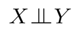

Note that real life joint distributions are at best close to independent. Independence is a *modelling assumption*. We'll get back to assumptions later.

### Conditional Independence

Unconditional (absolute) independence is very rare to come by, because the variables in a problem are usually all correlated. Conditional independence is our most basic and robust form of knowledge about uncertain environments. 

X is conditionally independent of Y given Z

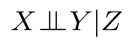

if and only if

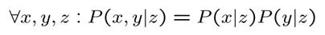

or equivalently, if and only if

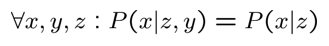

### Chain Rule

We all know the basic form of chain rule:

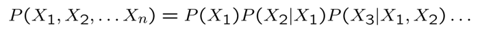

Imagine we want P(X, Y, Z). Using the chain rule, we can write:

- P(X,Y,Z) = P(X)P(Y|X)P(Z|X,Y)

But if we know that Z and Y are independent, we can instead write:

- P(X,Y,Z) = P(X)P(Y|X)P(Z|X)

These independencies can be derived from bayes' nets. This will come in handy when we want to infer probabilities from bayes nets.

## Bayes' Nets

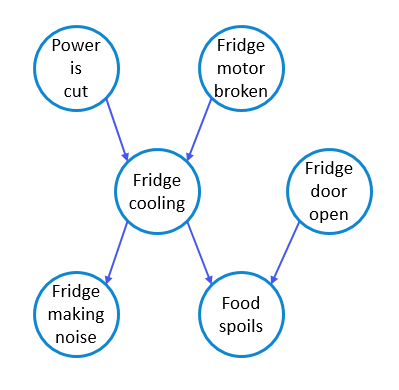

### Problems with joint distribution tables

### Graphical Notation

### Semantics

### Probabilities in Bayes' Nets
 in BNs, join distribution is obtained by the product of local conditional distributions. So, to find the probability of a full assignment, multiply all relevant conditional   probabilities.
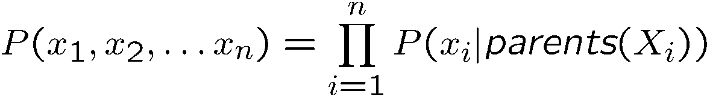
 in the following, we will prove the correctness of this method. 
 Note first the chain rule that applies to each distribution:
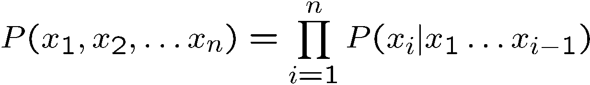
 Now with respect to conditional independence, we can claim that:

 because xi is conditional independent of other nodes, given its parents.  
 So, we can conclude that:

 Note that not every BN can produce every distribution, but the BN topology determines what conditional independence can be produced. 
 
 The following are some examples of BN distribution. 
 
 a. coin flips  
 In this case, a coin is tossed n times, the probability of a head or tail being equal in each toss. If these actions are independent of each other, then it is as follows.
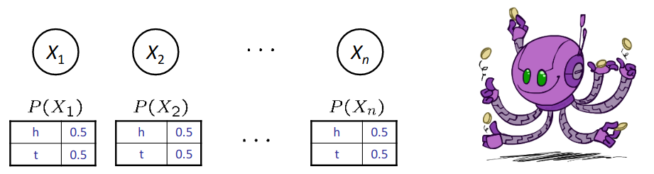
 for example P(H, T, T, H) = P(H)P(T)P(T)P(H)  
 Note that only distributions whose variables are absolutely independent can be represented by a Bayes’ net with no arcs. 

 b. traffic  
 In this example, R stands for rain and T stands for traffic. It is also considered that rain causes traffic.
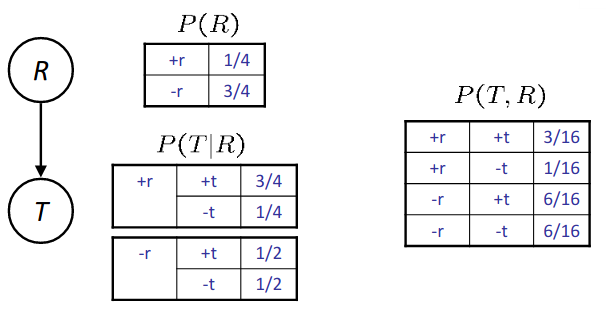
 for example P(+r, -t) = P(+r)P(-t|+r)  

 c. alarm network  
 In this case, it is assumed that the house alarm is sounded by an earthquake or burglary. John and Mary may also call us if the alarm sounds.
 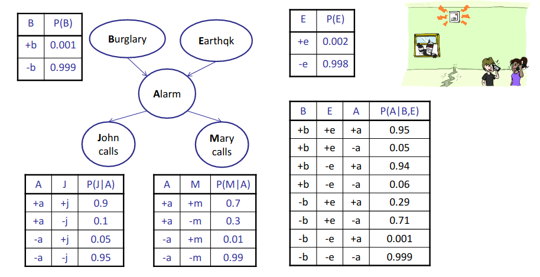

For example P(+b,-e,+a,-j,-m)=P(+b)P(-e)P(+a|+b,-e)P(-j|+a)P(-m|+a)

### Causality in Bayes' Nets
 If in a Bayes' net the arrows show the real causes, it can be better investigated and the probabilities found. The network also becomes simpler. Because the number of parents is less.  
 Sometimes arrows do not show causal relationships. Or even in a network, none of the arrows have a causal relationship. For example, when some important variables are not available in the network. In such cases, the arrows show correlation and not causation. 
 
 Therefore, we do not need to know the exact causal structure between the variables.
### Space Efficiency
 The CPT size of a node if it has m different value and has k parents, each of which also has m different value, is equal to m^(k+1).  
 Therefore, in a Bayes' net with N Boolean variables, if each node has a maximum of k parents, the size of the whole net is of the order of O(N*2^(k+1)). Whereas if we want to store their joint distribution, it is the size of 2^N.  
 
 So, we conclude that if we use this method, it usually requires less memory. It is also easier and faster to use local CPTs.

## Independence in Bayes' Nets

### Independency Assumptions

### D-separation

In previous sections we used conditional dependencies. But in a big graph, finding dependencies with algebraic methods is so difficult and complex. In this section we present an algorithm called D-separation to find different conditional dependencies.

#### Outline:

In this method, first we check conditional dependency for ***triples*** (3 nodes that are connected) and specify several rules to find whether the last and first variables are dependent or not. Then we use these rules to find conditional dependencies in general cases on bigger graph. In another words, in big graphs we do some processing on each triple in the path between the two desired nodes to find if they are independent.  
In the following section, we will examine three different situations for triples:

#### Causal Chain

The first configuration is “casual chain”.  

In this configuration, middle node transmits the effect of the previous node to the next one.

Example:

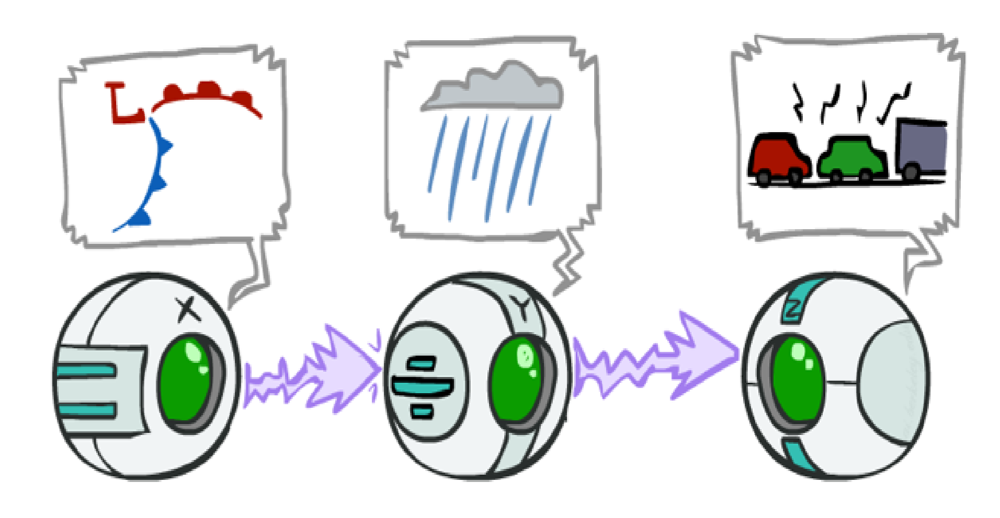

In this BN, low pressure causes rain and rain causes traffic. in another word rain transmits the effect of low pressure to traffic.  

is X is guaranteed to be independent of Z?  

the answer is NO. To prove this claim, it is enough to give an example that X and Z are dependent. suppose that X is random, and probability of low pressure (P(+x)) and high pressure(P(-x)) are equal to 0.5. P(+x)=P(-x)=0.5   

rainfall is completely dependent on low pressure and if low pressure occurs, rainfall is definite. and if high pressure occurs, rainfall is impossible.  
P(+y|-x)=0  P(+y|+x)=1   

Also, traffic is completely dependent on rainfall. if it rains, traffic will occur and otherwise there isn’t any traffic.  

P(+z|+x)=1 P(-z|+x)= 0  P(+z|-x)= 0  P(-z|-x)= 1  

now we should compare P(Z) and P(Z|X) to find dependency.  for example low pressure and traffic occurred. (X=+x and Z=+z) we know P(+z|+x)=1 but P(+z)=0.5  

As a result, the two variables are not independent.  

is X is guaranteed to be independent of Z given Y?  

the answer is YES. to prove this claim, we use algebraic operations. we should show equality of P(Z|Y) and P(Z|Y,X).

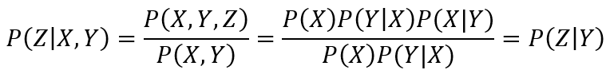

we conclude that with condition on Y, X and Z are independent.  

So, in triple casual case, if middle node is observed, end nodes are independent. because the effect of X to Z is not direct, if value of Y be known, change in X’ value causes no effect on Z’ value. in another word, if we have value of Y, value of X does not give any additional information about Z.  

So, evidence along the chain “blocks” the influence.

#### Common Cause

second configuration is “common cause”:  

in this configuration one variable effect on another two variables. but child nodes are not related directly.  

Example:

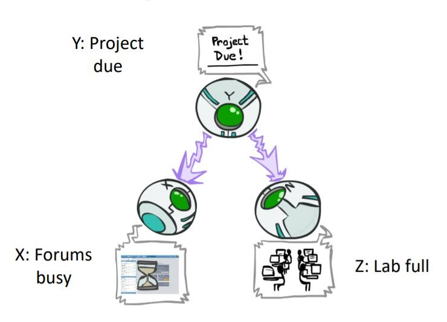
- P(x, y, z) = P(y) P(x|y) P(z|y)  

in this BN, project due causes lab full and forums busy.  

is X is guaranteed to be independent of Z?  

the answer is NO. it is enough to give an example set of CPTs that X and Z are dependent. suppose that Y is random, and the probability of being close to project deadline (P(+y)) and otherwise (P(-y)) are equal to 0.5. P(+y)=P(-y)=0.5  

laboratory fullness is completely dependent on project deadline and if deadline is near, laboratory is full. and if project deadline is not near, laboratory is not full.  
P(+z|+y)=1  P(+z|-y)=0  

Also, forums are related to project deadline. if deadline is near, forums get busy. 
P(+x|+y)=1  P(+x|-y)=0  

now we should compare P(Z) and P(Z|X) to find dependency.  for example, lab is full and forums are busy. (X=+x and Z=+z) we know P(+z|+x)=1 but P(+z)=0.5
As a result, the two child variables in common cause triples are not independent in general case.  

is X is guaranteed to be independent of Z given Y?  

the answer is Yes. to prove this claim, we use algebraic operations. we should show equality of P(Z|Y) and P(Z|Y,X).

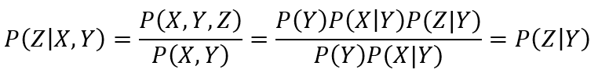

we conclude that with condition on Y, X and Z are independent.  

So, in triple common cause, if parent node is observed, child nodes are independent. because the effect of X to Z is not direct, if value of Y be known, change in X’ value causes no effect on Z’ value. in another word, if we have value of Y, value of X does not give any additional information about Z.  
So, observing the cause blocks influence between effects.

#### V-Structure

the last configuration is "common effect" and is sometimes called V-Structure.  

in this configuration, one variable is affected by another two variables.  

Example:

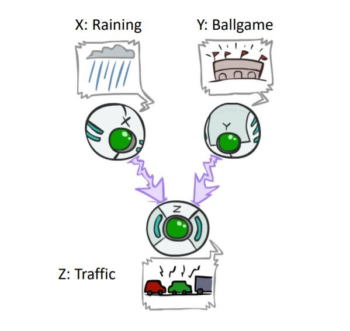
- P(x, y, z) = P(x) P(y) P(z|x, y)  

in following BN, both ballgame and raining cause traffic.  

is X is guaranteed to be independent of Y? 

the answer, unlike previous versions, is Yes. ballgame and rain do not get effect from each other or a common cause. to prove this claim, use algebraic operation again:

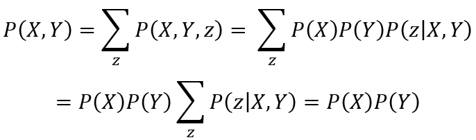

So we show P(X,Y) = P(X)P(Y) and conclude X and Y are independent.  

is X is guaranteed to be independent of Y given z? 

the answer is NO. with an example we describe the situation. consider X and Y have random values and probability of occurrence each one is 0.5. (P(+x)=P(+y)=0.5) and traffic will occur when ballgame or raining occurs.

- P(+z|+x,+y)=P(+z|+x,-y)=P(+z|-x,+y)=1    P(+z|-x,-y)=0  

From the problem description, We can conclude that P(+x|+z,-y)=1  and P(+x|-y)=0.5. So, P(X|Z,Y) is not equal to P(X|Y). 

So, with the observation of Z, X and Y are not independent. this means Observing an effect, activating influence between possible causes.

### Reachability

Now, we want to use these three cases to check conditional dependency in any arbitrary graph. generally, the problem is checking dependency between two random variables in a BN in which some (or any) variables are observed. for this goal, we break the graph into triples which we learned above, and do some checking on them. In the following, these steps are described. 

in the first step, we should shade evidence nodes, nodes that are observed in the problem. then looking for undirected paths between determined random variables. the first idea is that if two nodes are connected by a path that is blocked by a shaded node, two random variables are independent. But there are drawbacks to this rule. when we have several paths between two RVs or there is a V-structure triple that its bottom node is shaded, our method is wrong. So, we describe the next step to correct these problems.

### Active/Inactive Paths

Question: are X and Y conditionally independent given evidence variables {Z}? 

Yes, if x and y “d-separated” by z.

to describe the "d-separated" concept, we first need to understand the concept of active/inactive path. 

a path is active if each triple of it is active. a triple is active if:

- Causal chain A -> B -> C where B is unobserved (either direction)
- Common cause A <- B -> C where B is unobserved
- Common effect (aka v-structure) A -> B <- C where B or one of its descendants is observed

Now we consider all undirected paths from X to Y after shading evidence variables, if none of these paths aren’t active paths, we can say X and Y are d-separated by Z. 

in the figure below, examples of active and inactive triples are shown.

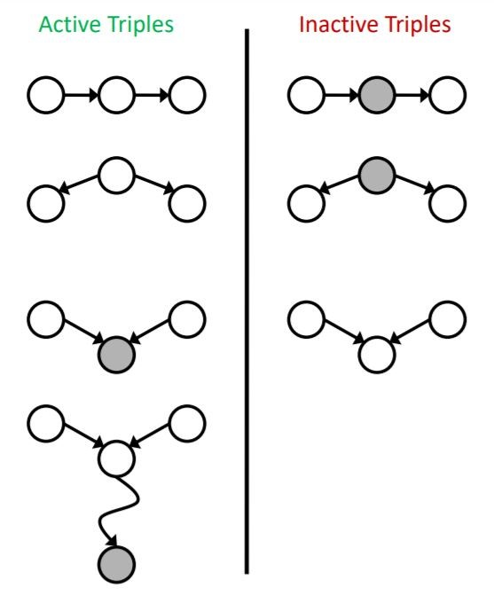

note that a single inactive triple makes a path inactive. but two RVs are independent if all paths between related nodes are inactive. So, if some paths were active, independence is not guaranteed.

Example:

 a. we want to check conditionally independence between R and B variables with different evidence.

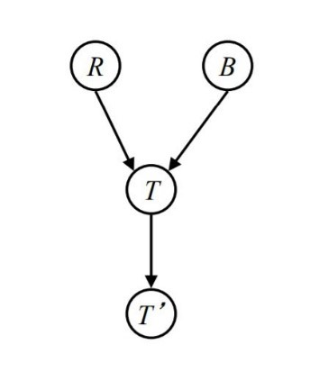

- **without evidence:** there is only one path between R and B that is a “common effect” triple. it is inactive so R and B are independent.
- **evidence=T:** there is a “common effect” triple that is active. So, the independence of R and B isn’t guaranteed.
- **evidence=T’:** this situation is similar to previous evidence.

 b. we want to check conditionally independence between L and B variables with different evidence.

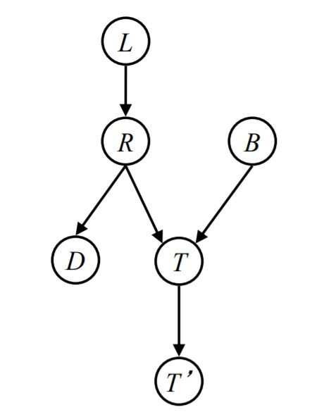

- **without evidence:** there is only one path between L and B that has two triples. L->R->T is active but R->T<-B is inactive. So, this pass is inactive. So, L and B are independent.
- **evidence = T:** similar to the previous segment there is only one path that has two triples. both are active. So, L and B aren't guaranteed to be independent given T.
- **evidence = T':** it is similar to segment. 
- **evidence = T, R:** similar to the 2’nd segment the R->T<-B triple is active but L->R->T is inactive. So, L and B are independent given T and R.

 c. we want to check conditionally independence between T and D variables with different evidence.

- **without evidence:** There are two paths between T and D. upper path is an active “common cause” and the lower path is an inactive “common effect”. So, L and T aren't guaranteed to be independent.
- **evidence = R:** There are two paths between T and D. upper path is an inactive “common cause” and the lower path is an inactive “common effect”.  So, L and T are independent given R.
- **evidence = R, S:** There are two paths between T and D. upper path is an inactive “common cause” and the lower path is an active “common effect”.  So, L and T aren't guaranteed to be independent.

### Structure Implications

 As you can see, with the help of this algorithm, we can examine the conditional independence of two random variables. So, if we test the algorithm on all modes, we get a list of conditional independence. but sometimes this list isn’t complete. because when we check conditional dependencies, some cases aren’t certain, and using this method alone, their independence cannot be recognized. 
but in some cases, “d-separation” algorithm can find all dependencies. For example, in the figure below;

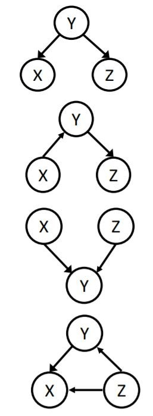

### Topology Limits Distributions

In a given graph topology, only certain joint distributions can be encoded. The graph structure guarantees certain (conditional) independence (There might be more independence). Adding arcs, increase the dependence of variables. 
For example, in the figure below, different kind of dependence for triples is mentioned.

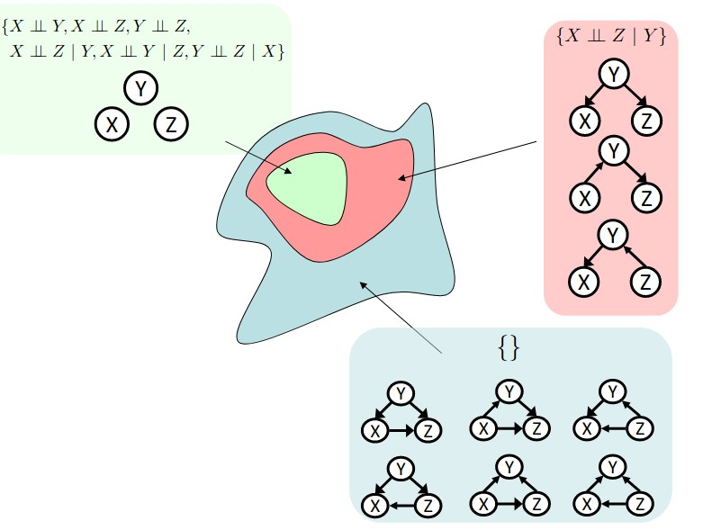

- Green color: triples in which every pair of RVs are independent.
- Red color: triples in which two RVs are independent given the 3rd one.
- Blue color: triples in which no independence is found.

## Conclusion

Through this lecture note, we saw that:

- Joint distributions can be encoded efficiently using bayes' nets which simplifies calculations a lot compared to the classic joint distribution tables method.

- Guaranteed independencies of distributions can be deducted from the bayesian net graph structure which weren't apparent at first. Moreover, using d-separation gives us precise conditional independence guarantees from the graph alone.

- Even that isn't all. There may as well be more (conditional) independencies that are not detectable until we inspect the specific distributions.

### What comes next

Up until now, we saw how to build a bayes' net and how to find the independencies. The next step is to put these bayes' nets to use and infer probabilities from it. It's basically done by multiplying probabilities taken from every node on the path from top to the desired node. Read the next lecture note to learn all the details.

## References

<http://ce.sharif.edu/courses/00-01/1/ce417-1/resources/root/Slides/PPT/Session%2011_12.pptx>
